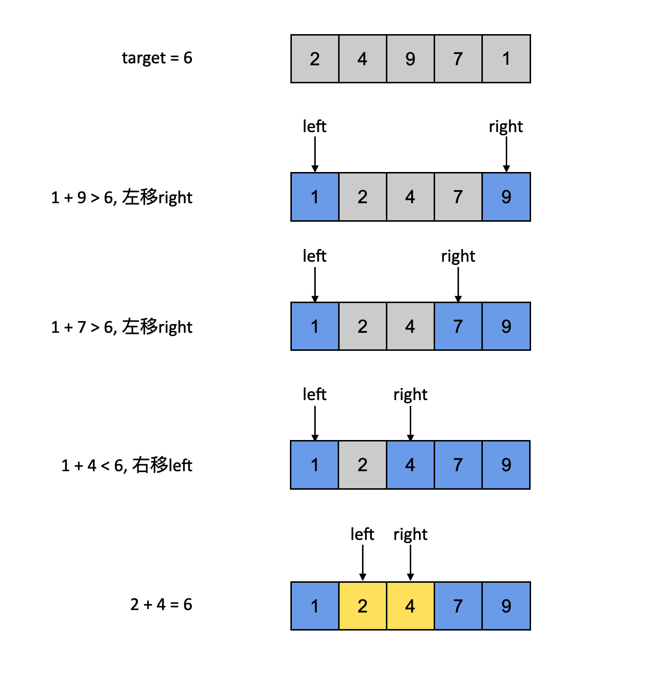

## 章节导读


同一道问题可能有多种解决方案。自然地，我们会将多种方法进行比较。那么怎么样才能知道是A方法好，还是B方法好？这时候我们就需要对算法的复杂度进行分析。

本章我们先介绍两个概念：时间复杂度与空间复杂度。并且用Two Sum作为案例，用时间空间复杂度分析Two Sum的三种解法

## 时间复杂度

时间复杂度描述的是算法执行需要消耗的时间。同等条件下，消耗时间越少，算法性能越好。但是，算法执行的确切时间无法直接测量，通常只有在实际运行时才能知道。所以我们通过估算算法代码的方法来得到算法的时间复杂度。

## 空间复杂度

空间复杂度描述的是算法在执行过程中所消耗的存储空间（内存+外存）。同等条件下，消耗空间资源越少，算法性能越好。

## 大O符号

大O符号是用于描述函数渐近行为的数学符号，在分析算法效率的时候非常有用。

借用wikipedia上的一个例子，解决一个规模为n的问题所花费的时间可以表示为：T(n)=4n<sup>2</sup>+2n+1。当n增大时，n<sup>2</sup>项将开始占主导地位，而其他各项可以被忽略。比如当n=500，4n<sup>2</sup>项是2n项的1000倍大，因此在大多数场合下，省略后者对表达式的值的影响将是可以忽略不计的。

长远来看，如果我们与任一其他级的表达式比较，n<sup>2</sup>项的系数也是无关紧要的。例如：一个包含n<sup>2</sup>项的表达式，即使T(n)=1,000,000n<sup>2</sup>，假定U(n)=n<sup>3</sup>，一旦n增长到大于1,000,000，后者就会一直超越前者。

## 案例：Two Sum

> 给出一个整数数组nums和一个target整数，返回两个和为target的整数。

假定我们正在面试，让我们用面试的方法来分析一下这道题。

1.向面试官确认输入、输出
通过询问面试官，我们可以知道：输入是一个int类型的数组和一个target；返回值是两个下标，并且以数组的形式返回；方法名没有特殊要求。这样一下我们就确定了函数的签名

```java
public int[] twoSum(int[] nums, int target) {
  // Solution
}
```

2.向面试官确认输入、输出是否有特例

接下来我们要确认一下输入输出的细节
+ 输入是否可以为空？
+ 输入的数组范围是正整数，还是任意范围？
+ 输入数组会不会特别大，甚至无法载入内存，比如300GB的数据量？
+ 如果输入不合法或者没有正确答案，我们已经返回空数组还是抛出异常？
+ 输入的数组中有重复么？如果没有重复，可以同一个数字用两次么？
+ 如果有多个解，那么返回第一个，还是所有解？
+ 你希望答案写成class，还是只提供方法本身即可？
+ ……

有些问题即使题目中已经提到，最好还是再次向面试官确认。如果以上这些问题你没有想到的话，那么说明思路仅限于做题，缺乏面试的沟通技巧。可以多找小伙伴Mock面试，注意多交流。

假设面试官告诉我们：只需要写函数本身。输入数组可能为空，但不会大到无法读进内存。数字的范围就是int类型的范围，可能有重复。对于不合法或者没有正确答案的情况，请自行判断。多个解法是，返回任意一个答案都可以。

得到了这些信息，我们可以先进行防御性编程。
```java
public int[] twoSum(int[] nums, int target) {
  if (nums == null || nums.length < 2) {
    return new int[0];
  }
  
  // TODO: solution here
  
  return new int[0];
}
```

3.举几个例子

接下来，我们可以要求面试官举几个例子，或者自己提出几个例子，来确保双方对题目没有异议。

> Example 1:
Input: nums = [], target = 0
Output: []

> Example 2:
Input: nums = [2], target = 4
Output: []

> Example 3:
Input: nums = [2, 3, 4, 2], target = 6
Output: [2, 4] or [4, 2]

> Example 4:
Input: nums = [2, 7, 11, -2], target = 9
Output: [2, 7] or [7, 2] or [11, -2] or [-2, 11]

+ 根据例子1、2，确定没有正确解时返回空数组。
+ 根据例子2，确定数字不可重复使用。
+ 根据例子3、4，确定如果有多个合适的解，返回任意一个都可以。

4. 开始解题

完成了之前的步骤，需要找到正确的思路。这道题有三种思路，我们需要一一分析判断，找到合适的解法之后，和面试官进行讨论。得到面试官的允许之后，才可以开始写代码。（如果一上来就埋头解题，即使做对了也不能拿到最高评价。）

## 解法1 Brute Force

没有具体思路的时候，暴力破解法应该是第一个想法。几乎任何后续更高效的算法都是在暴力破解法的基础上优化而来的。即使无法优化成功，一个可行解也好过一个高效但不可行的算法。

对于Two Sum这道题，最直观的想法大概是找到所有可能的数字组合，挨个计算他们的和，返回第一个满足条件的组合。这种解法并没有什么技术含量，但是可以作为我们下一步优化的基础。

```java
public int[] twoSum(int[] nums, int target) {
    if (nums == null || nums.length < 2) {
        return new int[0];
    }

    for (int i = 0; i < nums.length; i++) { // O(N)
        int firstNum = nums[i]; // 确定第一个可能的数字
        for (int j = i + 1; j < nums.length; j++) { // O(N)
            int secondNum = nums[j]; // 确定第二个可能的数字
            if (firstNum + secondNum == target) {
                return new int[]{firstNum, secondNum};
            }
        }
    }
    return new int[0];
}
```
假设我们的输入大小为N（即nums的长度为N），for循环遍历每个数字时，假设每访问一个数字需要消耗的1个单位的时间，那么对于长度为N的数组，一共需要消耗N的时间。在计算机领域，我们使用大O记号来表示这种量化方法，将for循环的消耗记为O(N)。由于解法1中，我们使用了嵌套了两重for循环，这说明我们对于N个数字，每个数字除了消耗1个单位时间用于访问，还消耗了N个时间第二次遍历数组，总体的时间消耗为O(N<sup>2</sup>).

## 解法2 使用HashSet

反思解法1的步骤，我们利用了两重for循环。第一层for循环我们有不得不使用的理由：因为我们至少需要遍历每个数字。第二个for循环的目的是找到与firstNum相加等于target的数字，在这里我们又使用了for循环。如果有一种办法能够让我们记住已经见过的数字，并且在O(1)的时间内检查是否有数字与firstNum相加等于taget，那么就可以省下一个O(N)的for循环。

有一个已知的数据结构可以解决这个问题——Set。Set对应数学意义上的集合，每个元素在集合中只出现一次，Set提供了add/remove/contains ... 等API，并且非常高效消耗均为O(1)。

在遍历数组的过程中，每遇到一个新的数字num，计算target - num的值并记为potentialMatch。检查set中是否包含potentialMatch，如果包含说明存在这么一组数字对，他们的和等于target；如果不包含，那么将当前的num加入set，然后检查下一个数字。

```java
public int[] towSum(int[] nums, int target) {
    Set<Integer> set = new HashSet<>();
    for (int num : nums) { // O(N)
        int potentialMatch = target - num;
        if (set.contains(potentialMatch)) { // O(1)
            return new int[]{potentialMatch, num};
        } else {
            set.add(num); // 空间消耗增加O(1)
        }
    }
    return new int[0];
}
```

这个方法利用了Set的特性：以O(1)的速度快速查询元素是否存在。从而省去了一个for循环，将时间复杂度降到了O(N)。但是Set消耗了额外的空间，在最差的情况下，Set可能保存了每一个数字但依旧返回了空数组。所以，解法二消耗了O(N)的空间和O(N)的时间。

## 解法3 使用排序

解法2利用了O(N)的额外空间去记录已经访问过的数组。那么是否存在一种办法可以不消耗额外的空间，同时提供高效地查询。

当然没有这种好事😭……

除非我们做一步预处理：将输入的数组排序处理。比如下图的例子：nums = [2, 4, 9, 7, 1], target = 6



1. 先将原数组进行排序(这里可以使用编程语言自带的排序方法)
2. 创建left、right两根指针。left指向第一位，right指向最后一位
3. 只要left和right不重合，循环比较left、right指向的两个数字的和sum：
    + 如果sum等于target，那么left、right所指向的数字就是我们要找的结果
    + 如果sum大于target，那么将right向左移动一位，让下一个sum变小
    + 如果sum小于target，那么将left向右移动一位，让下一个sum变大
4. 当循环结束，依旧没有答案，说明没有正确解

```java
public int[] twoSum(int[] nums, int target) {
    Arrays.sort(nums); // O(NlogN)
    int left = 0;
    int right = nums.length - 1;
    while (left < right) { // O(N)
        int sum = nums[left] + nums[right];
        if (sum == target) { 
            // 如果sum等于target，那么left、right所指向的数字就是我们要找的结果
            return new int[] {nums[left], nums[right]};
        } else if (sum < target) {
            // 如果sum小于target，那么将left向右移动一位，让下一个sum变大
            left++;
        } else if (sum > target) {
            // 如果sum大于target，那么将right向左移动一位，让下一个sum变小
            right--;
        }
    }
    return new int[0];
}
```

这个算法的优势在于每次只会让较大的值减小、或者较小的值增大，得到的sum是连续的。如果存在正确的解，就一定可以找到对应的left和right。left、right的单调移动，每次会排除一部分错误答案，减小搜索空间，而且保证了数组中每个数字仅被访问一次，消耗是O(N)的。但是在预处理的时候使用了排序，所以会有O(NlogN)的时间消耗。总体上消耗了O(NlogN)的时间和O(1)的空间。缺点是改变了原数组的元素位置。

## 时间-空间的取舍

让我们来回顾这三种解法：
+ 解法1消耗了O(N<sup>2</sup>)的时间和O(1)的空间
+ 解法2消耗了O(N)的时间和O(N)的空间
+ 解法3消耗了O(NlogN)的时间和O(1)的空间

与解法1的暴力算法相比，解法2是用了空间换时间，增加了Set的消耗，减短了查询的消耗。解法3则相反，用了时间换空间，通过原地排序，省去了Set。这两类操作统称space-time trade-off 空间-时间权衡。

通过对算法的复杂度分析，我们有了量化算法效率的方法。我们可以明确地指出，解法2比解法1更好，解法3比解法2消耗更少的内存。

|数据结构|关键信息|
|--|--|
|array|通过下标访问O(1)，查询O(N)，插入O(N)，删除O(N)|
|string|在内存中的形式与array等价|
|linked list|通过下标访问O(N)，查询O(N)，插入O(1)，删除O(1)|
|stack|last-in first-out，在内存中的形式等价于linked list|
|queue|first-in first-out，在内存中的形式等价于linked list|
|heap|查询极值O(1)，插入O(logN)，删除极值O(N)|
|hash table|插入、删除、查询O(1)|
|binary search tree|插入、删除、查询、找最大最小值、访问前驱结点、访问后继节点均为O(1)|

大多数情况下，算法的过程是基于对基础数据结构的操作。因此分析算法复杂度也要求我们掌握常见的数据结构。上表给出了常用数据结构和操作的时间复杂度。记住这张表，能帮助我们更快的分析一个新算法的复杂度。

## 习题

Two Sum有另一种版本不同于上文中的例题，要求返回的是数字的下标，与例题略有不同，非常适合作为习题

