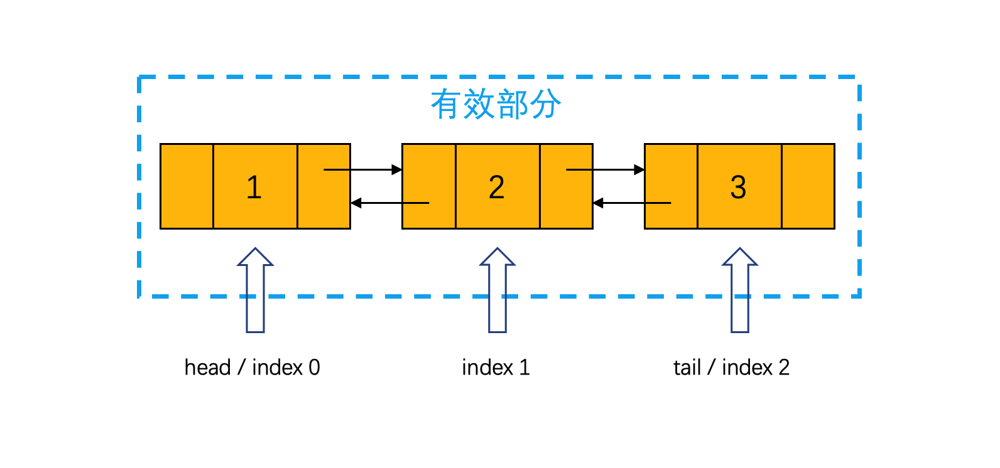
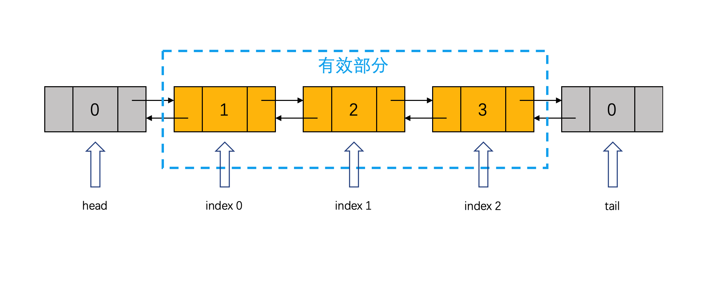
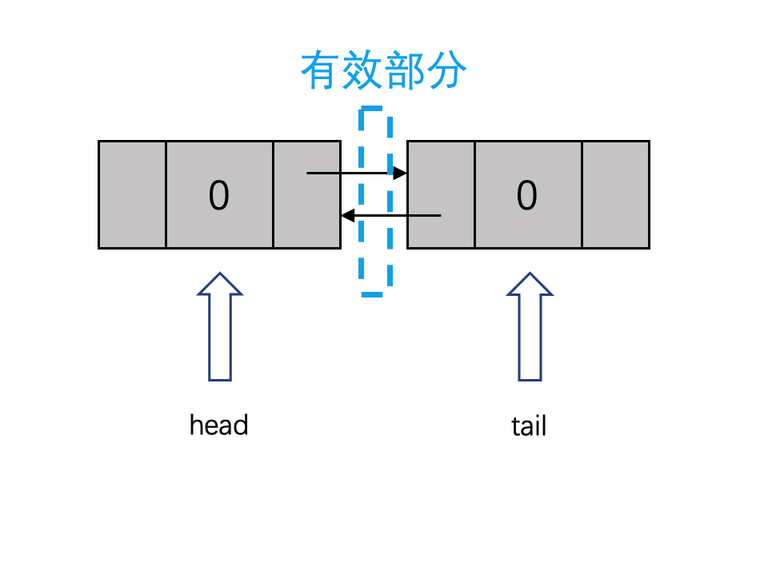
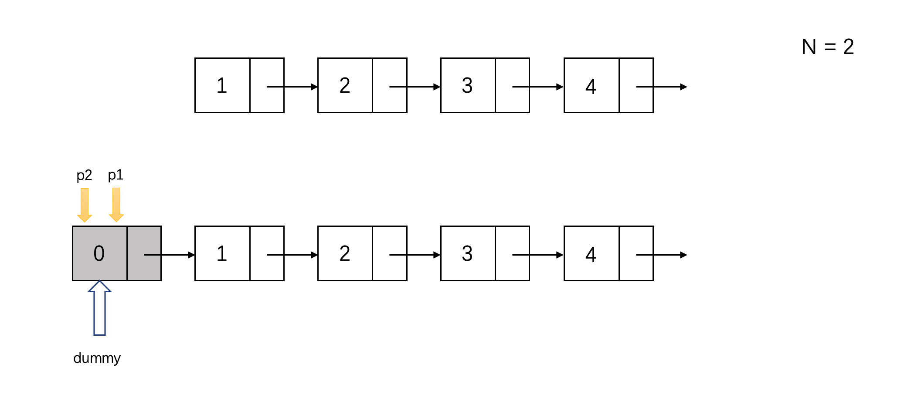
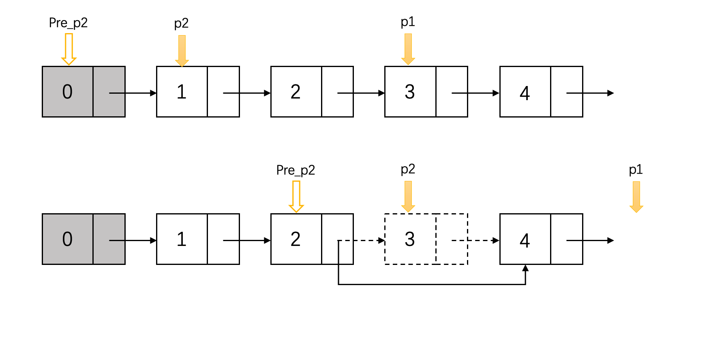
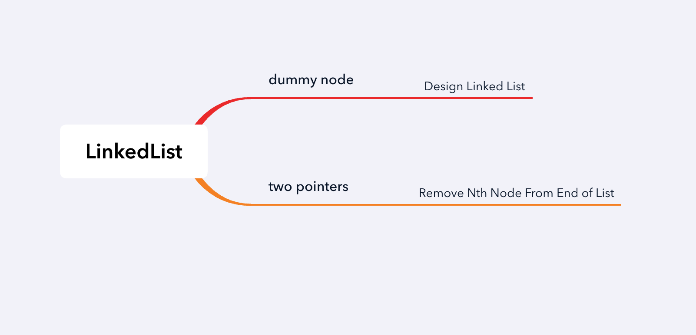

## 1. 基础知识——链表的概念
各位刷题的小伙伴大家好，这节课我们来看链表Linked List。

链表是一种最简单的数据结构，由多个串联的节点组成。作为一种线性集合存储的数据顺序，链表存储数据的顺序和在内存中的实际位置无关。链表中每个元素与下一个元素通过指针相连，在物理内存上不相邻。

常考的是单向链表：每个节点包含一个data字段和一个next指针域。data保存要存储的数据，next指针指向下一个节点，最后一个节点的next指针会指向一个空值NULL。


*图片来源维基百科*

双链表在单链表的基础上，增加了一个prev(previous)指针，prev指向前一个节点。相比于单链表，双链表额外提供了反向遍历的功能。


*图片来源维基百科*

链表是最简单、最常用的数据结构之一。它可以作为更高一级数据结构的基础，用于实现list,stack, queue等别的数据结构。链表的又是在于可以高效地从任何一个位置添加、删除元素。缺点则是对于查询元素，需要遍历整个链表。

## 2.案例：构造一个链表

**Design Linked List**

> 选择设计一个单链表或者双链表，实现以下API：
> + get(index)
> + addAtHead(val)
> + addAtTail(val)
> + addAtIndex(index,val)
> + deleteAtIndex(index)

题目本身虽然表示可以自行选择单链表或者双链表，实际面试中需要向面试官确认。我建议大家学会双链表的实现方式，因为java的LinkedList就是用双链表实现的，双链表更接近我们工作中使用的数据结构。单链表的实现相对简单，作为课后题，大家可以参考双链表自行实现。

### dummy node

实现链表有两种解法方法。

第一种，将head和tail分别指向第一个和最后一个节点。链表没有消耗额外的空间，JDK中采用了这种实现方式。


第二种，采用dummy node来降低实现难度。head和tail分别指向一个dummy node(虚拟节点/哑节点，也叫哨兵节点)。链表保存在head与tail之间，需要消耗额外的空间。dummy node的作用：当链表起始节点（甚至整个链表）有可能变化的时候，我们在原始链表的表头添加一个额外的节点，作为新的表头来保存链表信息。这里对于双链表，我们在尾部对应也添加一个虚拟节点。



### API分析

本文中我只介绍方法二，掌握之后大家可以自己尝试另一种解法。

题中要求的API如下：
+ get(index)
+ addAtHead(val)
+ addAtTail(val)
+ addAtIndex(index,val)
+ deleteAtIndex(index)

#### 构造方法

在我们尝试实现方法之前，第一步应该实现的是节点的定义和LinkedList的构造方法。

```java
class MyLinkedList {
    class Node {
        int val;
        Node prev, next;
        public Node(int val) {
            this.val = val;
        }
    }

    int size;
    Node head, tail;

// 初始化两个dummy node作为head和tail, 用一个size记录有效区域的长度
    public MyLinkedList() {
        size = 0;
        head = new Node(0);
        tail = new Node(0);

        head.next = tail;
        tail.prev = head;
    }
}
```

首先使用一个inner class实现Node class，双链表的每个节点包含一个数据域val 以及一个指向前一个节点的指针prev 和一个指向后一个节点的指针next。

在构造函数中，初始化两个dummy node作为head和tail，并且连接成链表，用一个size记录有效区域的长度。



#### 插入节点

链表中插入节点需要两步操作：
1. 定位到需要插入的位置，并获取对应的前后节点predecessor和successor
2. 通过修改指针，将节点插入对应位置
    + node.prev指向predecessor
    + node.next指向successor
    + predecessor.next指向node
    + successor.prev指向node

我们需要从basic case推导到common case，最好的入手点是addAtHead函数。我们直接利用head指针确定插入点的位置，然后修改前后指针，插入节点，最后更新size。addAtTail也是类似的操作。

```java
public void addAtHead(int val) {
    Node node = new Node(val);
    Node next = head.next;
    // 修改指针，将节点插入对应位置
    head.next = node;
    next.prev = node;
    node.prev = head;
    node.next = next;
    size++;
}

public void addAtTail(int val) {
    Node node = new Node(val);
    Node prev = tail.prev;
    // 修改指针，将节点插入对应位置
    prev.next = node;
    tail.prev = node;
    node.prev = prev;
    node.next = tail;
    size++;
}
```

#### 定位节点

addAtIndex需要我们先根据给定的index找到对应的位置，get也是同样的要求。我们先用一个private函数，实现从index找到对应的node。下面是一个最简单的实现：

```java
private Node node(int index) {
    if (index < 0 || index > size) {
        return null;
    }
    
    Node curt = head.next;
    for (int i = 0; i < index; i++)
        curt = curt.next;
    return curt;
}
```

有了这个函数我们就可以很方便的实现get和addAtIndex

```java
public int get(int index) {
    if (index < 0 || index >= size) 
        return -1; 
    return node(index).val; 
}

public void addAtIndex(int index, int val) {
    if (index < 0 || index > size) {
        return;
    }
    
    if (index == 0) {
        addAtHead(val); // index = 0, 等价于addAtHead
    } else if (index == size) {
        addAtTail(val); // index = size, 等价于addAtTail
    } else {
        Node successor = node(index);
        Node predecessor = successor.prev;
        Node node = new Node(val);

        node.prev = predecessor;
        node.next = successor;
        predecessor.next = node;
        successor.prev = node;
        size++;
    }
}
```

#### 删除节点

deleteAtIndex是addAtIndex的反向操作：
1. 定位到对应节点的位置，并获取对应的前后节点predecessor和successor
2. 通过修改指针，将节点从predecessor和successor指间移除
    + predecessor.next指向successor
    + successor.prev指向predecessor

```java
public void deleteAtIndex(int index) {
    if (index < 0 || index >= size) {
        return;
    }
    Node curt = node(index);
    Node predecessor = curt.prev;
    Node successor = curt.next;
    predecessor.next = successor;
    successor.prev = predecessor;
    size--;
}
```

### 优化

能做到以上几点，本题已经可以拿到leaning hire的评级了。接下来我们需要优化code style和提高效率。

双链表的最大优势是正向反向都可以遍历链表，我们利用这一点可以将查找节点的时间缩短一半。

```java
private Node node(int index) {
    Node curt;
    if (index < (size >> 1)) { //如果index在链表的前半部，从前往后正向遍历
        curt = head.next;
        for (int i = 0; i < index; i++)
            curt = curt.next;
    } else {  // 否则从后往前，反向遍历
        curt = tail;
        for (int i = size; i > index; i--)
            curt = curt.prev;
    }
    return curt;
}
```

另外 addAtHead，addAtTail(val)，addAtIndex(index,val)可以写成更统一的风格

```java
public void addAtHead(int val) {
    addAtIndex(0, val);
}

public void addAtTail(int val) {
    addAtIndex(size, val);
}

public void addAtIndex(int index, int val) {
    if (index < 0 || index > size) {
        return;
    }
    Node successor = node(index);
    Node predecessor = successor.prev;
    Node node = new Node(val);

    node.prev = predecessor;
    node.next = successor;
    predecessor.next = node;
    successor.prev = node;
    size++;
}
```

## 3. 案例2：删除倒数第N个节点

> 在给定的链表中，删除倒数第N个节点。

一个最简单有效的办法是遍历这个链表两次。第一次获得链表的长度L；第二次删除正数第L-N个节点。时间复杂度O(n), 是一种相当高效地算法。但是作为面试题，面试官一定会提出这么一个限制条件：如果只允许遍历一次呢？

### 双指针

显然是不可能的 =。=！ 面试官其实在忽悠你。要删除倒数第N个节点，至少每个节点要访问两次。有一个折中的办法：在一次遍历中，每个节点访问两次。（其实还是两次遍历）

之前我们在第1章第2节Two Sum问题中见过三种不同的解法，其中解法3就是用了双指针。双指针有多种变体，这里我们来看看双指针在链表上的应用。

使用双指针删除倒数第n个节点：
1. 指针1从head开始走n步
2. 当指针1达到节点n时，指针2从head出发，与指针1同步前进
3. 当指针1到达结尾时，指针2到达倒数第n个节点
4. 删除倒数第n个节点


然而实际上，指针2应该落后n+1步，因为我们需要从倒数第n个节点的前一位节点来删除目标节点



代码如下：
```java
class Solution {
    public ListNode removeNthFromEnd(ListNode head, int n) {
        // 有可能删除的是head，使用dummy node防止head丢失
        ListNode dummy = new ListNode(0);
        dummy.next = head;
        
        ListNode p1 = dummy, p2 = dummy;
        
        // 让p2落后n+1步
        for (int i = 0; i < n + 1; i++) { 
            p1 = p1.next;
        }
        
        // p1 & p2 同步前进，p1到达结尾时，p2指向目标节点的前一个节点
        while (p1 != null) {
            p1 = p1.next;
            p2 = p2.next;
        }
        
        // 删除p2的下一位节点
        p2.next = p2.next.next;
        
        return dummy.next;
    }
}
```

### 复杂度分析
时间复杂度O(n)，空间复杂度O(1)

## 总结

本章通过介绍了链表的结构和两种常用的技巧：dummy node, two pointers



## 习题
如果面试官以尽可能提高性能为理由，禁止使用dummy node。请试着实现无dummy node版本的LinkedList

