## 章节导读

上一节我们学习了DFS经典面试题。相对于DFS，广度优先搜索(BFS)是另一种使用广泛的搜索方式。这节课我们来看看BFS经典面试题。

## 基础知识——广度优先搜索

广度优先搜索BFS是不同于深度优先DFS的另一种搜索方式：BFS在每个节点会优先向邻近的节点延伸，覆盖全部的邻居节点之后，再从其中一个邻居节点向外延伸。

BFS没有递归写法需要借助队列(Queue)，我们会在之后的章节专门讲解Queue这种结构，现在我们只需要知道它是一种先进先出的结构

1. 初始化一个Queue，将根节点放入其中
2. 只要Queue不为空，执行以下循环
2.1. 从Queue中取出一个节点
2.2. 如果该节点存在左右分支，则分别加入Queue中
2.3. 访问该节点


*图片由visualgo制作*

模板代码：

```java
void bfs(TreeNode node) {
  if (node == null) return;
  
  Queue<TreeNode> queue = new LinkedList<>(); // 初始化一个Queue
  queue.offer(root); // 将根节点放入其中

  while (!queue.isEmpty()) { // 只要Queue不为空
    TreeNode curt = queue.poll(); // 从Queue中取出一个节点
    if (curt.left != null) // 加入左分支
      queue.offer(curt.left);
    if (curt.right != null) // 加入右分支
      queue.offer(curt.right);

    doSomething(curt); // 访问该节点
  }
}
```

这里我们简单对比一下Stack和Queue两种结构：
|数据结构|算法|顺序|实现|Java内置|加入一个元素|移除一个元素|查看下一个元素
|--|--|--|--|--|--|--|--|
|Stack|DFS深度优先|LIFO后进先出|Stack/ArrayDeque|实现|push|pop|peek|
|Queue|BFS广度优先|FIFO先进先出|LinkedList/ArrayDeque|接口|offer|poll|peek|

在之后的章节里，我们还会见到这张表更复杂的版本，目前我们只需要记住Stack对应DFS，Queue对应BFS。

+ Stack在java中存在已经实现好的数据结构，可以直接使用（java内置的Stack实现来自早期版本，在工作中并不推荐使用，但是在面试时可以拿来直接用，降低难度）。
+ Queue在java中是一个接口的形式，没有可以直接使用Queue的数据结构。比较接近的是实现了Queue接口的双端队列ArrayDeque（推荐，效率高），我们之前学过的链表LinkedList也实现了Queue接口，可以当做Queue使用。
+ ArrayDeque 是java中内置的双端队列，效率很高，可以从两端进行操作，兼容了Stack和Queue的API。

模板代码：
```java
Stack stack = new Stack(); // java内置了Stack结构

// ArrayDeque 兼容了Stack和Queue的API, 可以从两端进行操作
Deque stack = new ArrayDeque();
Deque queue = new ArrayDeque();

// LinkedList也实现了Queue接口
Queue queue = new LinkedList();
```

## 1.案例: 二叉树的层次遍历

> 给出一棵二叉树，返回其节点值的层次遍历（逐层从左往右访问）
> 
> 输入: 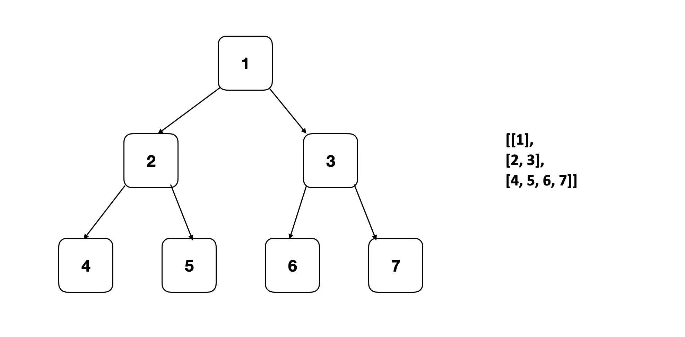
> 输出:[[1], [2, 3], [4, 5, 6, 7]]

### 思路分析

本题是BFS的经典题，几乎所有BFS的题目都可以当做是本题的变种。题目要求我们返回二叉树的层次遍历，也就是要求我们用BFS的方式，分层访问所有节点。我们在每一层需要一个列表来保存当前层的所有节点。因此我们需要对原有的模板做一些修改。

我们在按照BFS横向访问时，会将每个节点的左右子树添加入队列。初始化时，只包含根节点。而访问根节点之后，将根节点从队列中移除，此时队列中剩下根节点的左右子节点，即第二层所有节点。

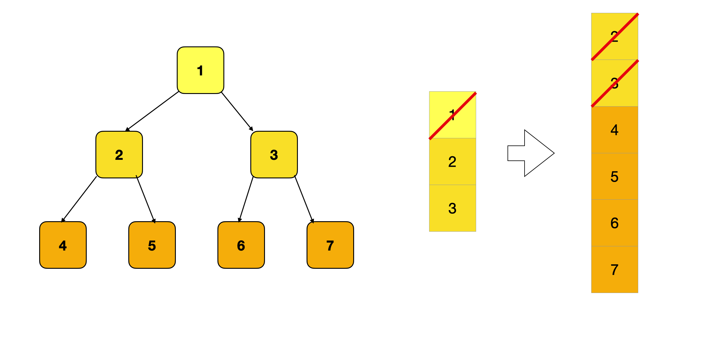

此时队列中只包含第二层的两个节点，当这两个节点被访问后，队列中只剩下第三层的4个节点，以此类推。这样我们发现，只要每次限制从队列中拿出的节点的个数，我们就可以保证每次只访问同一层的节点，达到层次遍历的效果。


### 代码实现

```java
public List<List<Integer>> levelOrder(TreeNode root) {
    List<List<Integer>> ans = new ArrayList<>();
    if (root == null) 
        return ans;

    Queue<TreeNode> queue = new ArrayDeque<>(); // 使用ArrayDeque作为Queue的实现
    queue.offer(root);

    while (!queue.isEmpty()) {
        int size = queue.size();
        List<Integer> line = new ArrayList<>();
        for (int i = 0; i < size; i++) { // 增加一个额外的限制，每次for循环只访问同一层
            TreeNode curt = queue.poll();
            if (curt.left != null) queue.offer(curt.left);
            if (curt.right != null) queue.offer(curt.right);

            line.add(curt.val);
        }
        ans.add(line); // 将同一层的节点，加入最终的ans列表
    }
    return ans;
}
```

### 分析
时间复杂度O(n)，空间复杂度O(n)

与DFS相同，我们使用bfs访问了所有的节点，所以消耗了O(n)的时间。空间上，二叉树最差情况可能退化成一根链表，所以空间复杂度为O(n)

## 2.案例: 最小深度

> 给定一棵二叉树，返回最小深度。
> 
> 输入: 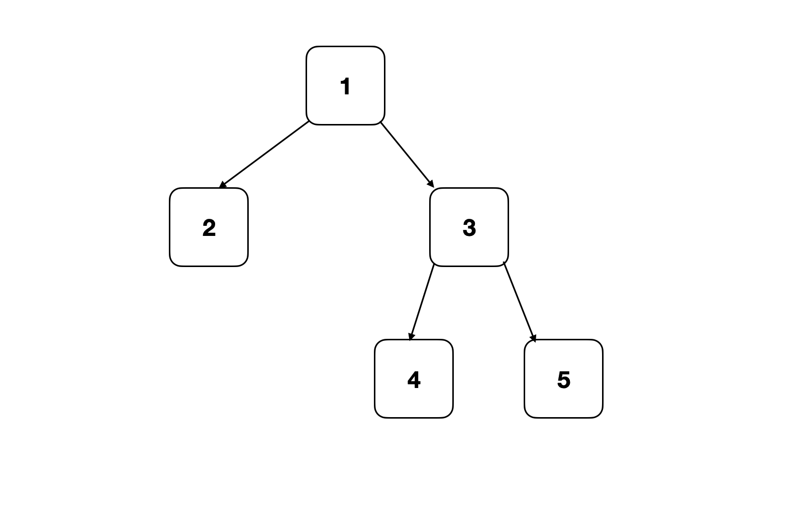
> 输出: 2

### 思路分析

二叉树的最小深度是从根节点到最近叶子节点的最短路径上的节点数量。这道题等价于从根节点出发，计算走到最近的叶子节点的距离。所以我们需要对上一题的遍历模板做一些改动，增加一个额外变量depth，记录从起点出发BFS向外扩展的距离


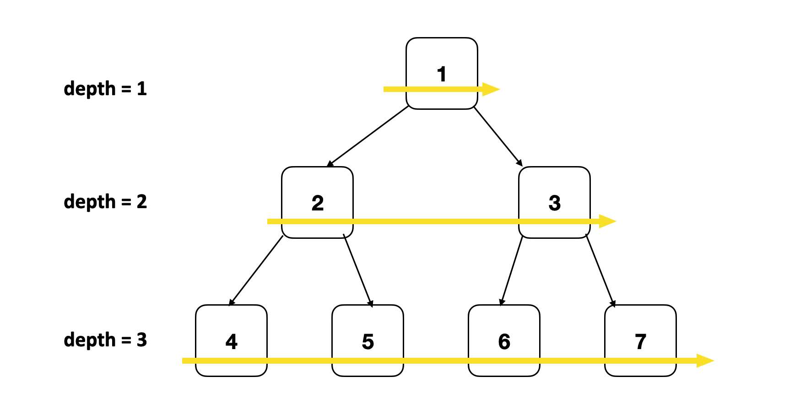

### 代码实现

```java
public int minDepth(TreeNode root) {
    if (root == null)
        return 0;

    Queue<TreeNode> queue = new ArrayDeque<>();
    queue.offer(root);
    int depth = 1; // 增加一个额外变量depth，记录从起点出发BFS向外扩展的距离

    while (!queue.isEmpty()) {
        int size = queue.size(); 
        for (int i = 0; i < size; i++) {
            TreeNode curt = queue.poll();
            if (curt.left == null && curt.right == null) // 遇到叶子节点
                return depth; // 遇到的第一个叶子节点就是深度最浅的叶子节点
            if (curt.left != null) queue.offer(curt.left);
            if (curt.right != null) queue.offer(curt.right);
        }
        depth++; // 深度加一
    }
    return 0;
}
```

### 分析
时间复杂度O(n)，空间复杂度O(n)

## 3.案例: 寻找树中右侧最近节点

> 给定一棵二叉树和一个节点u，返回节点u右侧的第一个节点（如果u是最右侧节点，则返回null）
> 
> 输入: 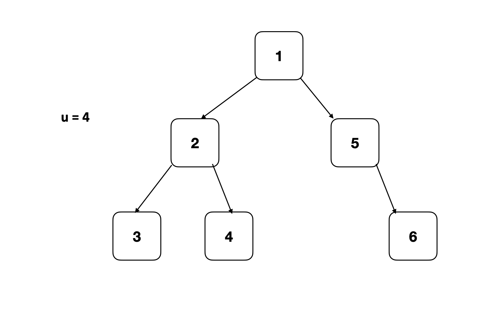
> 输出: 6

### 思路分析

有了前两题做铺垫，本题其实并不难。本题的关键在于定义右侧最近节点：如果节点u是最右侧节点，那么右侧对应节点为null；否则是u右侧第一个有效节点。根据BFS的访问顺序，同层的下一个右侧节点，即是队列中下一个即将访问的节点。

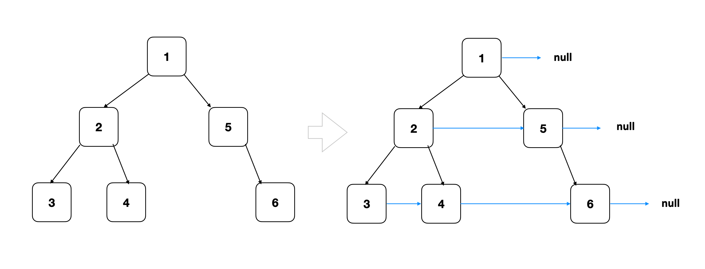

1. 根据BFS的顺序，每层从左到右访问节点
2. 直到遇到节点u，判断u是否是最右侧节点
2.1. 如果是最右侧节点，那么返回null
2.2. 否则返回队列中的下一个节点

### 代码实现

```java
public TreeNode findNearestRightNode(TreeNode root, TreeNode u) {
    if (root == null)
        return null;

    Queue<TreeNode> queue = new ArrayDeque<>();
    queue.offer(root);

    while (!queue.isEmpty()) {
        int size = queue.size();
        for (int i = 0; i < size; i++) {
            TreeNode curt = queue.poll();
            if (curt.left != null) queue.offer(curt.left);
            if (curt.right != null) queue.offer(curt.right);
            
            if (curt == u) // 遇到节点u，判断u是否是最右侧节点
              return i == size - 1 ? null : queue.peek();
        }
    }
    return null;
}
```

### 分析
时间复杂度O(n)，空间复杂度O(n)

## 4.案例: right-sibling tree

> 给定一棵二叉树，将它转化成right-sibling表示法。
> 
> 输入:
> 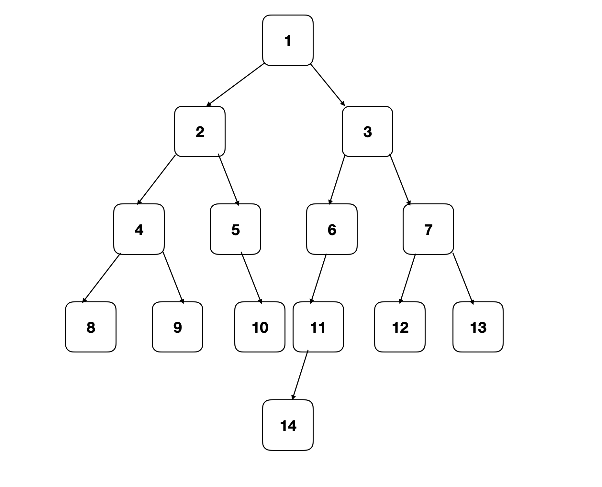
> 输出:
> 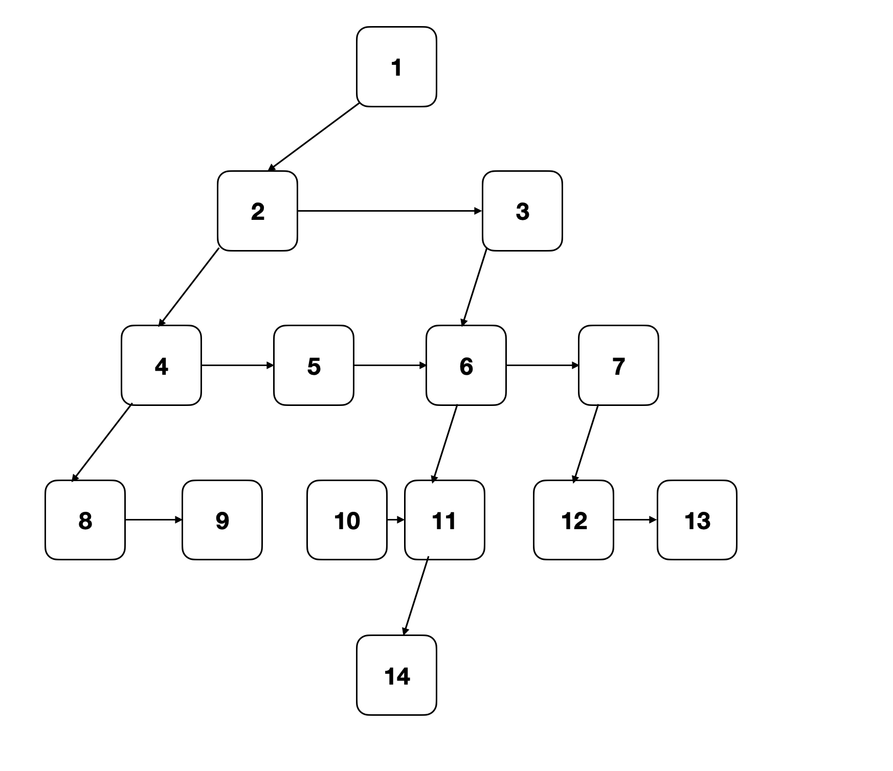

### 思路分析

LCRS树（left-child right-sibling binary tree，左孩子右兄弟树）是n叉树的一种表现方式，每个节点包含两根指针，但是拥有多个子节点。结构与普通二叉树相同，每个节点包含left和right两根指针。不同的是，left指针指向当前节点的第一个子节点，同一层的子节点之间通过right指针相连。

所以以下两种n叉树是等价的：
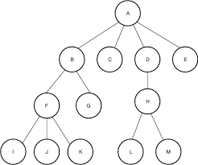
LCRS表示法：
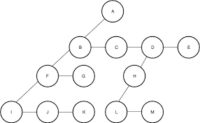
*图片来源geeksforgeeks*

本题要求我们将一棵二叉树转化成right-sibling表示法（不完全的LCRS树）。根据定义我们可以保持left指针不变，但是right指针需要指向同级的右侧节点。需要注意的是，right指针指向同级的右侧节点，如果当前节点右侧位置是null，那么right指向null（而第三题的解法会指向下一个有效节点）。所以我们需要对第三题的解法做出进一步修改。

之前的解法中，我们一直在使用ArrayDeque，因为ArrayDeque效率更高。但是ArrayDeque有一个缺点，就是ArrayDeque不能接受一个null对象。在这题中，我们使用LinkedList代替ArrayDeque，LinkedList可以接受null对象。这样如果当前节点右侧位置是null，那么right指针指向队列的下一个节点时可以直接得到null对象。

### 代码实现

```java
public TreeNode rightSiblingTree(TreeNode root) {
    if (root == null)	return null;

    Queue<TreeNode> queue = new LinkedList<>(); // 使用LinkedList代替ArrayDeque
    queue.offer(root);

    while (!queue.isEmpty()) {
        int size = queue.size();
        for (int i = 0; i < size; i++) {
            TreeNode curt = queue.poll();
            if (curt == null) continue; // 在获取节点时，检查是否为null
            queue.offer(curt.left); // 直接加入左右节点
            queue.offer(curt.right); // 左右节点可能为null
            curt.right = i != size - 1 ? queue.peek() : null; // 最右侧节点的right直接指向null
        }
    }

    return root;
}
```

### 分析
时间复杂度O(n)，空间复杂度O(n)

## 总结

这节课我们学习了二叉树的经典考察模板BFS遍历在面试题中的应用。下节课我们来看看大厂面试中出现过的二叉树面试题。

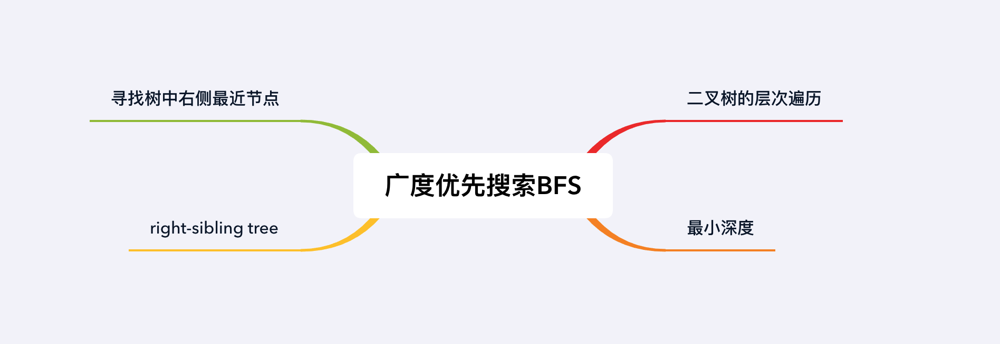

## 习题

1. 给定一棵二叉树，按照锯齿形层次遍历（先从左往右，下一层再从右往左，层与层之间交替进行），返回所有节点值
2. 给定一棵二叉树，以列表的形式返回每层的平均值。
3. 给定一棵二叉树，以列表的形式返回每层的最大值。
4. 给定一棵二叉树，从右向左看，返回从右侧所能看到的节点值（按照从顶部到底部的顺序）
5. 给定一棵二叉树，找到这棵树最中最后一行中最左边的值
6. 给定一棵二叉树，每个节点拥有一个额外的next指针，初始时next指针指向null。将next指针指向每个节点右侧的下一个节点。