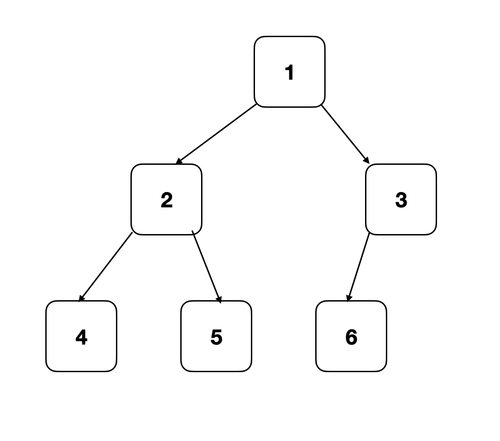
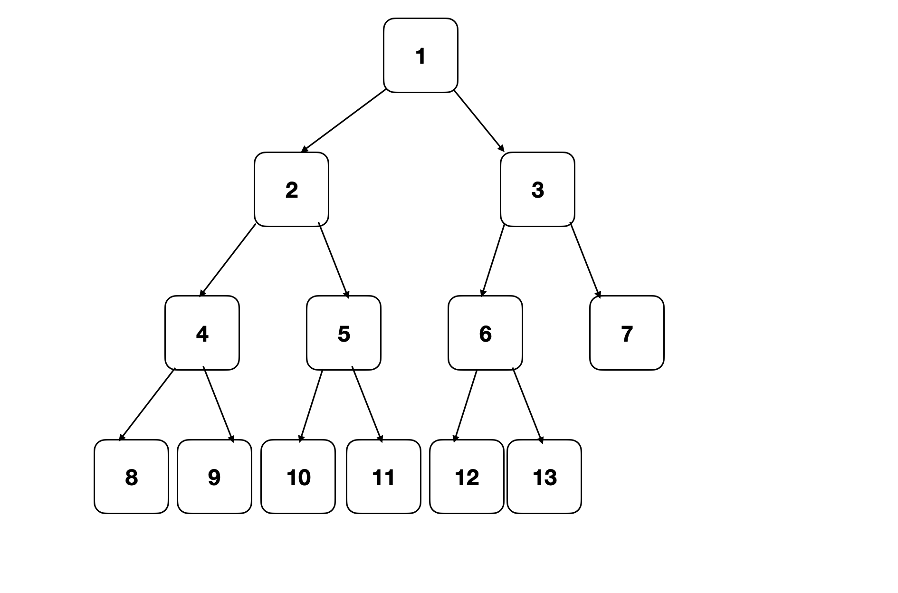
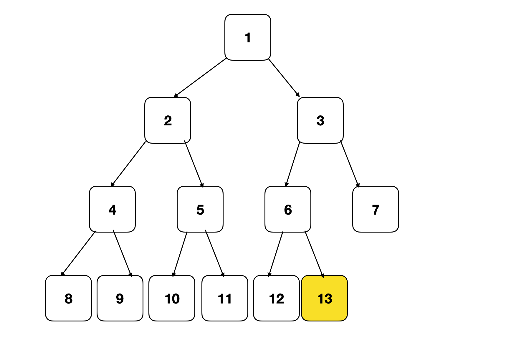
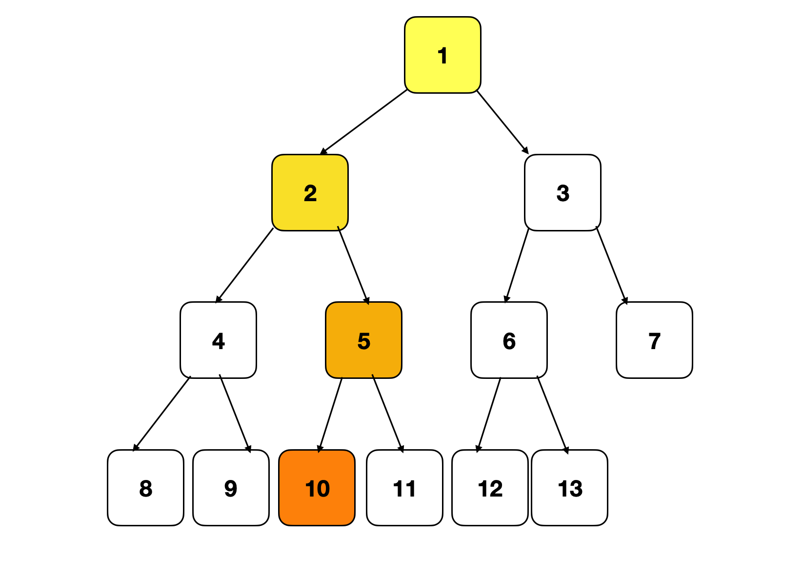
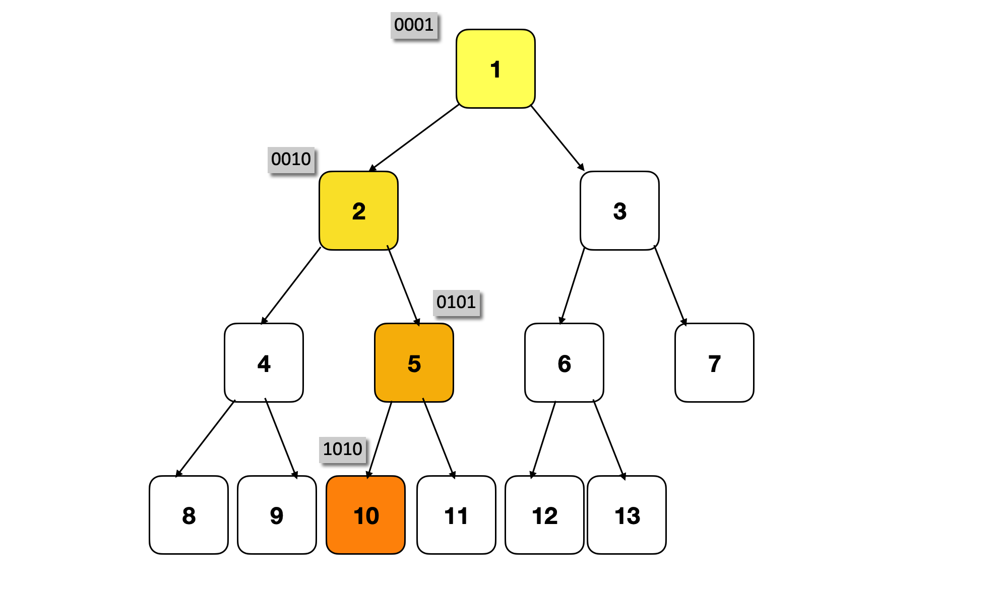
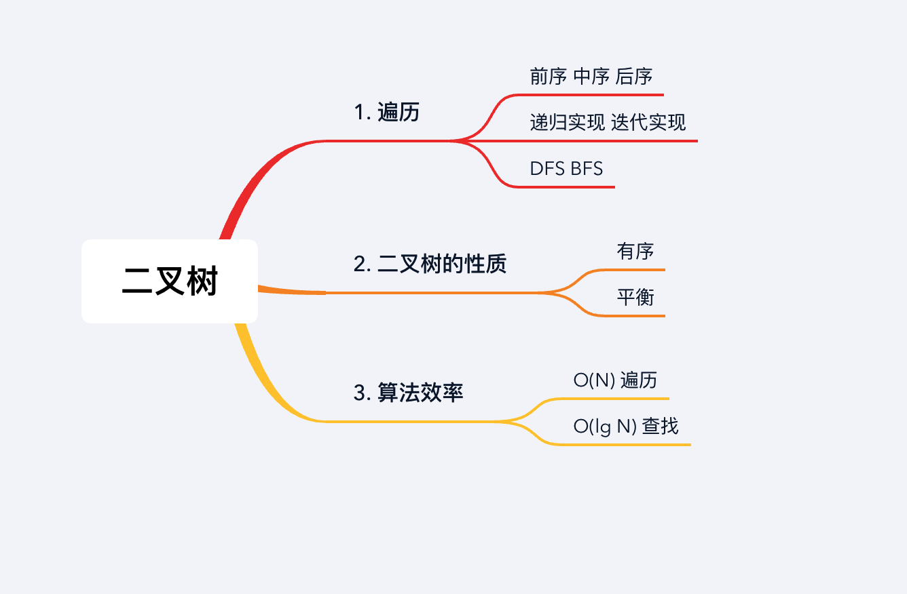

## 章节导读

之前我们已经学习了二叉树的结构和常用的面试技巧——递归、BFS、DFS。这节课我们来看看2018年谷歌面试中出现过的一道二叉树面试题。

## 1.案例: 统计完全二叉树的节点数

> 给定一棵完全二叉树，计算它的节点数。
>
> 输入:
> 
> 输出: 6

### 思路分析

完全二叉树是一种常考的数据结构，在一般二叉树的基础上要求每一层从左到右都需要填满，不能有空缺，最后一行可以在右侧有空缺。下图就是一棵完全二叉树



对于二叉树的面试题，通用的思路包含了三个步骤。

1. 是否需要遍历整棵树
2. 是否利用二叉树的性质（树是否平衡、左右子树是否有大小上的相关性、父节点与子节点有没有额外的关系）
3. 这些可以利用的性质中，有哪些可以帮我们得到更快的算法

对于本题，我们首先要做的是分析：哪些条件以及明确给出，哪些条件过于模糊需要与面试官讨论。比如：

1. 树与节点的具体定义是什么样的
2. 树的大小有多大范围
3. 整棵树是否可以被载入内存
4. 节点上的数字是已经给出，还是需要自己计算
5. ......

询问面试官后，我们至少可以得到以下信息：

1. 整棵树可以在内存中处理
2. 每个节点上的数字可以用`Integer number`表示
3. 该数字是一个虚拟的标签，并不是节点的一部分
4. ……

再结合上面提到的二叉树三步思路，我们可以首先抛出一个暴力解来与面试官沟通

### 解法1

将整棵树遍历一遍，经过所有节点，挨个统计，最后返回所有节点的个数。

```java
class Solution {
  public int countNodes(TreeNode root) {
    if (root == null) return 0;
    return countNodes(root.right) + countNodes(root.left) + 1;
  }
}
```

这种方法最简单粗暴，易于实现，时间消耗O(N)。从面试官的角度，如果这道题只做到这一步，只能收获`lean no hire`的评价。

> 谷歌的评价标准分为六个等级，按照面试者的水平：
strongly no hire < no hire < lean no hire < lean hire < hire < strongly hire
一般而言，只有在多轮面试中都拿到hire的面试者，才有机会被送到hiring committee, 由更高一级的委员会来评价

上面这种解法既没有利用好二叉树的性质，也没有将标签上的数字利用上

### 解法2

第二种解法，利用了完全二叉树的定义，即每一层一定是从左到右填满的。



比如图中，第四层只有左侧是填满的，最后一个数字13正是树的节点数。这样我们就将判断树的节点个数，等价成了寻找最大编号节点的问题。

我们可以用尝试用自然语言描述这样一个算法：首先，将从节点到树根的距离定义为深度。接下来利用二分法找到最后一个深度为4的节点，即为最大编号节点。

1. 从树根开始，先沿着左分支一直到叶子节点（8），得到最大深度4。
2. 从根节点的右节点3开始，沿着左分支到达12，同样最大深度为4。这说明最大编号节点大于等于12
3. 从3的右节点7开始继续沿左分支到达叶子节点（7），最大深度为3，说明最大编号小于（14）
……

使用二分法在每个分支依次寻找叶子节点，并比较最大深度，经过 logN 次寻找， 得到最大编号即为树的结点数。每次寻找需要经过 logN 个节点，时间复杂度为log<sup>2</sup>N。

这种方法利用了二叉树的性质，优化了查找速度。如果能够在规定时间内实现，面试官应该给出`hire`的评价。缺点是这种方法实现复杂，容易出bug。对于立志于进入大厂的同学，不应满足于一个能用的解法，我们需要更进一步追求`strongly hire`的评级。

### 解法3

第三种方法在解法2基础上进行了优化，同样利用了二分法。解法3和解法2在实现上是等价的，只不过由于解题的方向不同，解法3比解法2更容易实现。

首先，解法3需要一个辅助函数来判断某个编号是否存在于树中



比如我们想知道图中的树是否包含节点10。

根据这棵树的性质，父节点的编号等于子节点编号除以2。如果存在节点10，那么它与根节点的路径应该是`10 - 5 - 2 - 1`

```java
List<Integer> findPath(int num) {
    ArrayList<Integer> path = new ArrayList<>();
    while (num != 0) {
        path.add(num);
        num /= 2; // 每次用子节点编号除以2，获得父节点编号
    }
    Collections.reverse(path);
    return path;
}
```

我们可以从根节点出发，按照`1 -> 2 -> 5 -> 10`的顺序去判断每个节点是否存在，如果全部存在，那么这棵树包含节点10。反之，节点10并不存在。

```java
public boolean exist(TreeNode root, int num) {
    List<Integer> path = findPath(num);

    for (int i = 1; i < path.size(); i++) {
        if (root == null)
            return false;
        // 根据子节点编号和父节点编号的关系，判断分支的左右关系
        root = path.get(i) % 2 == 0 ? root.left : root.right;
    }
    return root != null;
}
```

PS. 这个辅助函数是可以优化的. `1 -> 2 -> 5 -> 10`的路径上，对分支选择仅仅依赖于数字的奇偶性，而非具体数值，三次选择依次为`左右左`。



我们可以利用目标节点10的二进制表达`1010`，来省略预计算路径的步骤，甚至将这一步的计算近似看成`O(1)`操作。

算法上，我们将第1个bit略过，第2个bit开始`0`代表`左`、`1`代表`右`。比如节点10(`1010`)，去掉第1个bit得到`010`， 对应`左右左`

```java
boolean exist(TreeNode root, int num) {
    for (int pivot = Integer.highestOneBit(num) / 2; pivot != 0; pivot /= 2) {
        if (root == null)
            return false;

        root = (num & pivot) == 0 ? root.left : root.right;
    }
    return root != null;
}
```

有了辅助函数exist之后，接下来我们的问题就可以等加成，在一个给定的连续范围`1 ~ N`中，判断N的具体值。因为`1 ~ N`是一个连续的范围，所以我们可以利用二分法来查找（我们会在之后的章节里详细介绍二分法的模板写法）:

```java
public int countNodes(TreeNode root) {
    int max = 1;
    while (exist(root, max)) {
        max *= 2; // 找到N的上限
    }
    int min = 1;
    while (min + 1 < max) { // 利用二分法模板，在min ~ max之间寻找N
        int mid = min + (max - min) / 2;
        if (exist(root, mid)) {
            min = mid;
        } else {
            max = mid;
        }
    }
    return exist(root, max) ? max : min;
}
```

### 总结

本章我们通过一道经典面试题，实践了二叉树考题的三步解题思路。对于这类经验性的题目，最好的方法就是不断练习。建议使用Leetcode 270， 958 作为课后习题



## 习题

1. 给定一棵二叉树，判断它是不是一颗完全二叉树
