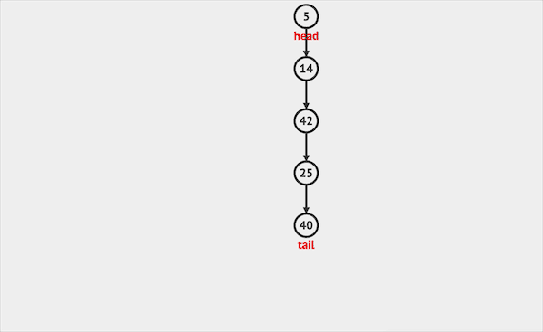
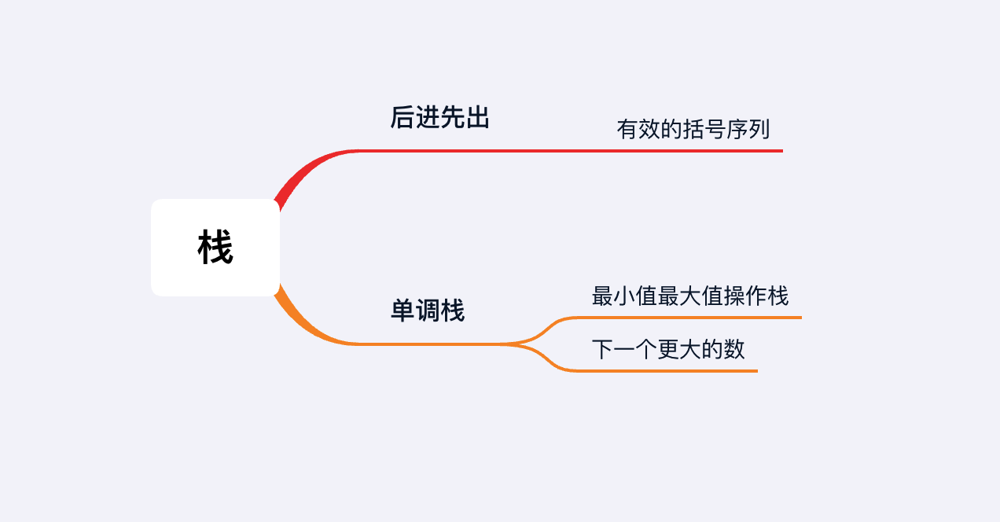

## 章节导读

本章我们来学习三种队列类的数据结构：Stack栈、Queue队列、Heap堆。这三种结构的相关性并不体现在代码上，而体现在逻辑层面和使用层面。他们都可以加入一个元素，移除一个元素，访问但不删除下一个元素。简单来说，Stack、Queue、Heap可以被看做三种不同的队列：Stack是后进先出队列，Queue是先进先出队列，Heap是按照优先级排列的队列。（这里为了避免队列这个词出现歧义，我用Queue表示先进先出的数据结构，用队列表示数据加入/删除的顺序结合）

这三种结构经常被拿来作比较，通常在教科书中会被看做三个不同的考点。但是在面试时，这三种结构可以被放在图论这个大类下，在某些情况下甚至可以出现在同一题里。Stack栈、Queue队列、Heap堆是必须要掌握的数据结构。

## 基础知识——栈

Stack 栈可以看做是一种特殊的线性表，所有的操作（访问、插入、删除）只能在栈顶进行，按照后进先出（LIFO, Last In First Out）的顺序运作。所以使用ArrayList实现栈比使用LinkedList实现更加高效。在Java中，Stack的实现是基于Vector类，而Vector类的写法类似于ArrayList。

Stack的主要API有三个：push插入, pop删除, peek访问。

1. push只能将元素插入栈顶。



*图片由visualgo制作*

2. pop只能将栈顶元素移除。


*图片由visualgo制作*

3. peek访问返回栈顶元素，但是不删除。

## 1.案例: 有效的括号序列

> 给定一个字符串所表示的括号序列，包含以下字符： '(', ')', '{', '}', '[' , ']'，判定是否是有效的括号序列。括号必须依照"()"顺序表示，"()[]{}"是有效的括号，"([)]"是无效的括号。
>
> 输入:string = "([])(){}(())()()"
> 输出: true

### 思路分析

这道题是Stack的基础运用。输入是一个string，在本题中它相当于一个char数组。输入的范围仅包括有效的括号字符: ( , ) , { , } , [ , ] . 为了判断输入的括号序列是否有效，我们需要确保每一个开括号都对应一个闭括号，并且开括号的顺序和闭括号的顺序相反。

因此我们需要遍历每个字符，如果遇到的是开括号 ( , { , [ ，那么我们将它压栈。如果我们遇到的是闭括号 ) , } , ] ，那么我们需要与前一个开括号进行比较，确保他们成对。对于成功配对的括号，我们可以将他们从栈中删除。否则说明收到的序列不是有效括号序列。


最后如果栈中没有额外的括号留下，那么整个序列是有效括号序列。

### 代码实现

```java
public boolean isValid(String s) {
    // 创建一个栈
    Stack<Character> stack = new Stack<>();
    // 遍历每一个字符
    for (char c : s.toCharArray()) {
        // 如果遇到的是开括号，将它压栈
        if (c == '(' || c == '[' || c == '{') {
            stack.push(c);
        }
        // 如果遇到的是闭括号 ，需要与前一个开括号进行比较，确保成对
        if (c == ')' || c == ']' || c == '}') {
            // 确保存在至少一个开括号
            // 并且该开括号与当前闭括号成对
            // 这里我们利用他们在ASCII码中的位置，快速判断是否成对
            if (stack.isEmpty() || Math.abs(stack.pop() - c) > 2) {
                return false;
            }
        }
    }
    // 如果栈中没有额外的括号留下，那么是有效括号序列。
    return stack.isEmpty();
}
```

### 分析
时间复杂度O(n)，空间复杂度O(n)。我们需要遍历整个输入的string，并且最差情况下需要将所有字符存在栈中。

## 核心算法——单调栈

Monotone Stack 单调栈，栈内元素都是单调递增或者单调递减的，有时候甚至是严格的单调递增或递减。从单调栈中获取元素，元素满足单调性。单调栈是Stack类考题中最常出现的解题技巧。

## 2.案例: 最小值最大值操作栈

> 实现一个栈，要求 O(1) 开销, 支持以下操作:
> + push(val) 将 val 压入栈
> + pop() 将栈顶元素弹出, 并返回这个弹出的元素
> + peek() 获得栈顶元素
> + getMin() —— 获得栈中的最小元素。
> + getMax() —— 获得栈中的最大元素。
>
> Sample:
> MinMaxStack(): -
> push(5): -
> getMin(): 5
> getMax(): 5
> peek(): 5
> push(7): -
> getMin(): 5
> getMax(): 7
> peek(): 7
> push(2): -
> getMin(): 2
> getMax(): 7
> peek(): 2
> pop(): 2
> pop(): 7
> getMin(): 5
> getMax(): 5
> peek(): 5

### 思路分析1

本题是单调栈的经典题型，要求我们实现的栈可以直接读取最大/最小元素。实际上，题目的含义是要求我们实现一个Stack用三个Stack的功能：正常Stack + 单调增Stack + 单调减Stack。

我们可以直接顺着这个思路来解题，初始化三个Stack：一个普通Stack + 两个单调栈（一个维护升序，一个维护降序）。单调升序栈每次只加入比上一个元素更大的元素，单调降序栈每次只加入比上一个元素更小的元素。peek(), getMin(), getMax()分别从三个栈获取栈顶元素。每次push一个新元素入栈时：

+ 普通stack直接压栈
+ 单调升序栈将当前元素与上一个元素相比较，如果当前元素更大则压栈当前元素，否则复制一份前一个元素
+ 单调降序栈将当前元素与上一个元素相比较，如果当前元素更小则压栈当前元素，否则复制一份前一个元素

对于本题而言，单调序列和严格单调序列都可以完成解题，相比之下，非严格单调序列的实现更加简单易懂。


### 代码实现1

```java
class MinMaxStack {
    // 初始化三个Stack：一个普通Stack + 两个单调栈
    private Stack<Integer> stack = new Stack<>();
    private Stack<Integer> min = new Stack<>();
    private Stack<Integer> max = new Stack<>();

    public int peek() { // 从普通栈获取栈顶元素
        return stack.peek();
    }

    public int pop() {
        int x = stack.pop();
        min.pop();
        max.pop();
        return x;
    }

    public void push(Integer x) {
        // 单调降序栈：如果当前元素更小则压栈当前元素，否则复制前一个元素
        min.push(stack.isEmpty() ? x : Math.min(x, min.peek()));
        // 单调升序栈：如果当前元素更大则压栈当前元素，否则复制前一个元素
        max.push(stack.isEmpty() ? x : Math.max(x, max.peek()));
        // 普通stack直接压栈
        stack.push(x);
    }

    public int getMin() { // 从降序栈获取栈顶元素
        return min.peek();
    }

    public int getMax() { // 从升序栈获取栈顶元素
        return max.peek();
    }
}
```

### 思路分析2

解法1存在一个缺陷：随着要求保存的特性越多，需要同时维护的栈越多。本题中只要求增加了获取最大/最小值的操作，我们额外多维护了两个栈。如果题目中加入更多要求：增加获取当前平均值的函数getMean(), 获取当前第三大的值get3rdMax()...这样我们需要同时维护更多的栈。

一个应对的解决方法是只是用一个栈，但是这个栈并不保存数据本身，而是保存一个对象。该对象包含了我们所有需要的特性。一个取巧的方法是使用数组，数组第1位保存当前数值，第2位保存当前最小值，第3位保存当前最大值。我们可以根据需求修改数组，并且只需要维护一个栈。

### 代码实现2

```java
class MinMaxStack {
    // 初始化一个栈
    private Stack<int[]> stack = new Stack<>();

    public int peek() {
        // 数组第1位保存当前数值
        return stack.peek()[0];
    }

    public int pop() {
        return stack.pop()[0];
    }

    public void push(Integer x) {
        if (stack.isEmpty()) {
            stack.push(new int[]{x, x, x});
            return;
        }

        int[] curt = stack.peek();
        // 在压栈时和前一位数值进行比较，构造新的数据对象
        stack.push(new int[]{x, Math.min(x, curt[1]), Math.max(x, curt[2])});
    }

    public int getMin() {
        // 数组第2位保存当前最小值
        return stack.peek()[1];
    }

    public int getMax() {
        // 数组第3位保存当前最大
        return stack.peek()[2];
    }
}
```
### 分析
时间复杂度O(1)，空间复杂度O(1)。每一步操作消耗的时间和空间在数量级上与单个Stack操作一致。

## 3.案例: 下一个更大的数

> 有两个数组 nums1和nums2（互不重复），其中nums1是nums2的子集。 在nums2的相应位置找到nums1所有元素的下一个更大数字。nums1中的数字x的下一个更大数字是nums2中x右边第一个更大的数字。 如果它不存在，则为此数字输出-1。
>
> 输入: nums1 = [4,1,3], nums2 = [1,3,4,2]
> 输出: [-1,3,4]

### 思路分析

本题依旧是单调栈的运用。给定的是一组输入nums1和一组数据集合nums2。要求在nums2中找到每个数字的下一个更大的数，然后按照nums1的顺序输出。

因此我们先针对nums2，利用单调栈来建立每个数字和它下一个更大数的对应关系。再按照nums1的数字输出最终结果。寻找数字x的下一个更大数y，等价于寻找y的前一个稍小的数x。而前一个稍小的数x，其实是在y出现之前的最大值。有了这层对应关系，我们就可以利用之前我们学的单调栈的实现方法。

1. 初始化一个Stack作为单调栈。
2. 遍历nums2，对于每个数字
2.1. 如果栈顶数字小于当前数字，则当前数字是栈顶数字的下一个更大数。
2.2. 弹出栈顶数字，利用map保存对应关系。跳转到步骤2.1
2.3. 如果栈顶数字大于当前数字，压栈，维护单调性
3. 遍历nums1，对于每个数字，在map中寻找对应的下一个更大数，如果不存在则返回-1.

### 代码实现

```java
public int[] nextGreaterElement(int[] nums1, int[] nums2) {
    HashMap<Integer, Integer> map = new HashMap<>();
    // 初始化一个Stack作为单调栈。
    Stack<Integer> stack = new Stack<>();

    for (int n : nums2) { // 遍历nums2
        while (!stack.isEmpty() && n > stack.peek()) // 如果栈顶数字小于当前数字
            map.put(stack.pop(), n); // 弹出栈顶数字，利用map保存对应关系
        stack.push(n); // 如果栈顶数字大于当前数字，压栈
    }
    int[] ans = new int[nums1.length];
    for (int i = 0; i < nums1.length; i++) // 遍历nums1
        ans[i] = map.getOrDefault(nums1[i], -1); // 在map中寻找对应的下一个更大数，不存在则返回-1
    return ans;
}
```

### 分析
时间复杂度O(n)，空间复杂度O(n)

## 总结

这节课我们学习了经典的Stack结构和常见考点单调栈在面试题中的应用。下节课将对比队列与栈的考题。



## 习题

1. 最小值操作栈：实现一个栈，要求 O(1) 开销, 支持以下操作:
+ push(val) 将 val 压入栈
+ pop() 将栈顶元素弹出, 并返回这个弹出的元素
+ peek() 获得栈顶元素
+ getMin() —— 获得栈中的最小元素。

2. 下一个更大的数2：给出一个循环数组，找到每个元素的下一个更大的数。 如果它不存在，则为此数字输出-1。
