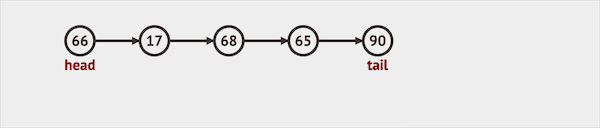

## 章节导读

上一节我们学习了经典的Stack栈结构和常见考点单调栈，本节课我们来学习Queue队列。

相比于Stack，Queue其实只是逻辑上存在的数据结构，单纯地实现Queue意义不大。（大家有时间可以自己试着实现以下，最终应该会写成LinkedList的等价形式。）Queue的行为其实完全可以用LinkedList来代替，Java中也是这么做的，使用LinkedList实现了Queue的接口。

```java
Queue queue = new LinkedList();
```

那么Queue类的问题到底是在考察什么呢？答案是数据顺序。更进一步说，是后进先出LIFO和先进先出FIFO两种顺序的正确选择。

## 基础知识——队列

Queue 队列也可以看做是一种特殊的线性表，元素只能从队列尾部插入，从队列头部访问、删除，按照先进先出（FIFO, First In First Out）的顺序运作。所以使用LinkedList实现队列比使用ArrayList实现更加高效。在Java中，没有提供默认的Queue的实现，仅提供了Queue的接口。常用的两种Queue的实现类为ArrayDeque和LinkedList。ArrayDeque使用了动态循环数组，并且实现了Deque双端队列的API，在多数场景下更加高效。

Queue的主要API有三个：offer插入, poll删除, peek访问。

1. offer只能将元素插入队列尾部。



*图片由visualgo制作*

2. poll只能将元素从队列头部移除。


*图片由visualgo制作*

3. peek访问返回队列头部元素，但是不删除。

## 1.案例: 用栈实现队列

> 使用两个栈实现先入先出队列。队列应当支持一般队列支持的所有操作。

### 思路分析

题目的本意是要求我们用LIFO序列模拟FIFO序列，并且在题干中给出了提示：用两个Stack模拟一个Queue。Queue的操作只有三个：加入、移除、访问。

我们利用两个Stack：一个负责加入元素，一个负责移除元素。每次push时，直接向in中加入元素。pop或者peek时，先查看out中是否有缓存好的元素，如果已经存在元素，那么直接返回out的栈顶元素。如果没有，那么将in中的元素弹出加入out，直到in为空为止。比如数字按1，2，3的顺序加入in；当in弹出元素加入out时，顺序会变成3，2，1；当out再弹出元素时，顺序会回复成1，2，3，满足FIFO的顺序。

### 代码实现

```java
class MyQueue {
    private Stack<Integer> in, out;
    public MyQueue() {
        in = new Stack<>(); // in负责加入元素
        out = new Stack<>(); // out负责弹出元素
    }

    public void push(int x) {
        in.push(x); // push时，直接向in中加入元素
    }

    public int pop() {
        peek(); // 确保out中存在缓存好的元素
        return out.pop();
    }

    public int peek() {
        if (out.isEmpty()) // 先查看out中是否有缓存好的元素，
            while (!in.isEmpty()) // 将in中的元素弹出加入out，直到in为空为止
                out.push(in.pop());
        return out.peek(); // 返回out的栈顶元素
    }

    public boolean empty() {
        return in.isEmpty() && out.isEmpty();
    }
}
```

## 2.案例: 用队列实现栈

> 使用两个队列实现后入先出栈。栈应当支持一般栈支持的所有操作。

### 思路分析

本题与上一题相反，要求我们用FIFO序列模拟LIFO序列，并且提示：用两个Queue模拟一个Stack。Stack的操作同样只有三个：加入、移除、访问。

我们需要利用两个Queue。每次加入的时候，把元素插入到queue的头部，那么也就形成了类似栈的出入顺序:

1. 创建一个临时队列temp，将原来queue里的元素移入temp（queue被清空）
2. 将新的元素加入queue（此时queue中只有这一个元素，并且排在第一位）
3. 等新元素进入queue之后，再将之前temp中的元素加入queue，排在新元素后面

移除元素时，直接从queue的头部移除。

### 代码实现

```java
class MyStack {
    Queue<Integer> queue;

    public MyStack() {
        queue = new LinkedList<>();
    }

    public void push(int x) {
        // 创建一个临时队列temp，将原来queue里的元素移入temp（queue被清空）
        Queue<Integer> temp = queue;
        queue = new LinkedList<>();

        // 将新的元素加入queue
        queue.offer(x);

        // 等新元素进入queue之后，再将之前temp中的元素加入queue，排在新元素后面
        while (!temp.isEmpty()) {
            queue.offer(temp.poll());
        }
    }

    public int pop() {
        // 直接从queue的头部移除
        return queue.poll();
    }

    public int top() {
        // 直接从queue的头部获取
        return queue.peek();
    }

    public boolean empty() {
        return queue.isEmpty();
    }
}
```

## 核心算法——双端队列

Deque 双端队列（全名double-ended queue）是一种同时具有Queue和Stack性质的数据类型。双端队列中的元素可以从两端弹出，插入和删除。Java中提供了LinkedList和ArrayDeque两种实现，推荐使用ArrayDeque。Deque是Queue类考题中最常出现的解题技巧。

Java中将一端定义为First，一端定义为Last。Deque提供addFirst, addLast, removeFirst, removeLast, getFirst, getLast 六种基础API。(注意不要Last-In-First-Out序列，First-In-First-Out序列的概念混淆）。基于基础API，Deque同时支持offer/poll/push/pop/peek 这两套操作。

## 3.案例: 数据流滑动窗口平均值

> 给出一串整数流和窗口大小，计算滑动窗口中所有整数的平均值。

### 思路分析

题目要求我们对数据流上一个固定大小的区间进行计算，这种计算模型叫做滑动窗口。滑动窗口是经典考察模板之一，我们在之后会详细论述。对于这题而言，我们需要一个数据结构来保存这段区间，并且不断关系区间里的数据：按照FIFO的顺序，弹出旧数据，加入新数据。同时由于本题给定了固定的窗口大小，所以最好的方法是使用循环数组来实现Queue。在Java中ArrayDeque正是用循环数组实现的。

我们使用一个额外的sum字段记录当前区间内的数字和。每当新的数字加入，除了从queue中弹出旧数据，加入新数据，我们还需要在sum上减去旧数据，加入新数据。最后用sum除以queue的大小，得到当前的平均值。

### 代码实现

```java
class MovingAverage {
    Deque<Integer> queue;
    int size;
    double sum;

    public MovingAverage(int size) {
        queue = new ArrayDeque<>(); // 初始化一个队列
        this.size = size;
        sum = 0;
    }

    public double next(int val) {
        queue.offer(val); // 加入新数据
        sum += val; // 加入新数据
        if (queue.size() > size) { // 如果当前队列的大小，超出窗口大小
            sum -= queue.poll(); // 弹出旧数据，并从sum减去旧数据
        }
        return sum / queue.size(); // 用sum除以queue的大小，得到当前的平均值
    }
}
```


### 分析
时间复杂度O(1)，空间复杂度O(n)

## 4.案例: 简化路径

> 给定一个文件的绝对路径(Unix-style)，请进行路径简化。Unix中, . 表示当前目录, .. 表示父目录。结果必须以 / 开头，并且两个目录名之间有且只有一个 /。最后一个目录名(如果存在)后不能出现 / 。你需要保证结果是正确表示路径的最短的字符串。
>
> 输入: path = "/foo/../test/../test/../foo//bar/./baz"
> 输出: "/foo/bar/baz"

### 思路分析

对于这道题，一个直观的想法是利用栈处理。首先将原字符串以'/'分隔, 然后遍历：

+ 遇到正常的目录名, 那么执行压栈
+ 遇到 '.' 或空名称 (对应 "//") ，那么忽略
+ 遇到 ".." ，则从栈顶弹出一个元素
  + 如果栈为空，则忽略不弹栈 (对应 "/../")
+ 最后将栈中的元素以 '/' 连接得到结果

但是在最后一步连接栈中元素时，会出现一个问题：从栈中弹出的元素时反序。直接使用stack的话，我们需要先缓存弹出的序列，然后翻转，最后连接。

对应的解决方案有三种：
1. 使用list，并且每次只在尾端操作，来代替stack的功能
2. 利用stack的父类vector的API，通过迭代器在stack上做正序访问
3. 使用deque代替stack

这三种方法对应着三种数据结构，但是在逻辑层面是一样的：我们需要一个数据结构，能够在处理原字符串时遵循LIFO顺序，在最后拼接字符串时遵循FIFO顺序。所以选择方法3是最正确的方式（方法1和2同样可行，但是可读性不如方法3）。

### 代码实现

```java
public String simplifyPath(String path) {
    String[] dirs = path.split("/"); // 将原字符串以'/'分隔
    Deque<String> deque = new ArrayDeque<>(); // 使用deque代替stack
    for (String dir: dirs) {
        switch (dir) {
            // 遇到'.'或空名称，忽略
            case ".":
            case "":
                continue;
            // 遇到 ".."
            case "..":
                if (!deque.isEmpty()) {
                    deque.removeLast(); // 从栈顶弹出一个元素
                }
                // 如果栈为空，则忽略
                continue;
            default:
                deque.addLast(dir); // 遇到正常的目录名, 压栈
        }
    }
    StringBuilder builder = new StringBuilder();
    while (!deque.isEmpty())
        builder.append("/").append(deque.removeFirst()); // 拼接字符串时遵循FIFO顺序
    // 对于空路径返回/，其余返回拼接好的路径
    return builder.length() == 0 ? "/" : builder.toString();
}
```

### 分析
时间复杂度O(n)，空间复杂度O(n)

## 总结

这节课我们学习了Queue队列和Deque双端队列在面试题中的应用。Queue类题目在面试中出现频率并不高，大多数时候是作为Stack的补充考题出现。


