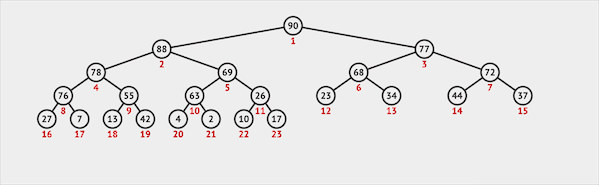
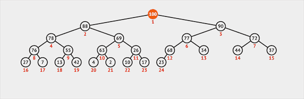
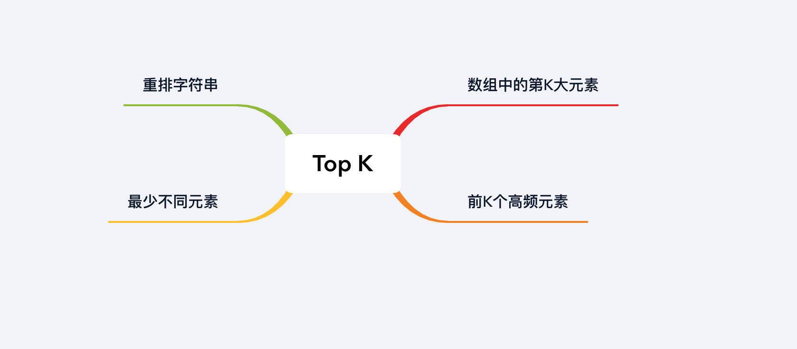

## 章节导读

之前我们学习了Stack栈和Queue队列的考点，以及衍生的单调栈和双端队列。本节我们学习优先队列。

优先队列遵循Queue队列的API，也提供poll/offer/peek等操作。优先队列结构复杂，相关考题难度都很高。通常面试官会考察优先队列的应用技巧。大部分编程语言会内置一种优先队列的实现方式，读者至少需要熟悉自己常用语言中的优先队列API接口、返回类型、实现方式和操作复杂度。

## 基础知识——优先队列

普通的队列是一种先进先出的数据结构，元素从队列尾部插入，从队列头部删除。PriorityQueue 优先队列中，元素除了插入的顺序之外，还被赋予了优先级。优先级最高的元素最先得到服务；优先级相同的元素按照其在优先队列中的顺序得到服务（访问/删除时具有最高优先级的元素最先被访问/删除）。优先队列往往用堆来实现。

## 基础知识——二叉堆
优先队列有多种实现方式，Java中实现优先队列的方式是binary heap 二叉堆。它具有两个重要的性质：

1. 是一棵完全二叉树。除了最底层，其他层的节点都被元素填满，且最底层尽可能地从左到右填入。
2. 堆序性：任意节点大于或等于它的任意子节点，最小元在堆的根上

Java中默认创建的堆叫做最小堆，它的堆序性要求根节点最小。通过改变比较顺序，我们可以创建最大堆，要求根节点最大。此时第2条会变成：任意节点小于或等于它的任意子节点，最大元在堆的根上。

### 堆化

在一个给定集合上创建二叉堆的过程叫做堆化，可以在O(n)时间内完成。初始的堆默认为乱序，每个节点通过下沉的方式与子节点交换位置维护堆序性。


*图片由visualgo制作*

### 插入

在二叉堆中插入一个节点需要两步：

1. 将新节点插入二叉堆的最末
2. 新节点通过上浮的方式与父节点交换位置维护堆序性


*图片由visualgo制作*

### 删除

二叉堆只能从堆顶删除元素(类似于Queue):

1. 从堆顶删除元素
2. 将最末位的元素交换到堆顶的位置
3. 堆顶（根节点）通过下沉的方式与子节点交换位置维护堆序性



## 核心算法——Top K

Top K 问题在题干中会有明显的提示：找到（最大/最小/最高品）K个元素。这类问题的最简单解法都是构造一个大小为K的堆结构。在Java中没有直接提供Heap这种数据结构，而是实现了一个原理为二叉堆的PriorityQueue优先队列。一般而言，当我们不需要对堆的结构做过多追究时，我们可以将PriorityQueue优先队列和Heap堆看做同一种东西。

## 1.案例: 数组中的第K大元素

> 在一个未排序的数组中，找到第K大的元素
>
> 输入: [3,2,1,5,6,4], k = 3
> 输出: 4

### 思路分析

本题代表了优先队列的基本应用。题目要求我们从数组中找出第K大元素，最简单的做法是将原数组按降序排序，然后返回第k位的值。显然这种做法有两个问题：
1. 过度依赖排序算法
2. 排序会破坏输入数组原有的顺序。

比较适合的方法是使用优先队列。维护一个最小堆，遍历每个数字，加入堆中。如果堆的大小超过k，那么弹出最小元素，保证堆大小不超过k。遍历完成后，堆里保存着最大的k个数，二叉堆的根即为第K大元素。

### 代码实现

```java
public int findKthLargest(int[] nums, int k) {
    PriorityQueue<Integer> heap = new PriorityQueue<>(); // 维护一个最小堆
    for (int n : nums) { // 遍历每个数字
        heap.offer(n); //加入堆中
        if (heap.size() > k) // 如果堆的大小超过k
            heap.poll(); // 弹出最小元素
    }
    return heap.poll(); // 二叉堆的根即为第K大元素
}
```

### 分析
时间复杂度O(n logk)，空间复杂度O(k). k是堆的大小，每次插入堆的操作消耗O(logk)的时间，一共发生了n次。

有一个比较高效的做法是使用quickselect算法，可以达到时间复杂度O(n)，空间复杂度O(1)。但是这种算法同样有两个问题：

1. 破坏输入数组原有的顺序。
2. 依赖于随机划分。

感兴趣的读者可以当做习题。

## 2.案例: 前K个高频元素

> 给定一个非空的整数数组，返回其中出现频率前k高的元素。
>
> 输入: [1, 3, 5, 12, 11, 12, 11], K = 2
> 输出: [12, 11]

### 思路分析

本题需要找到出现最高频的K个元素，所以我们首先要用一个Map来保存每个数字和频数对应的关系。

有了频数表之后，我们通过维护一个元素数目为k的最小堆，每次都将新元素的频数与堆顶端的元素（堆中频率最小的元素）的频数进行比较，如果新的元素的频数比堆顶端的元素大，则弹出堆顶端的元素，将新的元素添加进堆中。最终，堆中的k个元素即为前k个高频元素。

### 代码实现

```java
public int[] topKFrequent(int[] nums, int k) {
    // 将输入的数组转化成数字到频数的Map
    HashMap<Integer, Integer> count = new HashMap<>();
    for (int n : nums)
        count.put(n, count.getOrDefault(n, 0) + 1);
    // 建立一个最小堆，以出现的频数作为优先级
    PriorityQueue<Integer> heap = new PriorityQueue<>((n1, n2) -> count.get(n1) - count.get(n2));
    for (int n : count.keySet()) {
        heap.offer(n); //加入堆中
        if (heap.size() > k) // 如果堆的大小超过k
            heap.poll(); // 弹出最小元素
    }
    // 堆中的k个元素即为前k个高频元素
    int[] ans = new int[k];
    for (int i = 0; i < k; i++)
        ans[i] = heap.poll();
    return ans;
}
```

### 分析
时间复杂度O(n logk)，空间复杂度O(n)。k是堆的大小，每次插入堆的操作消耗O(logk)的时间，一共发生了n次。

## 3.案例: 最少不同元素

> 给定一个数组nums和一个整数k，我们从nums中移除k个元素，使得剩下的不同元素最少
>
> 输入: [3, 5, 12, 11, 12], K=3
> 输出: 1

### 思路分析

对于本题，我们要想办法将它转化成Top K问题，尝试套用Top K类的模板。要在移除k个可重复元素之后，剩下的不同元素最少。说明我们要在k次删除机会中，尽可能多的删除元素，所以我们要从出现频数最少的数字开始。因此本题等价于找到移除频数最少的n个数字，这n个数字的总频数不超过k。具体算法为：

1. 将输入的数组转化成数字到频数的Map
2. 建立一个最小堆，将不同的数字加入堆中，并以出现的频数作为优先级
3. 我们在每一步从堆中选取最低频数的数字。为了使剩下的不同元素最少，我们需要尝试将它排除。我们有k次删除的机会，如果某个元素出现了m次，我们可以用k减去m代表将这个元素出现的所有次数都删除。
4. 最后剩下的就是最少不同元素

### 代码实现

```java
public int findLeastNumOfUniqueInts(int[] arr, int k) {
    // 将输入的数组转化成数字到频数的Map
    HashMap<Integer, Integer> count = new HashMap<>();
    for (int n : arr)
        count.put(n, count.getOrDefault(n, 0) + 1);
    // 建立一个最小堆，以出现的频数作为优先级
    PriorityQueue<Integer> heap = new PriorityQueue<>((n1, n2) -> count.get(n1) - count.get(n2));
    // 将数字加入堆中
    heap.addAll(count.keySet());
    // 每一步从堆中选取最低频数的数字，尝试将它排除
    while (!heap.isEmpty() && k >= count.get(heap.peek()))
        k -= count.get(heap.poll());
    // 最后剩下的就是最少不同元素
    return heap.size();
}
```

### 分析
时间复杂度O(n logn)，空间复杂度O(n)。每次插入堆的操作消耗O(logn)的时间，一共发生了n次。

## 4.案例: 重排字符串

> 给定一个字符串S，判断是否能重排，使得相同的字符不相邻。
>
> 输入: aappp
> 输出: papap

### 思路分析

本题需要我们将已有的字符串重排成为新的字符串，我们可以利用Java提供的StringBuilder来构建新的字符串。我们首先需要统计每个字符出现的频数。根据字符的次数，我们建立一个最大堆。

在每一步拼接字符时，我们要满足两个条件：

1. 从当前剩下的字符串中，选取剩余次数最大的字符
2. 次数最大的字符不能与前一个字符重复

条件1是基于贪心算法：在每一步选择中都采取在当前状态下最好或最优（即最有利）的选择。选择剩余次数最大的字符，能最大程度保证相同的字符会被快速消耗，避免在相邻的两个位置出现。

同时，为了满足条件2，保证当前字符不能与前一个字符重复，每次从堆中取出的字符不能立刻加回堆中。需要等到下一步处理下一个剩余次数最大的字符之后，再将更新剩余次数的字符加入堆。

最后，如果所有字符都被用完了，说明我们成功找到了一种满足要求的重排顺序。

### 代码实现

```java
public String reorganizeString(String S) {
    // 统计每个字符出现的频数
    HashMap<Character, Integer> count = new HashMap<>();
    for (char c : S.toCharArray())
        count.put(c, count.getOrDefault(c, 0) + 1);
    // 根据字符的次数，建立一个最大堆
    // 如果两个字符出现的次数相等，那么按照字典序排序
    // 这里我们利用了Map内置的Entry结构
    PriorityQueue<Map.Entry<Character, Integer>> heap = new PriorityQueue<>((e1, e2) ->
      e1.getValue() != e2.getValue() ? e2.getValue() - e1.getValue() : e1.getKey() - e2.getKey();
    );

    // 将所有字符和对应的次数加入堆中
    heap.addAll(count.entrySet());

    Map.Entry<Character, Integer> prev = null;
    // 利用StringBuilder来构建新的字符串
    StringBuilder builder = new StringBuilder();
    while (!heap.isEmpty()) {
        // 从当前剩下的字符串中，选取剩余次数最大的字符
        Map.Entry<Character, Integer> curt = heap.poll();
        // 将上一步的字符加回堆
        if (prev != null && prev.getValue() > 0) {
            heap.offer(prev);
        }
        builder.append(curt.getKey());
        // 更新字符的剩余次数
        curt.setValue(curt.getValue() - 1);
        // 等到下一轮迭代之后加入堆
        prev = curt;
    }
    // 如果所有字符都被用完了，说明找到满足要求的重排顺序
    return builder.length() == S.length() ? builder.toString() : "";
}
```

### 分析
时间复杂度O(n logn)，空间复杂度O(n)。每次插入堆的操作消耗O(logn)的时间，一共发生了n次。

## 总结

本节课我们涵盖了优先队列和二叉堆的基础知识，并且见识了堆的一类经典考察模板：Top K问题。Top K问题只能算堆类问题中的基础问题，只要掌握了堆的基本用法就能快速解决。



## 习题

1. 使用quickselect算法，找到数组中的第K大元素。
2. K个最靠近原点的坐标: 给出平面上的一系列坐标，返回最靠近原点的K个坐标
3. 连接绳索: 有N条不同长度的绳索，我们需要以最小的成本将这些绳索连接成一条大绳索，连接两条绳索的成本等于其长度之和。
4. 给定一个字符串，根据字符出现频率排序
5. 返回数据流中的第 K 大元素
6. 给一个目标数 x, 一个非负整数 k, 一个按照升序排列的数组arr。在arr中找与x最接近的k个整数。返回这k个数并按照与target的接近程度从小到大排序，如果接近程度相当，那么小的数排在前面。
7. 最多不同元素：给定一个数组nums和一个整数k，我们从nums中移除k个元素，使得剩下的不同元素最多
