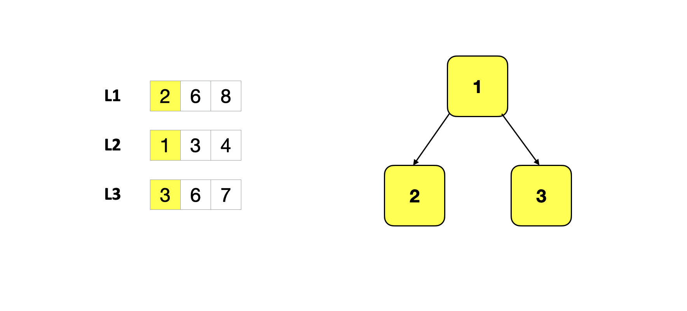
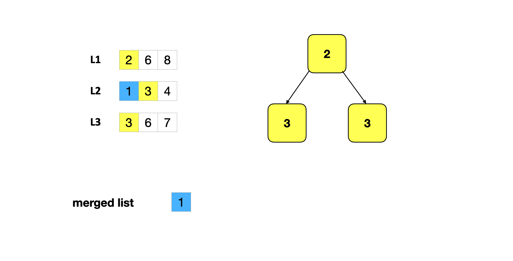
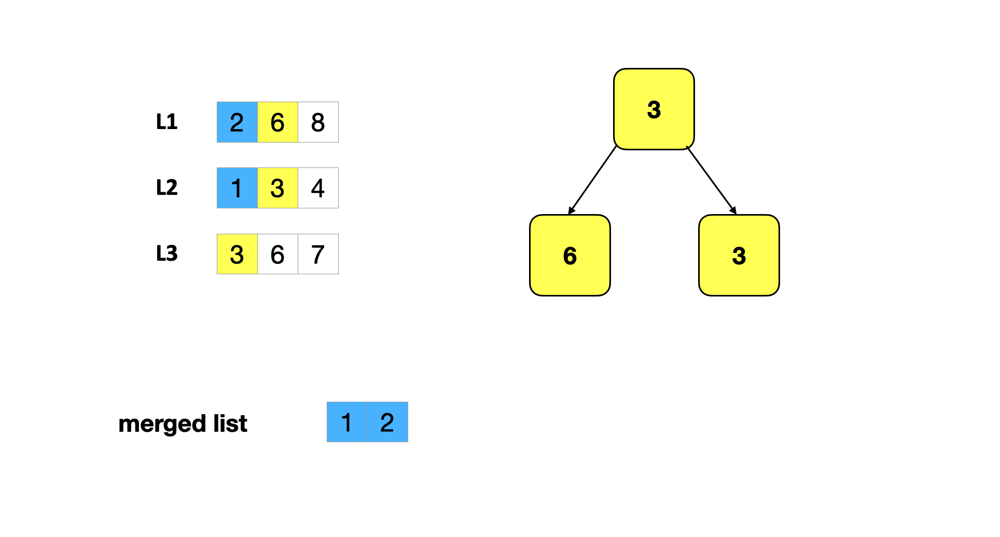
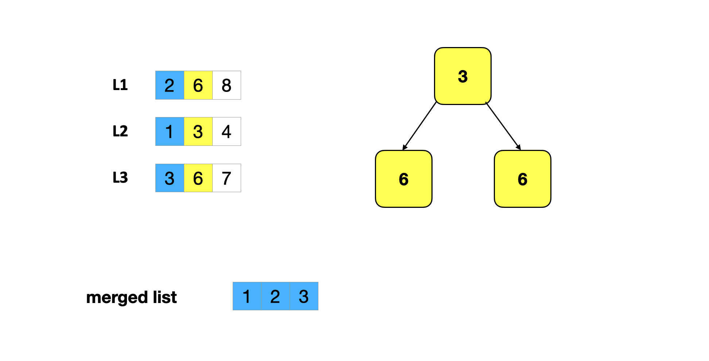

## 章节导读

上节课我们介绍了优先队列和二叉堆的基础知识，并且重点介绍了堆的经典考察模板之一：Top K问题。这节课我们来看看堆的另一种经典考察模板：k路合并。

## 核心算法——k路合并

k路合并一般会涉及到多个已排序的链表或者数组。这类题的特征比较明显，一旦出现K个排序好的列表，我们大概率可以利用堆来进行高效遍历：

1. 初始化一个最小堆
2. 将所有的列表的第一个（最小的）元素加入堆中
3. 从堆中弹出一个最小的元素（这个元素就是当前的全局最小元素），将该元素的下一位插入堆中
4. 重复步骤3直到堆为空

## 1.案例: k路合并

> 合并k个排序链表，并且返回合并后的排序链表。

### 思路分析

本题是2.2节中合并链表题的进阶题。原题要求我们合并两个已排序的链表。当时我们使用两根指针p1, p2分别指向两个链表的表头，并且依据两根指针类题目中“谁小移谁”的思路。每次比较p1和p2的值，取出值较小的那个，append在新链表的结尾。然后将指针移到下一位，直到结尾。

本题升级成了k个链表，我们遵循同样的思路。将所有链表的表头加入一个最小堆，最小堆会我们完成“谁小移谁”的部分。我们每次从最小堆中取出当前最小的表头，加入新链表的结尾。然后将该链表的表头移到下一位，重新加入最小堆，直到最小堆为空。



1. 将所有的列表的第一个（最小的）元素加入堆中



2. 从堆中弹出一个最小的元素（这个元素就是当前的全局最小元素），将该元素的下一位插入堆中



3. 重复上一步：从堆中弹出一个最小的元素，将该元素的下一位插入堆中



4. 最终当堆为空时，得到合并后的排序链表

### 代码实现

```java
public ListNode mergeKLists(ListNode[] lists) {
    // 维护一个最小堆
    PriorityQueue<ListNode> heap = new PriorityQueue<>((l1, l2) -> l1.val - l2.val);
    // 将所有链表的表头加入最小堆
    for (ListNode list: lists) {
        if (list != null)   heap.offer(list);
    }

    ListNode dummy = new ListNode(0); // 创建dummy node
    ListNode tail = dummy;
    while (!heap.isEmpty()) {
        // 每次从最小堆中取出当前最小的表头
        ListNode curt = heap.poll();
        // 加入新链表的结尾
        tail.next = curt;
        tail = curt;
        // 将该链表的表头移到下一位，重新加入最小堆
        if (curt.next != null)
            heap.add(curt.next);
    }
    return dummy.next;
}
```

### 分析
时间复杂度O(n logk)，空间复杂度O(k)。k是链表的个数，也是最小堆的大小。

## 2.案例: 有序矩阵中的第K小元素

> 给定一个 n x n 矩阵，每一行和每一列都按照升序排序，找出矩阵中的第k小元素。
>
> 输入: K=5
> [[2, 6, 8],
> [3, 7, 10],
> [5, 8, 11]]
> 输出: 7

### 思路分析

本题给定了一个n x n的矩阵，并且每行每列都是按升序排列的，我们可以等价的看成n个已排序的列表。为了在n个已排序的列表中找到第k小的元素，我们利用k路合并法遍历这n个已排序列表。

不同于上一题，本题的输入列表是一组数组。为了完成遍历，我们需要额外建立一个数据结构，保存遍历过程中的当前位置(col & row)和当前位置指向的数值(value)。将所有行的第一个位置加入最小堆，然后利用k路合并法遍历。不停弹出元素，直到第k个最小元素出现。

### 代码实现

```java
// 建立一个数据结构
class Node {
    int row, col, value;
    // 保存遍历过程中的当前位置和数值
    Node(int r, int c, int v) {
        row = r;
        col = c;
        value = v;
    }
}

public int kthSmallest(int[][] matrix, int k) {
    int n = matrix.length;
    // 维护一个按照当前数值排列的最小堆
    PriorityQueue<Node> heap = new PriorityQueue<>((node1, node2) -> node1.value - node2.value);
    // 将所有行的第一个位置加入最小堆
    for (int i = 0; i < n; i++)
        heap.offer(new Node(i, 0, matrix[i][0]));
    // 弹出前k-1个值
    for (int i = 0; i < k - 1; i++) {
        Node curt = heap.poll();
        // 将该位置的下一位加入最小堆，如果已经到达当前行的最末一位则跳过
        if (curt.col != n - 1)
            heap.offer(new Node(curt.row, curt.col + 1, matrix[curt.row][curt.col + 1]));
    }
    // 返回第k个值
    return heap.peek().value;
}
```

### 分析
时间复杂度O(n logn)，空间复杂度O(n)

使用最小堆的解法只利用了每行的升序，并没有利用列升序的信息。本题还有一种使用二分搜索的解法，利用了每行和每列的信息，感兴趣的读者可以作为习题。

## 3.案例: 最小范围

> 给定m个已排序的数组，找到一个最小范围，最小范围中包含每个数组的至少一个数。
>
> 输入: L1=[1, 5, 8], L2=[4, 12], L3=[7, 8, 10]
> 输出: [4, 7]

### 思路分析

为了寻找最小范围，我们需要同时确定范围的起点start和终点end。因为要满足最小范围中包含每个数组的至少一个数，并且数组已排序，我们可以将所有行的第一个位置加入最小堆，然后利用k路合并法遍历。同样是额外建立一个数据结构，保存遍历过程中的当前位置和数值。

一个比较直观的认知是我们要找的范围是由最小堆里的最小值和最大值确定的，这两个值分别是范围的起点start和终点end。我们通过比较每一个插入堆的值，记录下最大的那个作为end。每一步从堆中取出的最小元素作为start，和上一步的end组成当前的范围，这个范围包含每个数组的至少一个数。我们通过一个额外的数组记录范围，并且每次获得新的范围都和之前的进行比较，最终得到所有范围中最小的。


### 代码实现

```java
// 建立一个数据结构
class Node {
    int x, y, value;
    // 保存遍历过程中的当前位置和数值
    Node(int x, int y, int v) {
        this.x = x;
        this.y = y;
        this.value = v;
    }
}

public int[] smallestRange(List<List<Integer>> nums) {
    // 维护一个按照当前数值排列的最小堆
    PriorityQueue<Node> heap = new PriorityQueue<>((node1, node2) -> node1.value - node2.value);

    int max = Integer.MIN_VALUE;
    for (int i = 0; i < nums.size(); i++) {
        int value = nums.get(i).get(0);
        // 将所有列表的第一个位置加入最小堆
        heap.offer(new Node(i, 0, value));
        // 通过比较每一个插入堆的值，记录下最大的
        max = Math.max(value, max);
    }
    // 一个额外的数组记录范围
    int[] ans = null;
    while (!heap.isEmpty()) {
        // 每一步从堆中取出的最小元素
        Node curt = heap.poll();
        // 每次获得新的范围都和之前的进行比较
        if (ans == null || ans[1] - ans[0] > max - curt.value)
            ans = new int[]{curt.value, max};
        // 如果到达当前列表的结尾，那么后面出现的range一定比现在大，结束循环
        if (curt.y == nums.get(curt.x).size() - 1)  break;

        int value = nums.get(curt.x).get(curt.y + 1);
        // 将该位置的下一位加入最小堆
        heap.offer(new Node(curt.x, curt.y + 1, value));
        // 比较每一个插入堆的值，记录下最大的
        max = Math.max(value, max);
    }
    // 最终得到所有范围中最小的
    return ans;
}
```

### 分析
时间复杂度O(n logm)，空间复杂度O(m)。n是总共元素的个数，也是输入大小。m是列表的个数。

## 4.案例: 查找和最小的K对数字

> 给定两个以升序排列的数组, 找到和最小的k对数字。每对数字有两个来自不同数组的数字组成。
>
> 输入: L1=[2,8,9], L2=[1,3,6], K=3
> 输出: [[2,1],[2,3],[2,6]]

### 思路分析

本题涉及到两个已排序的数组，直觉上我们可以利用k路合并法遍历。但是仔细一想会发现遍历没什么用处。因为这其实是一道Top K类的问题。我们可以枚举所有成对的数字组合，加入最大堆中，然后选取最小的k对。

套用Top K模板：
1. 维护一个最大堆，用于比较每对数字之和
2. 枚举所有成对的数字组合，加入最大堆中
3. 如果堆的大小超过k，那么弹出最小元素，保证堆大小不超过k。
4. 遍历完成后，堆里保存着最小的K对数字

本题是为了提醒大家不要看到多个已排序的数组，就直接开始k路合并。还是应该认真分析题目的含义，以免走入思维误区。

### 代码实现

```java
public List<List<Integer>> kSmallestPairs(int[] nums1, int[] nums2, int k) {
    // 维护一个最大堆，比较每对数字之和
    PriorityQueue<List<Integer>> maxHeap = new PriorityQueue<>(
        (p1, p2) -> (p2.get(0) + p2.get(1)) - (p1.get(0) + p1.get(1)));
    //枚举所有成对的数字组合
    for (int m : nums1) {
        for (int n : nums2) {
            maxHeap.offer(Arrays.asList(m, n));
            if (maxHeap.size() > k) // 堆的大小超过k，那么弹出最小元素
                maxHeap.poll();
        }
    }
    // 返回堆里保存着最小的K对数字
    return new ArrayList<>(maxHeap);
}
```

### 分析
时间复杂度O(n<sup>2</sup> logk)，空间复杂度O(k). n是输入数组的大小，遍历两个数组枚举所有成对的数字组合需要O(n<sup>2</sup>). k是堆的大小，每次插入和移除消耗O(logk)

## 总结

这节课我们介绍了堆的第二种经典考察模板：k路合并，并且与上一节的Top K问题进行了比较。k路合并的基本特征是出现K个排序好的列表，并且需要我们进行遍历。


## 习题

1. 使用二分法查找有序矩阵中的第K小元素
2. 查找和最大的K对数字：给定两个以降序排列的数组, 找到和最大的k对数字
