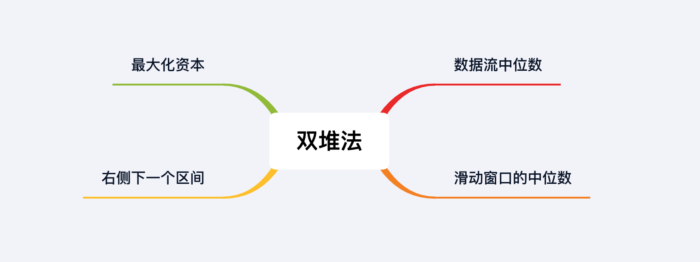

## 章节导读

本章我们已经介绍了堆的两种经典考察模板：Top K问题和k路合并。这两类考题都是依赖于堆本身的排序功能，大部分考题的难度不高。

这节课我们来看堆的第三种经典考察模板：双堆问题。这类题目基本都是难题，重点考察面试者对于堆结构和常用API的熟练度。读者需要非常熟悉自己所用语言中优先队列的API接口、实现方式和操作复杂度。

## 核心算法——双堆

双堆法，也叫Min-Max Heap法。这类问题会给我们一系列元素作为输入，面试者需要同时利用某一个子集的最小值和余下子集的最大值。这时候我们就需要维护两个堆：一个最大堆，一个最小堆。

## 1.案例: 数据流中位数

> 给定一个数据流，数据不停进入数据流。在每次添加一个新的数进入数组的同时返回当前新数组的中位数。
>
> Sample:
> addNum(3)
> addNum(1)
> findMedian() -> 2
> addNum(5)
> findMedian() -> 3
> addNum(4)
> findMedian() -> 3.5

### 思路分析

本题需要我们实时返回一个数据流的中位数（假设为x）。我们可以根据x将数据划分为两部分：大于x的集合和小于x的集合。由于x是中位数，所以这两个集合的大小应该大致相等（当总数为奇数时，应该大小相差不超过1）。

我们需要维护一个最小堆和一个最大堆。最大堆保存小于x的集；最小堆保存大于x的集合。

1. addNum: 当有新的数据加入时，我们先将新数据加入最大堆，然后在两个堆之间重新分配数据，维持平衡。
2. findMedian:
+ 当数据总数为偶数时，两个堆大小应该相等；此时中位数是两个堆的根元素的平均值（小于x的集合中的最大值 & 大于x的集合的最小值）。
+ 当数据总数为奇数时，我们规定最大堆的大小比最小堆大1；此时中位数是最大堆的根元素（也可以反过来规定最小堆的大小比最大堆大1；那么此时中位数就是最小堆的根元素）。

### 代码实现

```java
class MedianFinder {
    private PriorityQueue<Integer> minHeap, maxHeap;

    public MedianFinder() {
        // 维护一个最小堆和一个最大堆
        minHeap = new PriorityQueue<>();
        // 默认的优先队列将按照数值的升序赋予优先级，所以会形成最小堆
        // 通过传入Collections.reverseOrder()，将优先级变成降序，形成最大堆
        maxHeap = new PriorityQueue<>(Collections.reverseOrder());
    }

    public void addNum(int num) {
        // 加入最大堆
        maxHeap.offer(num);
        // 平衡最大堆和最小堆
        minHeap.offer(maxHeap.poll());
        // 维护two heaps的大小性质
        if (minHeap.size() > maxHeap.size())
            maxHeap.offer(minHeap.poll());
    }

    public double findMedian() {
        if (minHeap.size() == maxHeap.size()) // 两个堆大小时, 中位数是两个堆的根元素的平均值
            return minHeap.peek() / 2.0 + maxHeap.peek() / 2.0; // 防止两数和溢出整数表示范围
        return maxHeap.peek(); //否则中位数是最大堆的根元素
    }
}
```

### 分析
时间复杂度O(logn)，空间复杂度O(n)

## 2.案例: 滑动窗口的中位数

> 给定一个包含 n 个整数的数组，和一个大小为 k 的滑动窗口,从左到右在数组中滑动这个窗口，找到数组中每个窗口内的中位数。

### 思路分析

本题是第三题的变种，题目要求从数据流变成了数组与滑动窗口的组合。这样一来我们不仅要考虑加入两个堆加入数据的情况，还需要考虑到从两个堆移除数据和数组的边界条件。

我们依然需要维护一个最小堆和一个最大堆。假设中位数为x，最大堆保存小于x的集，最小堆保存大于x的集合。前k-1个数字加入两个堆之和，从第k个数字开始，我们对于每一个新加入的数字需要计算一个对应的中位数，然后删除最早加入的数字。

加入数据的步骤不变：先将新数据加入最大堆，然后在两个堆之间重新分配数据，维持平衡。删除数据的操作与之类似：先找到最早加入的数字，判断这个数字属于最大堆还是最小堆；然后移除这个数字；最后在两个堆之间重新分配数据，维持平衡。


### 代码实现

```java
public double[] medianSlidingWindow(int[] nums, int k) {
    // 维护一个最小堆和一个最大堆
    PriorityQueue<Integer> maxHeap = new PriorityQueue<>(Collections.reverseOrder());
    PriorityQueue<Integer> minHeap = new PriorityQueue<>();

    double[] ans = new double[nums.length - k + 1];
    for (int i = 0; i < nums.length; i++) {
        // 加入最大堆
        maxHeap.offer(nums[i]);
        // 平衡最大堆和最小堆
        minHeap.offer(maxHeap.poll());
        // 维护two heaps的大小性质
        if (minHeap.size() > maxHeap.size())
            maxHeap.offer(minHeap.poll());

        if (i - k + 1 >= 0) {
            // 计算中位数
            // 两个堆大小时, 中位数是两个堆的根元素的平均值
            // 否则中位数是最大堆的根元素
            ans[i - k + 1] = maxHeap.size() == minHeap.size() ?
                    (maxHeap.peek() / 2.0 + minHeap.peek() / 2.0) : maxHeap.peek();

            // 找到最早加入的数字
            int last = nums[i - k + 1];
            if (last <= maxHeap.peek()) // 判断这个数字属于最大堆还是最小堆, 然后移除这个数字
                maxHeap.remove(last);
            else
                minHeap.remove(last);
            // 在两个堆之间重新分配数据，维持平衡
            if (minHeap.size() > maxHeap.size())
                maxHeap.offer(minHeap.poll());
        }
    }
    return ans;
}
```

### 分析
时间复杂度O(nk)，空间复杂度O(k)。这里需要注意的是删除数字的步骤，Java中PriorityQueue提供的remove方法需要花费O(n)的时间遍历整个堆进行删除，所以整体时间开销为O(nk)。

## 3.案例: 最大化资本

> 给出一组投资项目和对应的收益，需要找到盈利最多的项目。初始资本w有限只能投资不超过k个项目，请选出能最大化盈利的项目。写出一个函数，返回最大化资本的最佳方法。（完成项目后，获得的净利润将被添加到总资本中。）
>
> 输入: Capitals=[0,1,2], Profits=[1,2,3], W=1, k=2
> 输出: 6
> 解释: 初始资本为1，选取项目2，总资本变为3（初始资本+项目2收益）。再选取项目3，总资本变为6.

### 思路分析

本题冗长的题干很有竞赛题的风味，初次见到这类题目的面试者很容易被吓住。实际上越是长的问题，解法其实越简单。因为大部分长题的考点在于将逻辑从复杂的题目描述中提取出来，反倒是在算法层面并不难。

选择项目需要满足两个约束条件：

1. 必须拥有启动资金所需的资本
2. 所选取的项目个数不能超过k

我们每次选择项目，都要先找到所有启动资金少于已有资本的项目，然后选择收益最大的那个。我们可以将题目的逻辑抽象成以下算法：

1. 构造两个优先队列：CapHeap是最小堆，按照Capital升序；ProHeap是最大堆，按照Profits降序
2. 将所有项目加入最小堆CapHeap
3. 从最小堆CapHeap中取出启动资金低于已有资本的项目，将它们加入最大堆ProHeap
4. 从最大堆ProHeap中取出收益最大的项目，进行投资（增加资本）
5. 重复2、3两步，直到所选取的项目个数达到k

### 代码实现

```java
public int findMaximizedCapital(int k, int W, int[] Profits, int[] Capital) {
    // 构造两个优先队列
    // CapHeap是最小堆，按照Capital升序
    PriorityQueue<Integer> minCapHeap = new PriorityQueue<>((n1, n2) -> Capital[n1] - Capital[n2]);
    // ProHeap是最大堆，按照Profits降序
    PriorityQueue<Integer> maxProHeap = new PriorityQueue<>((n1, n2) -> Profits[n2] - Profits[n1]);

    // 将所有项目加入最小堆CapHeap
    for (int i = 0; i < Capital.length; i++)
        minCapHeap.offer(i);

    int cap = W;
    for (int i = 0; i < k; i++) {
        // 从最小堆CapHeap中取出启动资金低于已有资本的项目，将它们加入最大堆ProHeap
        while (!minCapHeap.isEmpty() && Capital[minCapHeap.peek()] <= cap)
            maxProHeap.offer(minCapHeap.poll());
        // 从最大堆ProHeap中取出收益最大的项目
        if (!maxProHeap.isEmpty())
            cap += Profits[maxProHeap.poll()];
    }
    return cap;
}
```

### 分析
时间复杂度O(n logn)，空间复杂度O(n).

本题是一种不同的双堆问题，我们并没有将某个集合分成大数和小数两部分，而是对同一个数据的Capital和Profits分别排序。

## 4.案例: 右侧下一个区间

> 给定一组区间，对于每一个区间i，检查是否存在一个区间j，它的起始点大于或等于区间i的终点，我们称j为在i的右侧下一个区间。对于任何区间，返回满足条件的区间j的最小索引。如果j不存在，则返回-1。
>
> 输入: [[3,4], [1,5], [4,6]]
> 输出: [2, -1, -1]

### 思路分析

我们可以想象所有区间分布在一条数轴上，然后从右往左扫过。这里需要使用最大堆模拟从右往左遍历的过程。

将所有的区间加入两个最大堆中：一个最大堆maxStartHeap按照开始时间排序，另一个最大堆maxEndHeap按照结束时间排序。然后按照最大堆maxEndHeap遍历区间

1. 从maxEndHeap取出当前最大endTime的区间latestEnd
2. 从maxStartHeap找出区间latestEnd右侧的区间
2.1. 如果latestEnd右侧不存区间，那么返回-1
2.2. 如果latestEnd右侧存在区间，那么我们需要找出右侧所有区间中的第一个
3. 弹出maxStartHeap中的元素，直到latestEnd右侧第一个区间，保留该区间
4. 重复1-3步

### 代码实现

```java
public int[] findRightInterval(int[][] intervals) {
    int n = intervals.length;
    int[] ans = new int[n];
    // 最大堆maxStartHeap按照开始时间排序
    PriorityQueue<Integer> maxStartHeap = new PriorityQueue<>((n1, n2) -> intervals[n2][0] - intervals[n1][0]);
    // 最大堆maxEndHeap按照结束时间排序
    PriorityQueue<Integer> maxEndHeap = new PriorityQueue<>((n1, n2) -> intervals[n2][1] - intervals[n1][1]);

    // 将所有的区间加入两个最大堆中
    for (int i = 0; i < n; i++) {
        maxStartHeap.offer(i);
        maxEndHeap.offer(i);
    }

    while (!maxEndHeap.isEmpty()) {
        // 从maxEndHeap取出当前最大endTime的区间latestEnd
        int latestEnd = maxEndHeap.poll();
        int end = intervals[latestEnd][1];

        // 如果latestEnd右侧不存区间，那么返回-1
        if (intervals[maxStartHeap.peek()][0] < end) {
            ans[latestEnd] = -1;
            continue;
        }

        // 如果latestEnd右侧存在区间，那么我们需要找出右侧所有区间中的第一个
        int next = maxStartHeap.poll();
        // 弹出maxStartHeap中的元素，直到latestEnd右侧第一个区间
        while (!maxStartHeap.isEmpty() && end <= intervals[maxStartHeap.peek()][0])
            next = maxStartHeap.poll();
        ans[latestEnd] = next;
        // 保留latestEnd右侧第一个区间
        maxStartHeap.offer(next);
    }
    return ans;
}
```

### 分析
时间复杂度O(n logn)，空间复杂度O(n)。

本题与上一题非常类似，每一个对象有两个属性。我们需要对这两个属性分别排序。本题属于区间类问题，区间类问题都离不开排序，Heap/TreeMap/排序/二分查找都是这类题中常用的技巧。本题有多种解法，感兴趣的读者可以作为习题。

## 总结

双堆问题是优先队列/堆类问题中的高频考题，并且大部分题目难度偏高。面试者不仅需要非常熟悉堆的操作，还需要很强的逻辑思维能力，从题目中抽象出算法操作。



## 习题

1. 使用不同方法解答案例4：右侧下一个区间
