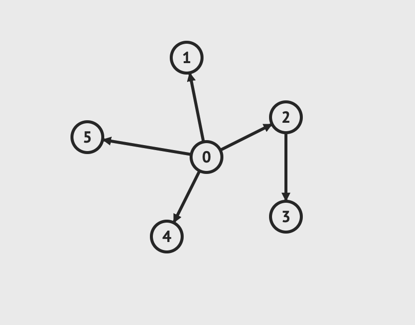
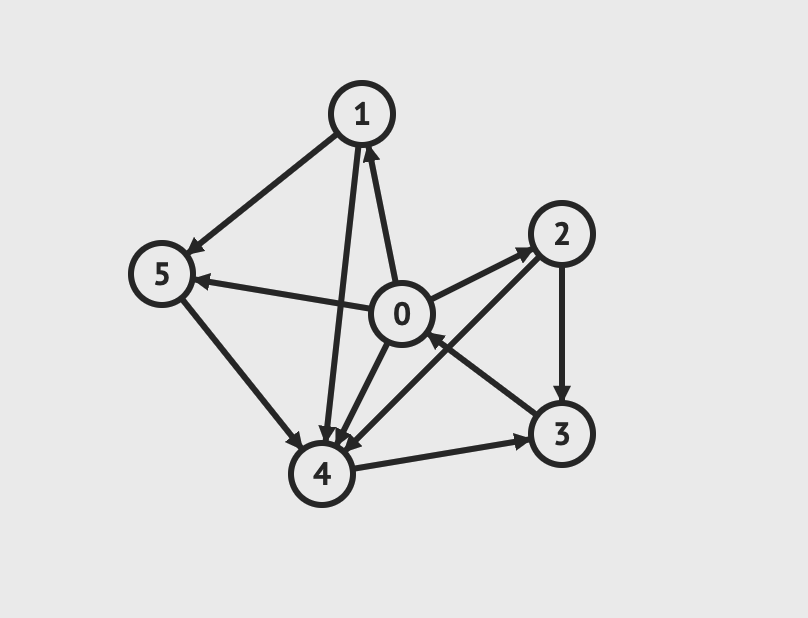
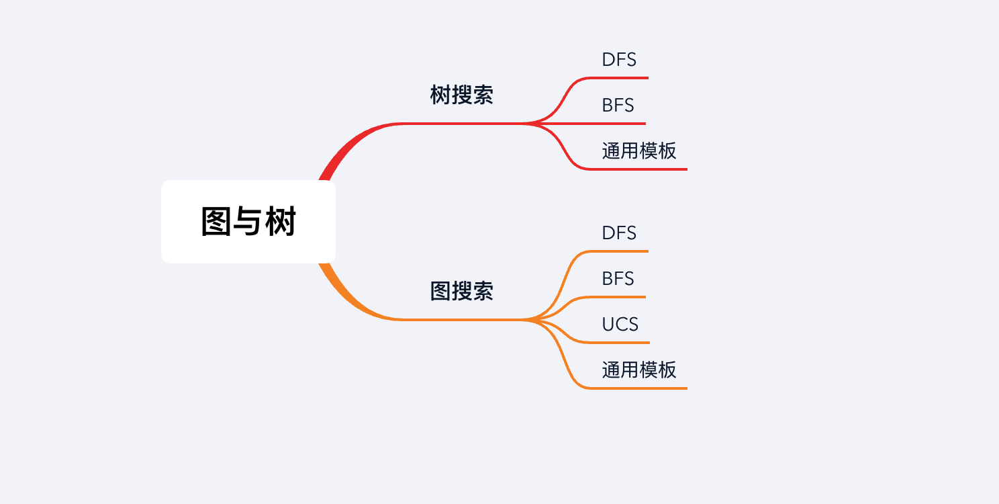

## 章节导读

在之前的章节中，其实我们已经见识过一些图的问题了。链表、树、甚至数组都是图论问题的一小部分。树是图的子集，而链表又是树的子集。这节课开始我们将从特例推广到一般，来学习图论的知识。

## 基础知识——图与树

在之前的章节里我们已经学习了树，尤其是二叉树。在图论中，树是一种连通图，其中任意两个顶点间存在唯一一条路径。下面这张图，其实也是一棵树。



*图片由visualgo制作*

如果在树的基础上加上环路，那么就会变成图。



*图片由visualgo制作*

从面试题的角度来看，树类问题是链表问题的进阶，图类问题是树类问题的进阶。

## 基础知识——树搜索

我们之前学习了BFS和DFS两种搜索算法。树类搜索有一种通用模板，我们用伪代码来描述。

首先我们先约定每个节点的结构：每个节点包含当前节点的值value，一个children列表包含所有当前节点的子节点（子节点可能有0个或多个）
```java
class Node {
    int value;
    List<Node> children;
}
```

假设我们要在一棵树上寻找一个target节点。我们定义tree_search函数，函数接收根节点root、目标节点target、数据队列sequence。

这里要注意数据队列sequence并不是指Queue结构，sequence代表了数据接收和处理的顺序。

+ 当sequence时LIFO队列时，表现为Stack。
+ 当sequence时FIFO队列时，表现为Queue。

数据队列sequence通过add向结构中添加一个元素，通过remove从结构中取出一个元素。

```js
// 接收根节点root、目标节点target、数据队列sequence
function tree_search(sequence, root, target):
  sequence = {root} // 初始化sequence，并向其中添加root节点
  while sequence is not empty: // 当sequence中还有元素存在是
    curt = sequence.remove() // 从sequence中取出一个元素
    if curt == target: // 如果遇上target，说明找到目标
      return true
    for (Node child : curt.children) // 扩展搜索的范围
      sequence.add(child) // 将当前节点所有的子节点添加进sequence
  return false // 当sequence为空时还没有找到target

// 如果将Queue传入tree_search
// sequence将按照FIFO先进先出的顺序添加和弹出元素，会得到BFS算法
function breadth_first_search(root, target):
  return tree_search(new Queue(), root, target)

// 如果将Stack传入tree_search
// sequence将按照LIFO后进先出的顺序添加和弹出元素，会得到DFS算法
function depth_first_search(root, target):
  return tree_search(new Stack(), root, target)
```

有了通用的tree_search模板，我们可以发现BFS和DFS的区别仅在于他们处理元素的顺序。tree_search的初始搜索范围只有root。访问root之后，会将root的所有的子节点添加进sequence，这一步叫做expanding path。随后我们会从sequence取出新的元素，进入下一步搜索。通过向tree_search传入不同的队列结构(Stack/Queue)影响expanding path的过程，而expanding path将决定访问的顺序是DFS还是BFS。

|算法|顺序|数据结构|
|--|--|--|
|DFS深度优先|LIFO后进先出|Stack|
|BFS广度优先|FIFO先进先出|Queue|

## 基础知识——图搜索

之前我们说过树是一种特殊的图，树没有环路。如果在树的基础上加上环路，那么就会变成图。与树搜索类似，图搜索也存在有一种通用模板。

我们重新约定节点的结构：每个节点除了包含当前节点的值value，还有一个neighbors列表。与树不同的是，因为图可以有环路，节点甚至可以指向自己，所以节点之间不存在上下级关系。neighbors列表可以包含0个或多个邻居节点。
```java
class Node {
    int value;
    List<Node> neighbors;
}
```

假设我们要在图上寻找一个目标节点。我们定义graph_search函数，函数接收起点src、目标节点dst、数据队列sequence。

```js
// 接收起点src、目标节点dst、数据队列sequence
function graph_search(sequence, src, dst):
  sequence = {src} // 初始化sequence，并向其中添加起点src
  visited = {} // 因为图可以有环路，我们需要一个visited集合来记录已经访问过的节点
  while sequence is not empty: // 当sequence中还有元素存在是
    curt = sequence.remove() // 从sequence中取出一个元素
    if curt in visited: // 避免重复访问
      continue
    visited.add(curt) // 将curt添加到visited，表示已经访问过
    if curt == dst: // 找到目标
      return true
    for (Node next : curt.neighbors) // 将当前节点相邻的节点添加进sequence
      sequence.add(next) // 扩展搜索的范围
  return false // 当sequence为空时还没有找到

// 如果将Queue传入graph_search，会得到BFS算法
function breadth_first_search(src, dst):
  return graph_search(new Queue(), src, dst)

// 如果将Stack传入graph_search，会得到DFS算法
function depth_first_search(src, dst):
  return graph_search(new Stack(), src, dst)

// 如果将PriorityQueue传入tree_search
// sequence将按照每条路径的权重向外扩展节点
// 会得到Uniform-Cost Search算法（Dijkstra算法）
function uniform_cost_search(src, dst):
  return tree_search(new PriorityQueue(), src, dst)
```

图搜索与树搜索基本相同，仅仅由于图可能存在环路，所以我们需要额外的visited集合记录访问过的节点。同样我们通过向graph_search传入不同的队列结构(Stack/Queue/PriorityQueue)影响expanding path的过程，而expanding path将决定访问的顺序为DFS/BFS/UCS。

|算法|顺序|数据结构|
|--|--|--|
|DFS深度优先|LIFO后进先出|Stack|
|BFS广度优先|FIFO先进先出|Queue|
|UCS一致代价搜索|根据权重弹出|PriorityQueue|

Uniform-Cost Search一致代价搜索算法是Dijkstra算法的变种之一，几乎所有考察Dijkstra算法的面试题都可以用UCS算法来解决。

## 1.案例: DFS

> 给定一张图，在图上运行DFS，打印所有节点

### 思路分析

图上的DFS与树上的DFS算法相似，只需要加入额外的visited集合记录已经访问过的节点，重复访问。

在图上运行DFS的效果如下：

*图片由visualgo制作*

### 代码实现

```java
public List<Node> depthFirstSearch(List<Node> array, Node src) {
    // 创建一个Stack作为LIFO队列
    Stack<Node> stack = new Stack<>();
    // visited集合记录已经访问过的节点
    Set<Node> visited = new HashSet<>();

    // 从起点src出发
    stack.add(src);
    while (!stack.isEmpty()) {
        // 从LIFO队列中取出一个元素
        Node current = stack.pop();
        // 避免重复访问
        if (visited.contains(current))
            continue;

        array.add(current);
        // expanding path: 将当前节点相邻的节点添加进LIFO队列
        for (Node next : current.neighbors)
            stack.push(next);
    }
    return array;
}
```

### 分析
时间复杂度O(v+e)，空间复杂度O(v)，v代表节点个数，e代表边的个数。每个节点仅访问一次所以Stack和Set的空间消耗为O(v)。每条边可能访问一次，时间复杂度O(v+e)。

## 2.案例: BFS

> 给定一张图，在图上运行BFS，打印所有节点

### 思路分析

图上的BFS与树上的BFS算法相似，只需要加入额外的visited集合记录已经访问过的节点，重复访问。

在图上运行BFS的效果如下：

*图片由visualgo制作*

### 代码实现

```java
public List<Node> breadthFirstSearch(List<Node> array, Node src) {
    // 创建一个Queue作为FIFO队列
    Queue<Node> queue = new LinkedList<>();
    // visited集合记录已经访问过的节点
    Set<Node> visited = new HashSet<>();

    // 从起点src出发
    queue.offer(src);
    while (!queue.isEmpty()) {
        // 从FIFO队列中取出一个元素
        Node current = queue.poll();
        // 避免重复访问
        if (visited.contains(current))
            continue;

        array.add(current);
        // expanding path: 将当前节点相邻的节点添加进FIFO队列
        for (Node next : current.neighbors)
            queue.offer(next);
    }
    return array;
}
```

### 分析
时间复杂度O(v+e)，空间复杂度O(v)，v代表节点个数，e代表边的个数。每个节点仅访问一次所以Queue和Set的空间消耗为O(v)。每条边可能访问一次，时间复杂度O(v+e)。

UCS(Dijkstra)算法适用于有权重的图。在没有权重时，每条边权重为1，UCS(Dijkstra)算法退化成BFS算法（PriorityQueue中权重相等，按照元素加入的顺序弹出，退化成Queue）。

## 总结

本节课我们对比了树和图的概念，总结了树搜索通用算法模板和图搜索通用算法模板，统一DFS和BFS算法。本质上这些不同的遍历方式都符合图遍历的定义，唯一的区别在于使用不同的队列导致expending path的顺序有所不同。


