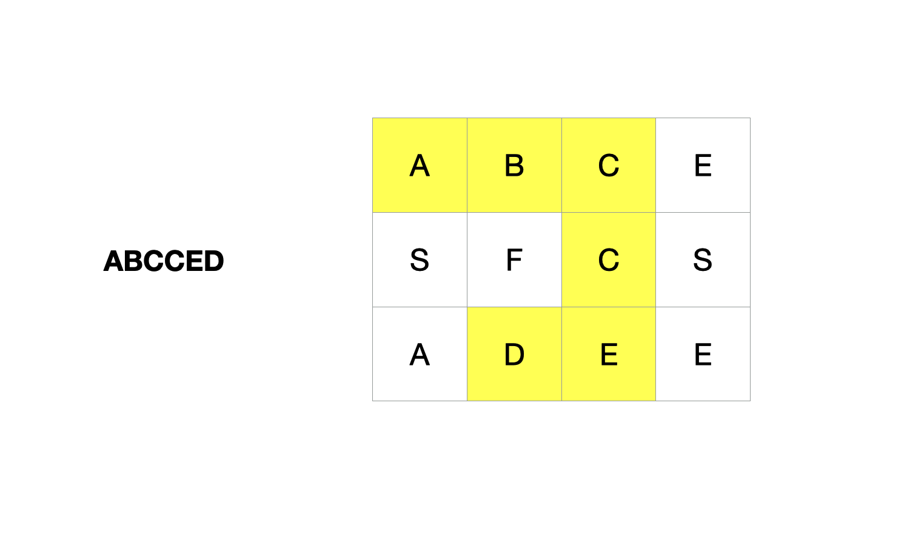
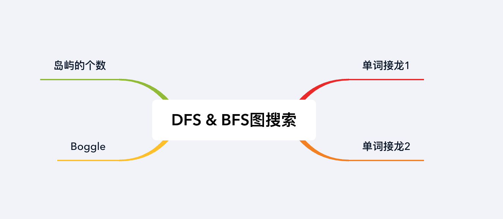

## 章节导读

上节课我们总结了图搜索的通用算法模板，通用算法模板将DFS和BFS算法视为同一种算法的不同变种。面试中的图搜索类题目并不难，大部分的图搜索类题目都可以用DFS或者BFS来解决，真正的难度在于从题目描述中将图构建出来。本节课我们来看DFS和BFS在图搜索类题目中的运用。

## 1.案例: 岛屿的个数

> 给一个 01 矩阵，求不同的岛屿的个数。0代表海，1代表岛，如果两个1相邻，那么这两个1属于同一个岛。我们只考虑上下左右为相邻。
>
> 输入:[
>  [1, 1, 0, 0, 0],
>  [1, 1, 0, 0, 0],
>  [0, 0, 1, 1, 0],
>  [0, 0, 0, 0, 1]]
> 输出: 3

### 思路分析

题目相对简单，甚至于已经将图给出。本题使用的是二维矩阵表示法，用01矩阵来表示地图。我们需要在这张地图上数出岛屿的个数，一个关键的条件是：相邻的1属于同一个岛屿。因此我们不仅要找到1的格子，还要判断哪些1与它相邻。对于这题来说DFS和BFS都可以解决，这里我们介绍DFS解法，将BFS解法留作习题。

我们用两层for循环按行列遍历图。当遍历点值为1时，岛屿数量加一，然后从这个位置开始dfs，搜索所有相连的点。我们需要向这个点的上下左右四个方向选择一个未走过的有效点继续走（即对下一个点递归调用dfs），有效点需要坐标合法且值为1。我们将走过的点数值改为0，由此来避免重复访问。当该点所有可走方向均为0点，则回溯上一层，直到遍历所有可以走到的点，退出dfs函数。

### 代码实现

```java
public int numIslands(char[][] grid) {
    int count = 0;
    // 遍历图
    for (int i = 0; i < grid.length; i++) {
        for (int j = 0; j < grid[0].length; j++) {
            // 当遍历点值为1时
            if (grid[i][j] == '1') {
                // 岛屿数量加一
                count++;
                // dfs搜索所有相连的点
                dfs(grid, i, j);
            }
        }
    }
    return count;
}

// 坐标上的四个方向(0, 1), (0, -1), (1, 0), (-1, 0)
private int[] dx = {0, 0, 1, -1};
private int[] dy = {1, -1, 0, 0};

private void dfs(char[][] grid, int i, int j) {
    // 判断是否是有效点
    if (!valid(grid, i, j))   return;
    // 将走过的点数值改为0，避免重复访问
    grid[i][j] = '0';
    // 向四个方向递归调用dfs
    for (int k = 0; k < 4; k++)
        dfs(grid, i + dx[k], j + dy[k]);
}

private boolean valid(char[][] grid, int i, int j) {
    // 有效点需要坐标合法，且值为1
    return i >= 0 && j >= 0 && i < grid.length && j < grid[0].length && grid[i][j] == '1';
}
```

### 分析
时间复杂度O(n)，空间复杂度O(n)。我们将遍历图的每一个位置，并且没有重复访问，所以时间复杂度为O(n)。因为我们使用了DFS，最差情况下递归深度为O(n)，所以空间复杂度为O(n)。

## 2.案例: Boggle

> Boggle是一种字母游戏：给出一个二维的字母板和一个单词，寻找字母板网格中是否存在这个单词。单词可以由按顺序的相邻单元的字母组成，其中相邻单元指的是水平或者垂直方向相邻。每个单元中的字母最多只能使用一次。
>
> 输入: ["ABCE","SFCS","ADEE"]，"ABCCED"
> 输出: true

### 思路分析

本题和上一题有部分相似之处，在搜寻目标单词时从相邻的单元格向外延伸。实际上，大部分题目都有这种相似性，从图的角度来看，相邻的单元格等价于直接连通的两个位置。尤其本题给定的单词是具有顺序的字母串，最简单的是使用DFS深度优先搜索在图上遍历，搜索单词。



遍历board每个点，看它是否和word开头字母相同，如果相同就执行dfs，递归的匹配当前位置与单词的字母。如果能匹配上，从当前点出发上下左右四个方向匹配下个字符的位置；否则退出dfs。

这类dfs题有两个关键点：

1. 状态回溯
2. 避免重复访问

状态回溯是指在我们退出dfs时，要将程序状态回复成执行dfs之前的状态。

避免重复访问：上一题中我们通过将0变成1来标记不需要重复访问的位置(这种操作叫做flip)，但这并不是通用解法。一般来说对于二维数组，我们有两种访问标记访问过的位置：

1. 使用一个同样大小的visited数组（`boolean[][] visited`），默认每个位置为false，将访问过的位置设置为true
2. 将2维矩阵映射到1维。假设每行的长度为len，那么可以用(x, y) -> id: x * len + y，将坐标映射成一个数字，存储在HashSet中避免重复访问

本题我们使用2维visited数组

### 代码实现

```java
public boolean exist(char[][] board, String word) {
    if (word == null || word.length() == 0) return true;

    // 遍历board每个点
    for (int i = 0; i < board.length; i++)
        for (int j = 0; j < board[0].length; j++)
            // 如果当前字符与word开头字母相同，执行dfs
            if (board[i][j] == word.charAt(0)) {
                // 使用2维visited数组标记访问过的位置
                boolean[][] visited = new boolean[board.length][board[0].length];
                // dfs递归的匹配board[i][j]与word第k位的字母
                if (dfs(board, i, j, word, 0, visited))
                    return true;
            }
    return false;
}

// 坐标上的四个方向(0, 1), (0, -1), (1, 0), (-1, 0)
private final int[] dx = {0, 0, 1, -1};
private final int[] dy = {1, -1, 0, 0};

private boolean dfs(char[][] board, int i, int j, String word, int k, boolean[][] visited) {
    if (k == word.length()) // 如果匹配到达单词结尾，说明匹配成功
        return true;
    if (invalid(board, i, j, word, k, visited))  // 判断是否是有效点
        return false;

    // 将当前位置标记为已经访问过
    visited[i][j] = true;
    for (int c = 0; c < 4; c++) // 向四个方向递归调用dfs
        if (dfs(board, i + dx[c], j + dy[c], word, k + 1, visited))
            return true;
    // 状态回溯，将程序状态回复成没有访问当前位置的状态
    visited[i][j] = false;
    return false;
}

private boolean invalid(char[][] board, int i, int j, String word, int k, boolean[][] visited) {
    // 有效点需要坐标合法，没有访问过，且board[i][j]与word第k位的字母相同
    return i < 0 || j < 0 || i >= board.length || j >= board[0].length
            || visited[i][j] || word.charAt(k) != board[i][j];
}
```

### 分析
时间复杂度O(N * 3<sup>L</sup>)，空间复杂度O(N)。L代表单词的长度，N代表矩阵的大小（单元格的数目）。我们可能在任意一个位置开始dfs，平均每次会向3个方向（4个方向中有一个是来的方向，已经访问过；3个是未访问的方向）执行dfs。dfs的最大搜索深度等于单词的长度L。所以时间复杂度为O(N * 3<sup>L</sup>)。

## 3.案例: 单词接龙1

> 给出两个单词（start和end）和一个字典，找出从start到end的最短转换序列，输出最短序列的长度。
> 变换规则如下：
> + 每次只能改变一个字母
> + 变换过程中的中间单词必须在字典中出现
>
> 输入: start = "hit"，end = "cog"，wordList = ["hot","dot","dog","lot","log"]
> 输出: 5 ("hit"->"hot"->"dot"->"dog"->"cog")

### 思路分析1

本题的图没有直接给出，需要我们根据给出的变换规则自己建模。我们可以将每个单词视为一个节点，可以互相转换的两个单词之间存在一条边。所以题目可以转换为，寻找从起始点start走到终点end的最短路径（每条边长度相等均为1）。对于每条边等长的图，寻找最短路径的基本方法是使用BFS。

1. 新建一个队列和一个集合，从起点start开始执行bfs
2. 每一轮遍历当前队列中所有节点。对每个节点，将该节点能走到的所有节点加入队列
3. 如果遇到end节点，退出bfs；否则将路径长度+1。直到队列为空。

### 代码实现1

```java
public int ladderLength(String beginWord, String endWord, List<String> wordList) {
    // 将list转成set，方便快速查找
    Set<String> words = new HashSet<>(wordList);
    if (!words.contains(endWord))
        return 0;

    // 新建一个队列和一个集合
    Queue<String> queue = new LinkedList<>();
    Set<String> visited = new HashSet<>();
    // 从起点开始执行bfs
    queue.offer(beginWord);
    visited.add(beginWord);

    int step = 0;
    while (!queue.isEmpty()) {
        int size = queue.size();
        step++;
        // 遍历当前队列中所有节点
        for (int i = 0; i < size; i++) {
            String curt = queue.poll();
            if (curt.equals(endWord)) // 如果遇到目标节点，退出bfs
                return step;
            // 获得当前节点能走到的所有节点
            List<String> neighbors = expanding(curt.toCharArray());
            for (String neighbor : neighbors) {
                if (words.contains(neighbor) && !visited.contains(neighbor)) {
                    // 将未访问的有效节点加入队列
                    queue.offer(neighbor);
                    visited.add(neighbor);
                }
            }
        }
    }
    return 0;
}

private List<String> expanding(char[] word) {
    List<String> neighbors = new ArrayList<>();
    // 在单词的每一个位置
    for (int i = 0; i < word.length; i++) {
        char tmp = word[i];
        // 用a-z循环替换该位置的字符
        for (char j = 'a'; j <= 'z'; j++) {
            word[i] = j;
            neighbors.add(new String(word));
        }
        word[i] = tmp;
    }
    return neighbors;
}
```

### 分析1
时间复杂度O(nm)，空间复杂度O(n)。n为wordList中单词个数，m为单词长度。bfs所有节点最多遍历一次，每次遍历到之后，需要扫遍单词的每个字符。

### 思路分析2

本题的升级版做法是使用双向BFS。思路与解法1一致，但是使用了两个队列，从start和end分别出发。每次从较小的那个队列开始执行BFS。每一轮遍历当前队列中所有节点。对每个节点，将该节点能走到的所有节点加入队列。如果搜索范围与另一侧队列相遇，退出bfs；否则将路径长度+1。直到队列为空。

### 代码实现2

```java
public int ladderLength(String start, String end, List<String> wordList) {
    Set<String> dict = new HashSet<>(wordList);
    if (!dict.contains(end)) return 0;

    // 使用两个队列
    Queue<String> startQueue = new LinkedList<>(), endQueue = new LinkedList<>();
    Set<String> startSet = new HashSet<>(), endSet = new HashSet<>();

    // 分别将start和end添加进对应的队列
    addWord(startQueue, startSet, start);
    addWord(endQueue, endSet, end);

    int step = 1;
    while (!startQueue.isEmpty() && !endQueue.isEmpty()) {
        // 从较小的那个队列开始执行BFS
        boolean forwarding = startQueue.size() <= endQueue.size();
        Queue<String> queue = forwarding ? startQueue : endQueue;
        Set<String> forward = forwarding ? startSet : endSet, backward = forwarding ? endSet : startSet;

        step++;
        // 遍历当前队列中所有节点
        int size = queue.size();
        for (int i = 0; i < size; i++){
            String curt = queue.poll();
            // 获得当前节点能走到的所有节点
            List<String> neighbors = expanding(curt.toCharArray());
            for (String neighbor : neighbors) {
                // 排除不在字典中的节点
                if (!dict.contains(neighbor))
                    continue;
                // 如果搜索范围与另一侧队列相遇，退出bfs
                if (backward.contains(neighbor))
                    return step;
                // 将未访问的有效节点加入队列
                if (!forward.contains(neighbor))
                    addWord(queue, forward, neighbor);
            }
        }
    }
    return 0;
}

private void addWord(Queue<String> queue, Set<String> set, String word) {
    // 将单词加入队列和集合，防止重复访问
    queue.offer(word);
    set.add(word);
}

private List<String> expanding(char[] word) {
    List<String> neighbors = new ArrayList<>();
    // 在单词的每一个位置
    for (int i = 0; i < word.length; i++) {
        char tmp = word[i];
        // 用a-z循环替换该位置的字符
        for (char j = 'a'; j <= 'z'; j++) {
            word[i] = j;
            neighbors.add(new String(word));
        }
        word[i] = tmp;
    }
    return neighbors;
}
```

### 分析
时间复杂度O(nm)，空间复杂度O(n)。n为wordList中单词个数，m为单词长度。双向BFS的理论时空消耗与普通BFS相同，但是在OA上实际执行时，时间缩短10倍左右。

## 4.案例: 单词接龙2

> 给出两个单词（start和end）和一个字典，找出从start到end的最短转换序列，输出最短序列。
> 变换规则如下：
> + 每次只能改变一个字母
> + 变换过程中的中间单词必须在字典中出现
>
> 输入: start = "hit"，end = "cog"，wordList = ["hot","dot","dog","lot","log"]
> 输出: "hit"->"hot"->"dot"->"dog"->"cog"

### 思路分析

本题是上一题的进阶版，上一题仅仅是要求计算出最短序列的长度，而本题要求返回最短序列本身。

第一部分解法与上一题类似：使用bfs搜索最短路径，同时将每一步搜索的结果缓存下来，记录该节点到start的最短距离。这样我们就有了一个字典的子集，其中包含了所有可能的变换序列。

第二部分我们使用dfs，从end出发，在上一步缓存的子集中向start回溯。

### 代码实现

```java
public List<List<String>> findLadders(String beginWord, String endWord, List<String> wordList) {
    // 将list转成set，方便快速查找
    Set<String> dict = new HashSet<>(wordList);
    dict.add(beginWord);

    List<List<String>> ans = new ArrayList<>();
    if (!dict.contains(endWord))
        return ans;

    // 建立一个map用于缓存每一步搜索的结果
    Map<Integer, Set<String>> map = new HashMap<>();
    // 从起点开始执行bfs，返回最短路径的长度
    int distance = bfs(beginWord, endWord, dict, map);

    // 如果distance为0说明不存在最短路径
    if (distance == 0)
        return ans;
    // 用列表记录最短路径
    List<String> path = new ArrayList<>();
    // 从end出发
    path.add(endWord);
    // distance代表当前节点到start的距离，从distance - 1开始向start搜索
    dfs(endWord, distance - 1, map, path, ans);
    for (List<String> list : ans) // 将所有找到的路径翻转成从start到end
        Collections.reverse(list);
    return ans;
}

// 与案例3的解法1基本相同
private int bfs(String beginWord, String endWord, Set<String> dict, Map<Integer, Set<String>> map) {
    // 新建一个队列和一个集合
    Queue<String> queue = new LinkedList<>();
    Set<String> visited = new HashSet<>();

    // 从起点开始执行bfs
    queue.add(beginWord);
    visited.add(beginWord);

    int distance = 0;
    while (!queue.isEmpty()) {
        int size = queue.size();
        distance++;
        map.put(distance, new HashSet<>());
        // 遍历当前队列中所有节点
        for (int i = 0; i < size; i++) {
            String curt = queue.poll();
            // 记录当前节点到start的最短距离
            map.get(distance).add(curt);
            // 如果遇到目标节点，退出bfs
            if (curt.equals(endWord))
                return distance;
            // 寻找该节点能走到的所有节点
            List<String> neighbors = expanding(curt.toCharArray());
            for (String neighbor : neighbors) {
                if (dict.contains(neighbor) && !visited.contains(neighbor)) {
                    // 将未访问的有效节点加入队列
                    queue.offer(neighbor);
                    visited.add(neighbor);
                }
            }
        }
    }
    return 0;
}

private void dfs(String curt, int distance, Map<Integer, Set<String>> map, List<String> path, List<List<String>> ans) {
    if (distance == 0) {
        // 当distance为0时，说明到达start
        // 将当前找到的路径存入ans
        ans.add(new ArrayList<>(path));
        return;
    }
    // 获取所有距离start为当前distance的节点
    Set<String> set = map.get(distance);
    // 获得当前节点能走到的所有节点
    List<String> neighbors = expanding(curt.toCharArray());
    for (String neighbor : neighbors) {
        // 从这些节点中，找到向start距离更近一步的节点
        if (set.contains(neighbor)) {
            // 将该节点添加进path
            path.add(neighbor);
            // 递归执行dfs
            dfs(neighbor, distance - 1, map, path, ans);
            // 回溯状态，移除节点
            path.remove(path.size() - 1);
        }
    }
}

// 与案例3的expanding函数相同
private List<String> expanding(char[] word) {
    List<String> neighbors = new ArrayList<>();
    // 在单词的每一个位置
    for (int i = 0; i < word.length; i++) {
        char tmp = word[i];
        // 用a-z循环替换该位置的字符
        for (char j = 'a'; j <= 'z'; j++) {
            word[i] = j;
            neighbors.add(new String(word));
        }
        word[i] = tmp;
    }
    return neighbors;
}
```

### 分析

时间复杂度O(nm)，空间复杂度O(n)，与案例3相同。

BFS和DFS方向其实并不重要，只需要互相相反即可。先使用BFS的预处理出最短路径可能存在的集合，在使用DFS根据distance逐步向start搜索。如果只使用DFS遍历所有的可能会超时。

更准确地说，第二部分其实是启发式搜索。我们使用了distance和map预估了dfs下一个节点可能存在的位置，这样才降低了dfs搜索的开销。

## 总结

本章我们研究了面试中常见的图搜索问题。图搜索问题的基础解法基本都是DFS和BFS算法和他们的变种算法。面试者务必要掌握在图上执行DFS和BFS的能力。



## 习题

1. 用BFS解决岛屿的个数
