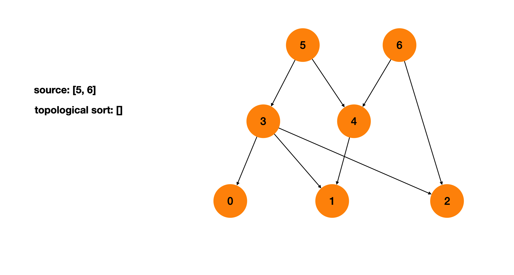
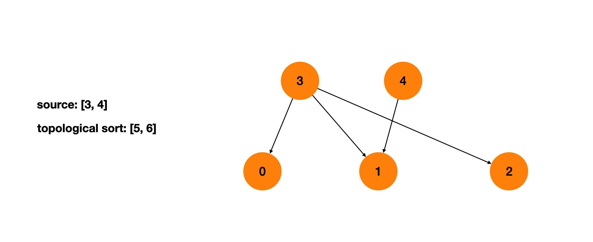
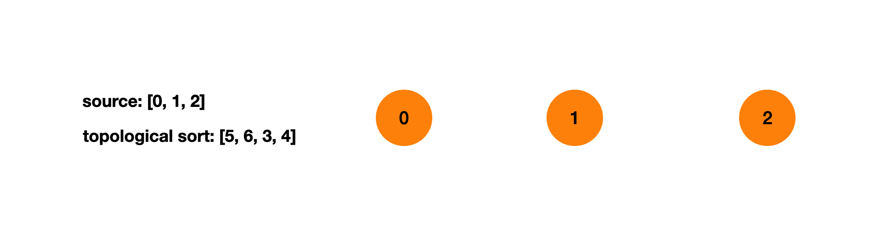
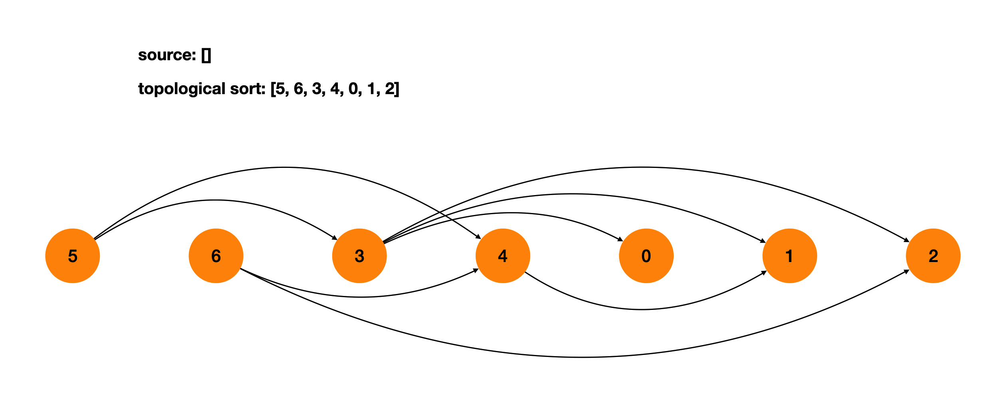
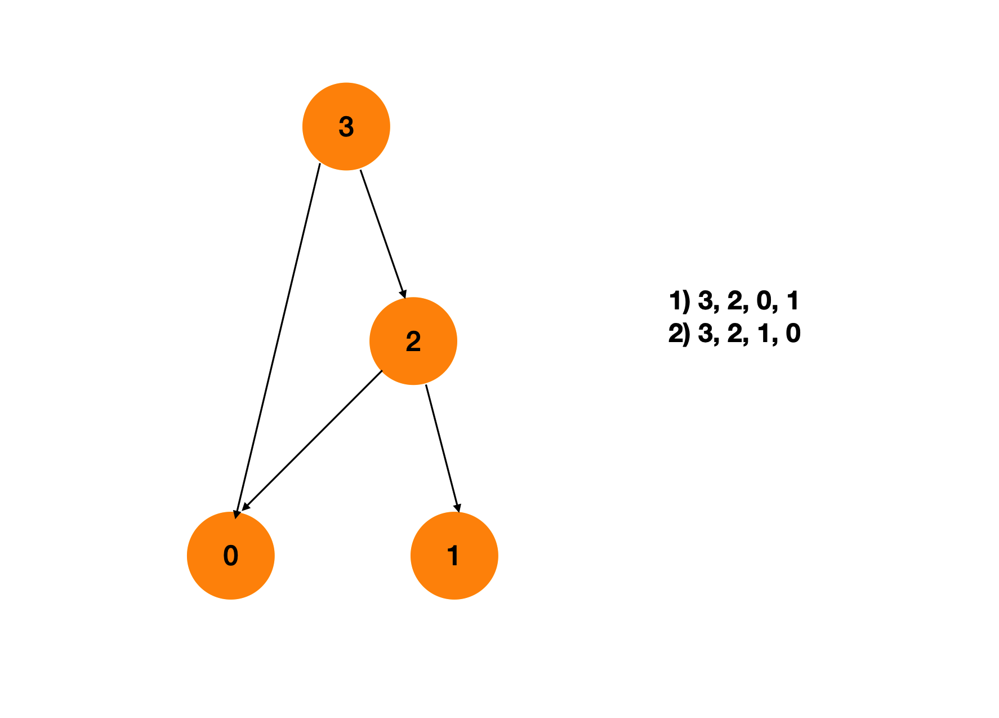
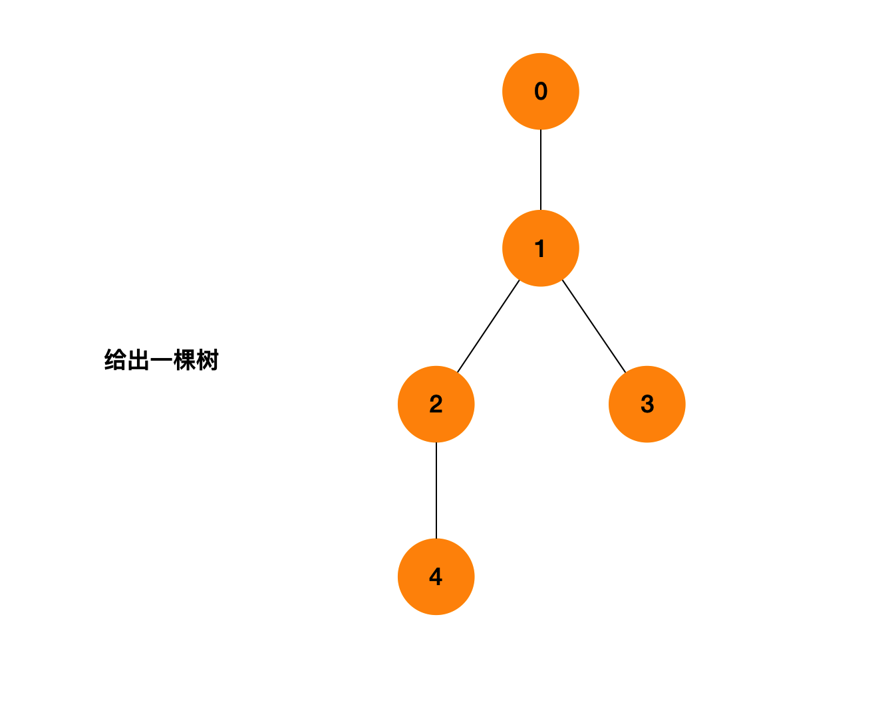
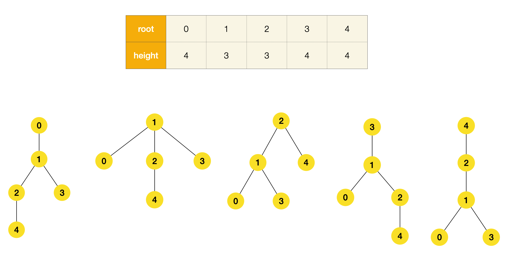
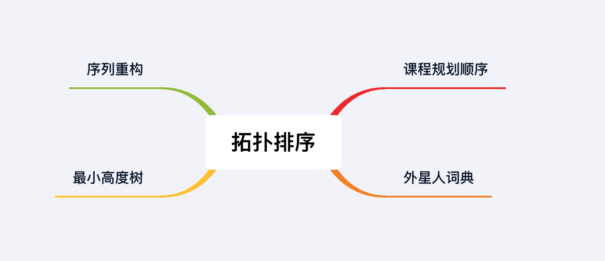

## 章节导读

上一节我们重温了DFS和BFS算法，并且研究了他们在图搜索类面试题中的应用。本章我们来看Topological Sort 拓扑排序。

拓扑排序通常用于在一大堆依赖关系中寻找线性顺序。在拓扑排序中，如果X依赖于Y，那么排序的结果会使Y出现在X之前。拓扑排序的原理非常直观，并且在生活中非常常见，比如选课时要先修课程A然后才能选课程B，工程上jar包C依赖于jar包D，等等。

## 核心算法——Topological Sort

一个有向图的拓扑序是它包含的所有节点的一种线性顺序。对于每条从U到V的有向边(U, V)，在拓扑序中U会排在V之前。

我们先讲解几个基础概念：
 1. 入度 & 出度：入度和出度表示了节点与边的关系。假设有向图只包含从u到v的有向边u->v，我们称u的出边条数为1，即出度为1；v的入边条数为1，即入度为1。
 2. Source 源点 & Sink 汇点：源点 & 汇点借用了水流的概念。Source 源点代表只向外流出的点，只有出度，没有入度。Sink 汇点代表只向内流入的点，只有入度，没有出度。
 3. 拓扑排序的顺序从一个source出发，终点是一个sink。
 4. 只有不包含环路的图才能进行拓扑排序。

拓扑排序的逻辑满足BFS的遍历顺序。我们从所有的source出发，向外拓展。每一步将source保存进一个列表，然后删除source。删除source后会产生新的source，我们需要重复上一步。直到访问完所有节点。



将所有的source添加到列表



删除source后会产生新的source



重复上一步，直到访问完所有节点



将所有的节点按照拓扑排序的顺序排在一条线上，每条边都是从左指向右的。

## 1.案例: 课程规划顺序

> 现在你总共有n门课需要选，记为 0 到 n - 1. 一些课程在修之前需要先修另外的一些课程，比如要学习课程0你需要先学习课程1，表示为[0,1]。给定n门课以及他们的先决条件，返回一种有效的选课顺序。
>
> 输入: n=4, prerequisites=[3, 2], [3, 0], [2, 0], [2, 1]
> 输出: 以下两种都是有效拓扑排序，返回任意一种
> 1. 3, 2, 0, 1
> 2. 3, 2, 1, 0

### 思路分析

我们先根据题目给出的prerequisites画出一张图



根据两门课之间的约束关系，我们可以将课抽象为节点，将约束抽象为一条有向边。利用拓扑排序解决，一个有效的选课序列就是一个拓扑序。

1. 建图并记录所有节点的入度
2. 将所有入度为0的节点加入队列
3. 从队列中取出一个元素curt
4. 访问curt所有的邻接点next，将next的入度减1，当减到0后，将next加入队列
5. 重复步骤3、4，直到队列为空
6. 如果拓扑序列个数等于节点数，代表存在拓扑序


### 代码实现

```java
public int[] findOrder(int numCourses, int[][] prerequisites) {
    // 建图并记录所有节点的入度
    HashMap<Integer, List<Integer>> graph = new HashMap<>();
    int[] indegree = new int[numCourses];
    for (int[] edge : prerequisites) {
        int to = edge[0];
        int from = edge[1];
        graph.putIfAbsent(from, new ArrayList<>());
        // 建图，将邻接点加入邻接表
        graph.get(from).add(to);
        // 记录入度
        indegree[to]++;
    }

    Queue<Integer> queue = new LinkedList<>();
    for (int i = 0; i < numCourses; i++) {
        // 将所有入度为0的节点加入队列
        if (indegree[i] == 0) {
            queue.offer(i);
        }
    }
    int[] ans = new int[numCourses];
    int i = 0;
    while (!queue.isEmpty()) {
        // 从队列中取出一个元素curt
        int curt = queue.poll();
        ans[i++] = curt;
        // 访问curt所有的邻接点next
        List<Integer> neighbors = graph.getOrDefault(curt, new ArrayList<>());
        for (int next : neighbors) {
            // 将next的入度减1
            indegree[next]--;
            // 入度为0，将next加入队列
            if (indegree[next] == 0) {
                queue.offer(next);
            }
        }
    }
    // 如果拓扑序列个数等于节点数，代表存在拓扑序
    return i == numCourses ? ans : new int[0];
}
```

### 分析
时间复杂度O(V + E)，空间复杂度O(V + E)。V代表图的节点数，即课程数。E代表图的边数，即约束条件prerequisite的数量。

## 2.案例: 外星人词典

> 有一种使用拉丁字母的外来语言，但是无法得知字母之间的顺序。我们会从词典中收到一个非空的单词列表，并按照新语言的字典顺序排序。找出这种语言的字母顺序。
> 1. 假设所有的字母都是小写。
> 2. 如果a是b的前缀且b出现在a之前，那么这个顺序是无效的。
> 3. 对于无效顺序，则返回空字符串。
> 4. 如果存在多个有效的字母顺序，返回字典序最小的。
>
> 输入: ["ywx", "wz", "xww", "xz", "zyy", "zwz"]
> 输出: ywxz

### 思路分析

一直给定的单词列表是按照字典序排列的，所以我们可以通过比较相邻的两个单词来确定字母之间的顺序。每次取出相邻的两个单词，找到它们之间第一个不同的字母，从中提取出顺序。比如"xww"和"xz"，第2位开始不同，说明w排在z之前。

我们可以将所有的字母看做不同的节点，将整个单词表看做一张图。我们要对这张图做拓扑排序来确定这种语言的字母顺序。

需要注意的是题目中存在一条潜在规则：如果a是b的前缀且b出现在a之前，那么这个顺序是无效的。 比如[“abc”, “ab”]，“ab”是“abc”的前缀，但“abc”出现在“ab”之前。这其实违反了一条潜在规则，就是我们认为空字符应该是字符顺序的最前一位。根据我实际尝试，这条规则并不是在所有OJ中都存在。如果在面试中遇上本题，需要和面试官反复确认。

### 代码实现

```java
public String alienOrder(String[] words) {
    // 初始化两张Map，分别作为邻接表和入度表
    HashMap<Character, Integer> indegree = new HashMap<>();
    HashMap<Character, List<Character>> graph = new HashMap<>();
    for (String s : words) {
        for (char c : s.toCharArray()) {
            // 每个节点的入度初始化为0
            indegree.putIfAbsent(c, 0);
            // 初始化每个节点的邻接表
            graph.putIfAbsent(c, new ArrayList<>());
        }
    }

    // 建图
    for (int i = 0; i < words.length - 1; i++) {
        String s1 = words[i], s2 = words[i + 1]; // 取得相邻的两个单词
        // 如果a是b的前缀且b出现在a之前
        if (s1.length() > s2.length() && s1.startsWith(s2))
            return ""; // 顺序无效，返回空
        for (int j = 0; j < Math.min(s1.length(), s2.length()); j++) {
            char c1 = s1.charAt(j), c2 = s2.charAt(j);
            // 找到第一位不同的字符
            if (c1 != c2) {
                // 添加边
                graph.get(c1).add(c2);
                // 更新入度
                indegree.put(c2, indegree.get(c2) + 1);
                break;
            }
        }
    }
    // 将所有入度为0的节点加入Queue
    Queue<Character> queue = new LinkedList<>();
    for (char c : indegree.keySet()) {
        if (indegree.get(c) == 0) {
            queue.offer(c);
        }
    }

    StringBuilder builder = new StringBuilder();
    // 拓扑排序
    while(!queue.isEmpty()) {
        // 从队列中取出一个元素curt
        char curt = queue.poll();
        // 拼接到结果最末
        builder.append(curt);
        // 访问curt所有的邻接点
        List<Character> neighbors = graph.get(curt);
        for (char c : neighbors) {
            // 入度减1
            indegree.put(c, indegree.get(c) - 1);
            // 入度为0，加入队列
            if (indegree.get(c) == 0) {
                queue.offer(c);
            }
        }
    }
    return builder.length() == indegree.size() ? builder.toString() : "";
}
```

### 分析
时间复杂度O(V + E)，空间复杂度O(V + E)。V代表图的节点数，即字符数。E代表图的边数，即约束条件数（单词列表的长度）。

## 3.案例: 序列重构

> 给定一个org序列和一组seqs序列，判断是否能从seqs重构得出唯一的org序列。
>
> 输入: originalSeq: [3, 1, 4, 2, 5], seqs: [[3, 1, 5], [1, 4, 2, 5]]
> 输出: true
> 输入: originalSeq: [1, 2, 3, 4], seqs: [[1, 2], [2, 3], [2, 4]]
> 输出: false

### 思路分析

拓扑排序的思路出发，对于本题我们需要解决两个问题：


1. 能否从seqs构造出org
2. seqs是否可能构造出多种序列

比如[[1, 2], [2, 3], [2, 4]]，既可以构造出[1, 2, 3, 4]，又可以构造出[1, 2, 4, 3]。

与前两题相比，本题的重点在于：

1. 需要保证构造出来的序列，每一位与org相对应
2. 需要保证构造序列时，每一步只有唯一选择

从算法实现的角度看，只要保证queue里最多同时只有一个元素即可

### 代码实现

```java
public boolean sequenceReconstruction(int[] org, List<List<Integer>> seqs) {
    // 初始化两张Map，分别作为邻接表和入度表
    HashMap<Integer, List<Integer>> graph = new HashMap<>();
    HashMap<Integer, Integer> indegree = new HashMap<>();

    for (List<Integer> seq : seqs) {
        for (int n : seq) {
            // 初始化每个节点的邻接表
            graph.putIfAbsent(n, new ArrayList<>());
            // 每个节点的入度初始化为0
            indegree.putIfAbsent(n, 0);
        }
    }
    // 得到的节点少于org序列包含的节点，一定无法构造成功
    if (indegree.size() != org.length) {
        return false;
    }
    // 建图
    for (List<Integer> seq : seqs) {
        for (int i = 0; i < seq.size() - 1; i++) {
            int from = seq.get(i), to = seq.get(i + 1);
            graph.get(from).add(to);
            indegree.put(to, indegree.get(to) + 1);
        }
    }
    // 将所有入度为0的节点加入Queue
    Queue<Integer> queue = new LinkedList<>();
    for (int n : indegree.keySet()) {
        if (indegree.get(n) == 0) {
            queue.offer(n);
        }
    }
    // 指向org的第一位字符
    int pos = 0;
    // 拓扑排序
    while (!queue.isEmpty()) {
        // 保证queue里最多同时只有一个元素
        if (queue.size() > 1) {
            return false;
        }
        // 从队列中取出一个元素curt
        int curt = queue.poll();
        // 与org比较，保证构造出来的序列每一位与org相对应
        if (curt != org[pos++]) {
            return false;
        }
        // 访问curt所有的邻接点
        List<Integer> neighbors = graph.get(curt);
        for (int next : neighbors) {
            // 入度减1
            indegree.put(next, indegree.get(next) - 1);
            // 入度为0，加入队列
            if (indegree.get(next) == 0) {
                queue.offer(next);
            }
        }
    }
    // 直到最后一个字符都匹配一致
    return pos == org.length;
}
```

### 分析
时间复杂度O(V + E)，空间复杂度O(V + E)。V代表图的节点数，即字符数。E代表图的边数，即seqs的长度。

## 4.案例: 最小高度树

> 给出一个k叉树性质的无向图，可以选择任何一个节点作为根。这个图就变成了一个有根树。在所有可能的有根树中，有最小高度的树叫做最小高度树（MHT, minimum height tree）。给定这样的图，找出所有的MHT，返回根标记的数组。
>
> 输入: n: 5, edges: [[0, 1], [1, 2], [1, 3], [2, 4]]
> 输出: [1, 2]

### 思路分析

先根据题意画出这棵树



分别尝试用不同的节点作为根节点，并统计高度



从画图的过程中，我们可以直观地了解到：节点数大于2时，叶子节点不能作为MHT的根节点，因为叶子节点的邻居节点一定能有更小的高度（比如上图中叶子节点[0, 3, 4]）。

本题的思路相当于拓扑排序和按层BFS的混合，每次将叶子节点加入queue，然后将叶子节点从原图删去。删去后形成新的图，再取出新的叶子节点加入queue，重复上一步。直到最后一组节点，就是我们要的答案。


1. 创建图，统计每个节点的入度
2. 把所有入度为1的节点放入queue（叶子节点）
3. 把每个叶子节点的邻居节点的入度减1
4. 当节点入度为1时，放入queue（新的叶子节点）
5. 最后的一组queue就是最后的根节点，也就是答案

### 代码实现

```java
public List<Integer> findMinHeightTrees(int n, int[][] edges) {
    // 只有一个节点时，该节点就是根节点
    if (n == 1) {
        return Arrays.asList(0);
    }

    // 初始化两张Map，分别作为邻接表和入度表
    HashMap<Integer, List<Integer>> graph = new HashMap<>();
    HashMap<Integer, Integer> indegree = new HashMap<>();

    for (int i = 0; i < n; i++) {
        // 初始化每个节点的邻接表
        graph.put(i, new ArrayList<>());
        // 每个节点的入度初始化为0
        indegree.put(i, 0);
    }

    for (int[] edge: edges) {
        int from = edge[0], to = edge[1];
        // 树是无向图，所以每条边需要两个方向
        graph.get(from).add(to);
        graph.get(to).add(from);
        // 同上，入度需要两个方向更新
        indegree.put(to, indegree.get(to) + 1);
        indegree.put(from, indegree.get(from) + 1);
    }
    // 把所有入度为1的节点放入queue（叶子节点）
    LinkedList<Integer> queue = new LinkedList<>();
    for (int node : indegree.keySet()) {
        if (indegree.get(node) == 1) {
            queue.offer(node);
        }
    }
    // 拓扑排序
    while (!queue.isEmpty()) {
        int size = queue.size();
        // 更新剩下未访问的节点数
        n -= size;
        // 剩下的节点数为0，那么当前就是最后一组节点
        if (n == 0) {
            return queue;
        }
        for (int i = 0; i < size; i++) {
            // 从队列中取出一个元素curt
            int curt = queue.poll();
            // 把每个叶子节点的邻居节点的入度减1
            List<Integer> neighbors = graph.get(curt);
            for (int next : neighbors) {
                // 双向入度减1
                indegree.put(next, indegree.get(next) - 1);
                indegree.put(curt, indegree.get(curt) - 1);
                // 当节点入度为1时，放入queue（新的叶子节点）
                if (indegree.get(next) == 1) {
                    queue.offer(next);
                }
            }
        }
    }
    return queue;
}
```

### 分析
时间复杂度O(V + E)，空间复杂度O(V + E)。V代表图的节点数。E代表图的边数。

本题并不是单纯地套用拓扑排序算法，而是使用拓扑排序的思路，实现上更接近BFS层级遍历算法。难度不高，但要求知识点融会贯通。

## 总结

本章我们学习了图类题中的经典考察模板：拓扑排序。并且联系了BFS层级遍历算法，与拓扑排序进行比较。希望读者能够掌握这两种算法的内核，而不是背下解题模板。



## 习题

1. 课程规划：现在你总共有n门课需要选，记为 0 到 n - 1. 一些课程在修之前需要先修另外的一些课程，比如要学习课程0你需要先学习课程1，表示为[0,1]。给定n门课以及他们的先决条件，判断是否存在有效的选课顺序。
2. 全部课程规划顺序：现在你总共有n门课需要选，记为 0 到 n - 1. 一些课程在修之前需要先修另外的一些课程，比如要学习课程0你需要先学习课程1，表示为[0,1]。给定n门课以及他们的先决条件，返回所有有效的选课顺序。
