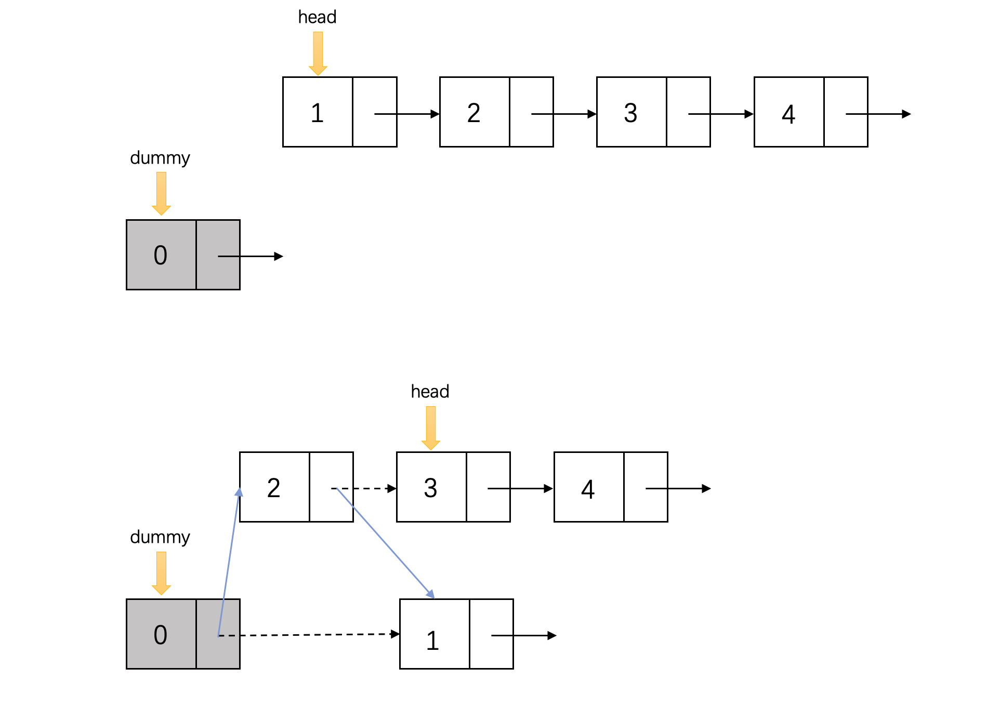
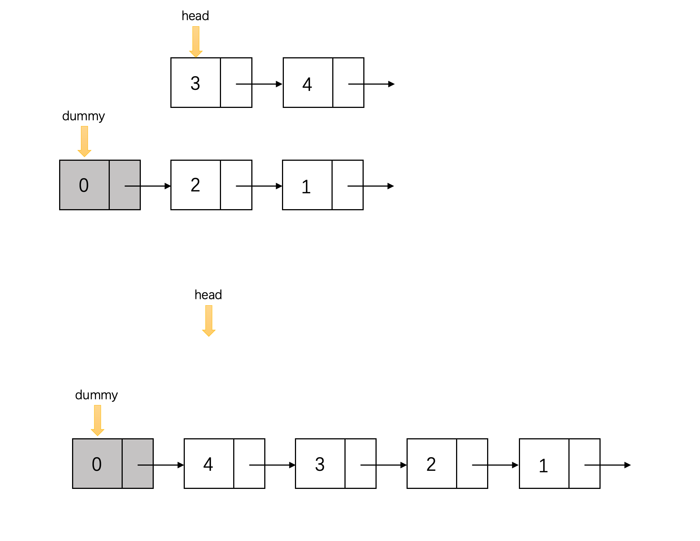
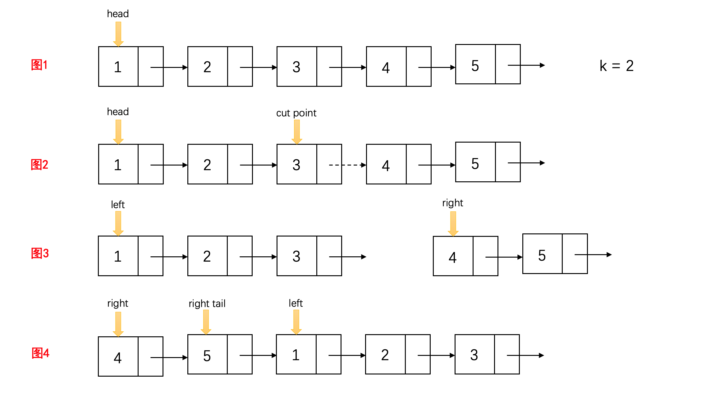
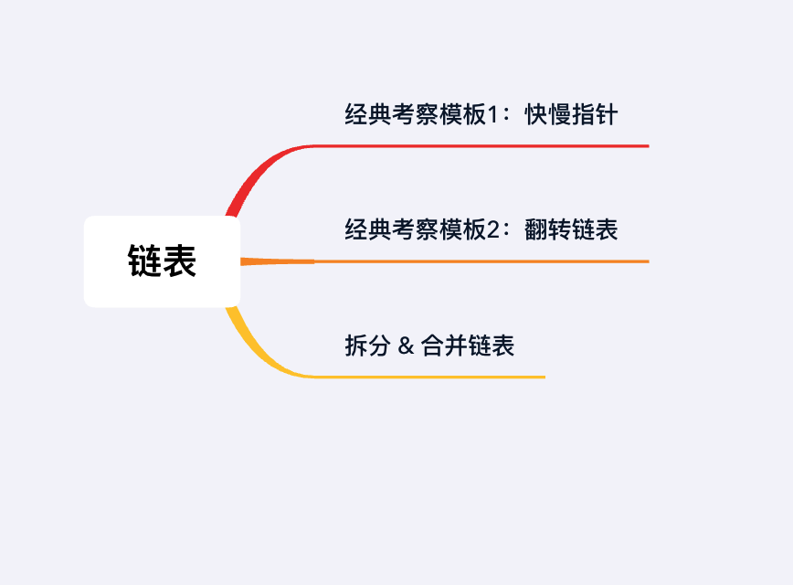

## 章节导读

上一篇文章中，我们学习了链表的构造和两个常用的小技巧dummy node & two pointers。这节课我们来学习面试中常问的链表操作和两种核心算法，并且通过四道例题体会它们在实际面试题中的考察方式。

## 核心算法——链表翻转

链表翻转是链表题中最基础的考点之一，也是很多链表题目的基础。因为翻转链表的多用性，它存在多种解法，因此面试官常常会给出特别的限制条件，比如要求实现in-place（原址）写法，不允许消耗额外内存空间。本算法是面试常考的考题模板之一，需要掌握至少一种实现方式，并且能比较不同方案之间的优劣。

## 核心算法——快慢指针

快慢指针法，也叫龟兔赛跑算法。它是依靠两根不同速度的指针沿着链表移动，常常用于解决链表和数组的环路问题。快慢两根指针沿着链表以不同的速度向前移动，一旦快指针追上慢指针（沿着环路“套圈”），这说明链表中存在环路。本算法也是面试常考的考题模板之一，必须要掌握。

## 1.案例：翻转链表

> 翻转一个给定的链表（单链表）。

###思路分析

这道题有四种常见写法，可以利用迭代、递归、栈和虚拟节点写出各种有效解。其中利用dummy node 可以做到时间和空间复杂度上均保持最优。

利用一个dummy指针，作为新链表的表头。每次从原链表的head取出一个节点，插入dummy node 于新链表之间的位置，作为新的表头。


原链表全部取完后，返回dummy.next指针。


### 代码实现

```java
public ListNode reverseList(ListNode head) {
    ListNode dummy = new ListNode(0);
    while (head != null) {
        ListNode next = head.next;
        head.next = dummy.next;
        dummy.next = head;
        head = next;
    }
    return dummy.next;
}
```

### 分析
时间复杂度O(n)，空间复杂度O(1)

本文中的解法利用了dummy node。如果面试官希望你进一步优化空间，不使用dummy node，建议尝试从已有的算法上推导出更优的解法作为习题

## 2.案例: 合并链表

> 将两个排序链表合并为一个新的排序链表

### 思路分析

这道题关键的操作在于我们需要同时遍历两个链表。给定的两个链表都已经是升序，要求合并后的链表依然保持升序。我们需要两个指针p1, p2分别指向两个链表的表头。每次比较p1和p2的值，取出值较小的那个，append在新链表的结尾。然后将指针移到下一位，直到结尾。

### 代码实现

```java
public ListNode mergeTwoLists(ListNode l1, ListNode l2) {
    ListNode head = new ListNode(0);
    ListNode tail = head;

    while (l1 != null && l2 != null) {
        if (l1.val < l2.val) { // 比较p1和p2的值，取出值较小的
            tail.next = l1;
            l1 = l1.next;
        } else {
            tail.next = l2;
            l2 = l2.next;
        }
        tail = tail.next;
    }

    tail.next = (l1 == null) ? l2 : l1;
    return head.next;
}
```
上面是迭代写法，本题存在多种等价的递归解法，下面是其中一种
```java
public ListNode mergeTwoLists(ListNode l1, ListNode l2) {
    ListNode dummy = new ListNode(0);
    helper(l1, l2, dummy);
    return dummy.next;
}

private void helper(ListNode l1, ListNode l2, ListNode tail) {
    if (l1 == null || l2 == null)   {
        tail.next = l1 != null ? l1 : l2;
        return;
    }

    if (l1.val < l2.val) { // 比较p1和p2的值，取出值较小的
        tail.next = l1;
        helper(l1.next, l2, tail.next);
    } else {
        tail.next = l2;
        helper(l1, l2.next, tail.next);
    }
}
```

### 分析
时间复杂度O(n)，空间复杂度O(1)

本题存在多种等价的递归解法，这里使用了优化的尾递归调用，节约了空间。还有一种解法使用了普通递归，建议作为习题

## 3.案例: 环检测算法

Cycle Detection 环检测算法，是链表类题中相对高难度的部分，也是很多公司的高频题。我们可以通过快慢指针来实现一个简单的Floyd环检测算法。

> 给定一个链表，判断链表中是否有环。

### 思路分析
Floyd环检测是利用快慢指针实现的，快慢指针法也叫做龟兔赛跑算法。初始化两个指针p1, p2，一起指向链表头。慢指针每次走一步，快指针每次走两步，如果快指针能够再次追上慢指针，则说明该链表有环路。


### 代码实现
```java
public boolean hasCycle(ListNode head) {
    return floyd(head) != null;
}

private ListNode floyd(ListNode head) {
    if (head == null || head.next == null) {
        return null;
    }

    ListNode slow = head, fast = head;
    while (fast != null && fast.next != null) {
        // 慢指针每次走一步，快指针每次走两步
        slow = slow.next;
        fast = fast.next.next;
        if (slow == fast) { // 快慢指针相遇，找到环路
            return fast;
        }
    }
    return null;
}
```

### 分析
时间复杂度O(n)，空间复杂度O(1)

### Follow-up

> 给定一个链表，如果链表中存在环，则返回到链表中环的起始节点，如果没有环，返回null。

### 思路分析

相比于前一题, 本题才是Floyd环检测算法的完整形式。完整的Floyd环检测算法回答了三个问题：
1. 是否有环路
2. 环路的入口
3. 链表起点到环路入口的距离

本题相当于完成了Floyd环检测算法的前两步：
1. 利用快慢指针判断是否有环路
2. 当快慢指针相遇时，将慢指针放回到起点。慢指针和快指针每次都只走1步，当二者相遇时，即为环路的入口。


### 代码实现
```java
public ListNode detectCycle(ListNode head) {
    ListNode fast = floyd(head); // 重复利用上一题的floyd函数
    if (fast == null) {
        return null;
    }

    ListNode slow = head; //将慢指针放回到起点
    while (slow != fast) { //二者相遇时，即为环路的入口
        slow = slow.next;
        fast = fast.next;
    }
    return slow;
}
```

### 分析
时间复杂度O(n)，空间复杂度O(1)

这题的考点是Floyd环检测算法，对于不知道这种算法的同学，本题还存在一种使用HashSet的方法，建议作为习题。

## 4.案例: 循环移动链表

> 给定一个链表，循环移动链表，使得每个节点向右移动k个位置

### 思路分析

这道题需要融合我们之前提到的大部分技巧：
1. 计算链表的长度
2. 根据长度计算要翻转的距离
3. 找到第K个节点，并切分
4. 交换两个子链表的位置



### 代码实现

答案的逻辑很简单，首先我们需要抽象出一些辅助函数来帮助我们完成单独的每一步：

#### 1.计算链表的长度

```java
int getSize(ListNode head) {
    int count = 0;
    while (head != null) {
        head = head.next;
        count++;
    }
    return count;
}
```

#### 2.根据长度计算要翻转的距离

右移k步，等价于找到倒数第k个节点。由于我们已经得到了总长度size，我们只需要找到从前往后数第size-k个节点（实际上我们需要是size - k - 1的节点和它的next指针）
```java
ListNode findCuttingPoint(ListNode head, int n) {
    for (int i = 0; i < n; i++) {
        head = head.next;
    }
    return head;
}
```

#### 3.某个链表的结尾

```java
ListNode findTail(ListNode head) {
    while (head.next != null) {
        head = head.next;
    }
    return head;
}
```

有了以上这些辅助函数，我们可以很快实现答案的主体部分。

```java
public ListNode rotateRight(ListNode head, int k) {
    int size = getSize(head); // 计算链表的长度
    
    // 确保输入有效
    if (size <= 1)  return head;
    k = k % size;
    if (k == 0) return head;

    // 根据长度计算要翻转的距离, 找到第K个节点
    ListNode cuttingPoint = findCuttingPoint(head, size - k - 1);
    
    // 切分链表
    ListNode right = cuttingPoint.next;
    cuttingPoint.next = null;

    // 交换两个子链表的位置
    ListNode rightTail = findTail(right);
    rightTail.next = head;
    return right;
}
```

### 分析
时间复杂度O(n)，空间复杂度O(1)

还有一种解法，将链表先连成环，再找到新的链表头位置，重新拆分。建议作为习题

## 总结



本章介绍了多种常用的链表技巧，重点是掌握两种经典考察模板：快慢指针和翻转链表

## 习题

1. 翻转链表中第m个节点到第n个节点的部分
2. 给定一个链表以及一个k,将这个链表从头指针开始每k个翻转一下。（链表元素个数不是k的倍数，最后剩余的不用翻转）
3. 写一个算法来判断一个数是不是“快乐数”：对于一个正整数，每一次将该数替换为他每个位置上的数字的平方和，然后重复这个过程直到这个数变为1，或是无限循环但始终变不到1。如果可以变为1，那么这个数就是快乐数。(提示：使用环检测算法)
4. 给定单链表，将所有奇数节点连接在一起，然后将偶数节点连接在一起。（这里讨论的是节点编号，而不是节点中的值）
5. 设计一种方式检查一个链表是否为回文链表。