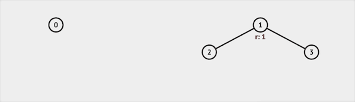
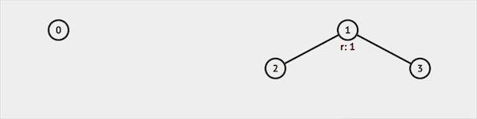
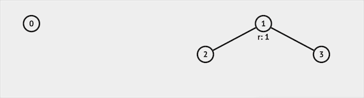
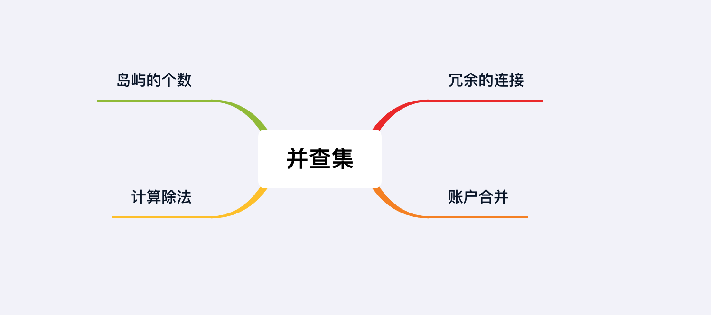

## 章节导读

上一章我们学习了图类题中的经典考察模板：拓扑排序。拓扑排序与BFS层级遍历算法非常相似，但是思路并不相同。希望读者能够掌握并区分这两种算法。本章我们来看另一种经典考察模板：并查集

## 核心算法——并查集

并查集本身是一种树型的数据结构（也叫disjoint-set），专门处理连通性（合并与查询）问题。Union-Find并查描述的是该数据结构的算法操作：

+ Find：确定元素属于哪一个子集
+ Union：将两个子集合并成一个集合

### 并查集森林

并查集森林是一种将每一个集合以树表示的数据结构，其中每一个节点保存着到它的父节点的引用。在并查集森林中，每个集合的代表即是集合的根节点。Find根据其父节点的引用向根行进，直到到达树根。Union通过将一棵树的根连接到另一棵树的根，将两棵树合并到一起。

### Union

Union可以将两个子集合并成一个集合。初始时有4个节点，互不相连。我们先合并1和2，再合并2和3。我们可以发现1和3也被我们间接相连了。


*图片由visualgo制作*

### Find

Find函数用于确定元素属于哪一个子集。比如我们查询集合3，并查集会返回根节点1，说明集合3属于集合1代表的集合。


*图片由visualgo制作*

### IsSame

IsSame并不是标准API的一部分，需要自己实现。实现时IsSame函数会调用Find函数，查询两个集合是否属于同一个更大的集合。
比如我们查询IsSame(2, 3)，并查集会先查询得知集合2属于集合1代表的集合，集合3也属于集合1代表的集合。返回true，说明集合2 & 3属于同一集合。


*图片由visualgo制作*

如果我们查询IsSame(0, 3)，并查集会先查询得知集合0属于集合0代表的集合，集合3属于集合1代表的集合。返回false，说明集合0 & 3属于不同集合。


*图片由visualgo制作*

## 核心算法——并查集的最优实现

并查集有多种实现方式，我们在这里只介绍并查集的最优实现。这种实现方法能够在不明显增加空间复杂度的情况下，提供最高效的合并、查找功能，并且能适应所有面试题。

```java
class UF {
    int count;  // 记录当前包含集合的个数
    int[] size; // 记录每个集合的大小
    int[] id; // 每一个节点保存着到它的父节点的引用

    public UF (int n) {
        // 初始时，每个节点是只包含它本身的集合
        count = n; // n个节点对应n个集合
        // 创建与节点个数相同大小的两个数组
        size = new int[n];
        id = new int[n];
        for (int i = 0 ; i < n; i++) {
            // 因为每个初始集合是只包含节点本身
            size[i] = 1; // 集合大小为1
            id[i] = i; // 集合id为节点本身的id
        }
    }

    public int find(int n) {
        // 根据当前节点父节点的引用向根行进，直到到达树根
        while (n != id[n]) {
            id[n] = id[id[n]]; // 路径压缩，改变每一个节点的引用
            n = id[n];
        }
        return n;
    }

    public boolean union(int a, int b) {
        // 分别找到a, b的父节点
        int pa = find(a);
        int pb = find(b);
        // a & b已经属于统一集合
        if (pa == pb) return false;

        // 将小的集合合并入大的集合
        if (size[pa] < size[pb]) {
            id[pa] = pb;
            size[pb] += size[pa];
        } else {
            id[pb] = pa;
            size[pa] += size[pb];
        }
        count--; // 合并后，集合个数减1
        return true; // 合并成功
    }
}
```

每次操作的时间复杂度可近似看做O(1)，空间复杂度O(n)。

## 1.案例: 冗余的连接

> 树是一个无环无向联通图。给定一个具有N个节点的树，树上添加了一条额外的边。找到应该被删除的边，将图还原成一棵树。
>
> 输入: [[1,2], [1,3], [2,3]]
> 输出: [2,3]

### 思路分析

此题的思路比较简单，是并查集的简单应用。样例输入为[[1,2], [1,3], [2,3]]时，给出的图是个环。我们不断地把边加入并查集中，一旦发现有条边的两个端点已经在同一个集合内，说明这两个点之前已经连接过，因此当前这条边就是多余的边。

### 代码实现

```java
class Solution {
    public int[] findRedundantConnection(int[][] edges) {
        // 建立一个大小为N的并查集
        UF uf = new UF(edges.length + 1);
        // 不断地把边加入并查集
        for (int[] e: edges) {
            // 如果两个端点已经在同一个集合内，这条边就是多余的边
            if (!uf.union(e[0], e[1])) {
                return e;
            }
        }
        return new int[0];
    }
    // 将并查集作为inner class，放在原有的class内部
    class UF {
        int count;  // 记录当前包含集合的个数
        int[] size; // 记录每个集合的大小
        int[] id; // 每一个节点保存着到它的父节点的引用

        public UF (int n) {
            // 初始时，每个节点是只包含它本身的集合
            count = n; // n个节点对应n个集合
            // 创建与节点个数相同大小的两个数组
            size = new int[n];
            id = new int[n];
            for (int i = 0 ; i < n; i++) {
                // 因为每个初始集合是只包含节点本身
                size[i] = 1; // 集合大小为1
                id[i] = i; // 集合id为节点本身的id
            }
        }

        public int find(int n) {
            // 根据当前节点父节点的引用向根行进，直到到达树根
            while (n != id[n]) {
                id[n] = id[id[n]]; // 路径压缩，改变每一个节点的引用
                n = id[n];
            }
            return n;
        }

        public boolean union(int a, int b) {
            // 分别找到a, b的父节点
            int pa = find(a);
            int pb = find(b);
            // a & b已经属于统一集合
            if (pa == pb) return false;

            // 将小的集合合并入大的集合
            if (size[pa] < size[pb]) {
                id[pa] = pb;
                size[pb] += size[pa];
            } else {
                id[pb] = pa;
                size[pa] += size[pb];
            }
            count--; // 合并后，集合个数减1
            return true; // 合并成功
        }
    }
}
```

### 分析
时间复杂度O(n)，空间复杂度O(n)。在之后的题解中，我们将略过UF并查集的class定义，直接调用。

## 2.案例: 岛屿的个数2

> 给定一个n x m的二维矩阵和一个大小为k的二元数组A，初始二维矩阵全0。二元数组A内的k个元素代表k次操作，表示把二维矩阵中下标为(A[0], A[1])的元素由海洋变为岛屿。返回每次变化之后，二维矩阵中岛屿的数量。
>
> 输入: n = 4, m = 5, A = [[1,1],[0,1],[3,3],[3,4]]
> 输出: [1,1,2,2]

### 思路分析

因为相邻的岛屿会被看成一个岛屿，所以由海洋变为岛屿可以导致岛屿合并，从而岛屿数量减少。记录岛屿数量变化的过程，我们需要定义一个矩阵记录地图状态, 还需要定义初始含n × m个集合的并查集。不同于上一题，本题是一个二维的空间状态，所以每个节点相邻点有4个方向。我们有两种处理方法：1. 修改并查集的定义，使用二维数组版本的并查集。2. 将二维的位置投影到一维(x, y) -> x * len + y。本题两种方法都可以，方法2代码量较少。

### 代码实现

```java
public List<Integer> numIslands2(int m, int n, int[][] positions) {
    List<Integer> ans = new ArrayList<>();
    // 定义一个二维数组来记录岛屿的变化
    int[][] island = new int[m][n];
    // 记录总共的水域面积
    int total = m * n;
    // 根据格子的数量创建并查集
    UF uf = new UF(total);
    // 四个方向
    int[] dx = {0, 0, 1, -1};
    int[] dy = {1, -1, 0, 0};
    for (int[] p : positions) {
        // 如果当前位置可以从海洋变成岛屿
        if (island[p[0]][p[1]] != 1) {
            // 将当前位置标记成岛屿
            island[p[0]][p[1]] = 1;
            // 海洋范围减少
            total--;
            for (int i = 0 ; i < 4; i++) {
                // 找到相邻的位置
                int x = p[0] + dx[i], y = p[1] + dy[i];
                // 如果该位置有效且已经是岛屿，那么与当前岛屿合并
                if (x >= 0 && y >= 0 && x < m && y < n && island[x][y] == 1)
                    uf.union(p[0] * n + p[1], x * n + y);
            }
        }
        // 岛屿的个数等于从所有集合数量中减去海洋的数量
        ans.add(uf.count - total);
    }
    return ans;
}
```

### 分析
时间复杂度O(k)，空间复杂度O(n * m)

## 3.案例: 账户合并

> 给定一个帐户列表，每个元素是一个字符串列表，其中第一位元素是用户名，其余元素是该用户的电子邮件。我们需要合并这些帐户：如果两个帐户有相同的电子邮件地址，则这两个帐户肯定属于同一个人。合并帐户后，按以下格式返回帐户：每个帐户的第一个元素是名称，其余元素是按字典序排序后的电子邮件。
>
> 输入:
> [
> ['Jack', 'jacksmith@mail.com', 'jack00@mail.com'],
> ['Jack', 'jacknybravo@mail.com'],
> ['Jack', 'jacksmith@mail.com', 'jack_newyork@mail.com'],
> ['Mary', 'mary@mail.com']
> ]
> 输出:
>[
>['Jack', 'jack00@mail.com', 'jack_newyork@mail.com', 'jacksmith@mail.com'],
>['Jack', 'jacknybravo@mail.com'],
>['Mary', 'mary@mail.com']
>]

### 思路分析

本题很明显是连通性问题，但是处理的过程比较复杂。我们将每个账号看做一个单独的节点，然后根据相同的email来连接节点。连接后要将连接在一起的账号放在同一个列表中。

1. 将每个email对应到一个账户；如果某个email对应多个账户，用union find将多个账号相连
2. 相连之后，并查集会将email汇聚成几个集合，将每个集合和根节点的账号id对应起来，用一个map储存账号id与其该有的所有emails的映射关系。
3. 将上一步的列表排序，加上id所对应的人名，加入答案列表

### 代码实现

```java
public List<List<String>> accountsMerge(List<List<String>> accounts) {
    // 创建对应所有账号的并查集
    UF uf = new UF(accounts.size());
    // 建立一个map，将每个email对应到一个账户
    HashMap<String, Integer> email2Id = new HashMap<>();
    for (int i = 0; i < accounts.size(); i++) {
        List<String> acc = accounts.get(i);
        for (int j = 1; j < acc.size(); j++) {
            // 每个email对应到第一次出现时所属的账户
            String email = acc.get(j);
            email2Id.putIfAbsent(email, i);
            // 如果对应多个账户，将多个账号相连
            uf.union(i, email2Id.get(email));
        }
    }
    // 用一个map储存账号与其该有的emails的映射关系。
    HashMap<Integer, List<String>> id2Email = new HashMap<>();
    for (String email: email2Id.keySet()) {
        // 将每个集合和根节点的账号id对应起来
        int id = uf.find(email2Id.get(email));
        id2Email.putIfAbsent(id, new ArrayList<>());
        id2Email.get(id).add(email);
    }

    List<List<String>> result = new ArrayList<>();
    for (int id : id2Email.keySet()) {
        List<String> account = new ArrayList<>();
        result.add(account);
        // 得到账号用户名
        String name = accounts.get(id).get(0);
        account.add(name);
        // 列表排序
        List<String> email = id2Email.get(id);
        Collections.sort(email);
        // 加入答案列表
        account.addAll(email);
    }
    return result;
}
```

### 分析
时间复杂度O(n)，空间复杂度O(n)

## 4.案例: 计算除法

> 给出一组等式equations和他们对应的值values，每组等式由两个数字组成equations[i] = [A<sub>i</sub>, B<sub>i</sub>]，满足A<sub>i</sub> / B<sub>i</sub> = values[i]。给出一组queries，每组query由两个数字组成queries[i] = [C<sub>i</sub>, D<sub>i</sub>]。返回所有queries的值。
>
> 输入:
> equations = [["a","b"],["b","c"]]
> values = [2.0,3.0]
> queries = [["a","c"],["b","a"],["a","e"],["a","a"],["x","x"]]
> 输出: [6.00000,0.50000,-1.00000,1.00000,-1.00000]

### 思路分析

本题的原型是谷歌的一道汇率转换题，题干与本题类似，给出A->B, B->C, C->D... 等汇率转换比率，计算A->D的汇率。

这题需要对UnionFind算法做出一点修改。只有两个节点相连通，才能相除。这说明他们属于同一个集合，有一个共同的父节点。所以我们需要额外的map记录当前节点对它所属的父节点的权重。比如X、Y有共同的父节点Z，我们已知 X/Z 的值和 Y/Z 的值，所以 X/Y = (X/Z) / (Y/Z)。

### 代码实现

```java
class Solution {
    // 记录每个节点对应的父节点
    Map<String, String> father = new HashMap<>();
    // 记录每个节点对它所属的父节点的权重
    Map<String, Double> weight = new HashMap<>();
    public double[] calcEquation(List<List<String>> equations, double[] values, List<List<String>> queries) {
        for (int i = 0; i < equations.size(); i++) {
            // 获取每个等式的两个部分s1 & s2
            String s1 = equations.get(i).get(0), s2 = equations.get(i).get(1);
            // 如果s1 & s2没被访问过，将它们加入并查集
            putIfAbsent(s1);
            putIfAbsent(s2);
            // 找到对应的父节点
            String root1 = find(s1);
            String root2 = find(s2);
            // 将root1的父节点指向root2
            father.put(root1, root2);
            // 更新root1对它所属的父节点的权重
            weight.put(root1, weight.get(s2) * values[i] / weight.get(s1));
        }

        double[] res = new double[queries.size()];
        for (int i = 0; i < queries.size(); i++) {
            // 获取每个query的两个部分s1 & s2
            String s1 = queries.get(i).get(0), s2 = queries.get(i).get(1);
            // 如果s1 & s2没在图中出现过，或者不属于同一集合
            if (!father.containsKey(s1) || !father.containsKey(s2) || !find(s1).equals(find(s2)))
                res[i] = -1.0; // 无效查询，返回-1
            else  // 根据他们分别对父节点的权重，计算结果
                res[i] = weight.get(s1) / weight.get(s2);
        }
        return res;
    }

    private void putIfAbsent(String s) {
        father.putIfAbsent(s, s);
        weight.putIfAbsent(s, 1.0);
    }
    // 修改后的find函数
    private String find(String s) {
        // 如果已经到达父节点，返回本身
        if (father.get(s).equals(s)) {
            return s;
        }
        // 更新到父节点的权重
        String prev = father.get(s);
        String p = find(father.get(s));
        father.put(s, p);
        weight.put(s, weight.get(prev) * weight.get(s));
        return p;
    }
}
```

### 分析
时间复杂度O(n)，空间复杂度O(n)。本题可以使用BFS/DFS求解，感兴趣的读者可以作为习题。

## 总结

本章我们学习了图类题中的第二类经典考察模板：并查集。并查集经常出现在大厂面试题中，本身难度不高，但是需要读者掌握这种数据结构的写法。大部分题目都只是并查集结构的简单应用。



## 习题

1. 使用BFS/DFS求解案例4计算除法
