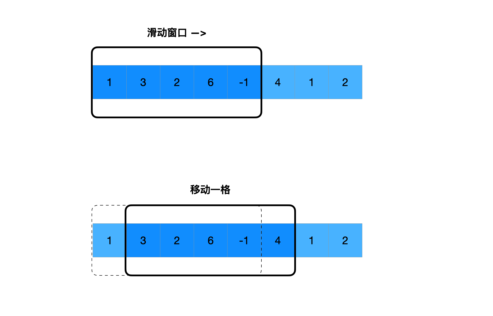
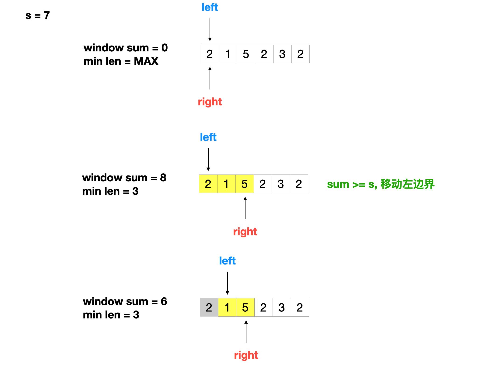
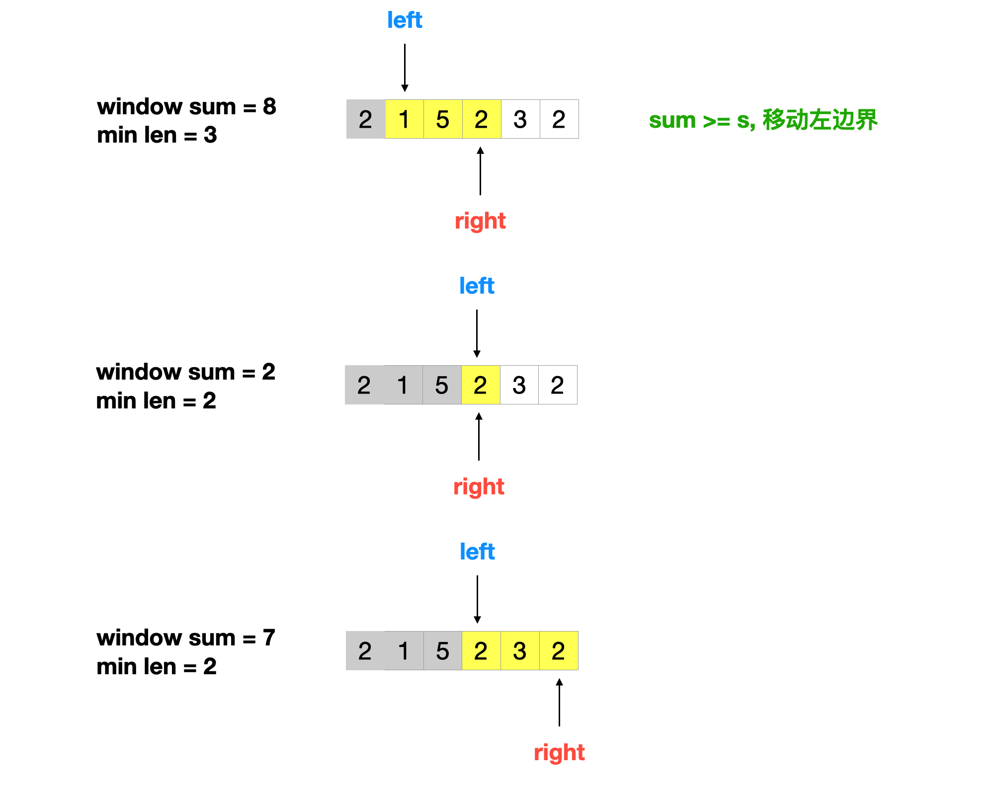
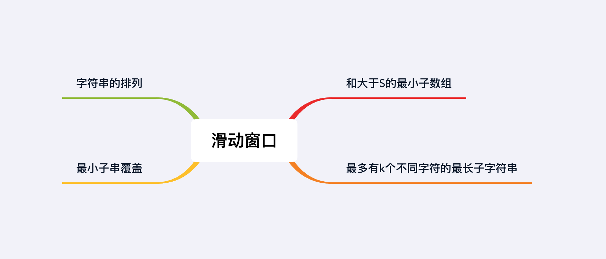

## 章节导读

我们在之前的数组入门章节中，介绍了数组配合指针的基本技巧，其中最重要的技巧是两根指针。两根指针法有多个变种，本章我们来学习其中最重要的一种变化：滑动窗口。

## 核心算法——滑动窗口

在数组或者链表类问题中，我们常常需要在一段给定长度的连续子数组或者子链表上进行计算或者查询。朴素解法会使用两层for循环，实际上在子数组位置变化时，变化前后的子数组有大量的共有元素，因此我们可以重复使用前一次的子数组，这种技巧就是滑动窗口。



我们将每个连续的子数组看做一个固定长度的窗口，窗口沿着数组滑动。滑动窗口的空间消耗为O(n)。定长滑动窗口通常可以使用for循环配合指针解决。

如果滑动窗口的长度经常发生变化，我们称之为动态滑动窗口。动态滑动窗口法有一套基础模板，但是这套模板比较繁琐，需要我们理清题目的要求，针对题意套用。
```java
int left = 0, right = 0;
for (right = 0; right < nums.length; right++) {
    // do something
    while (left < nums.length) {
        if (condition) {
            // do something
        } else {
            // do something
            break;
        }
    }
    // do something
}
```

下面是简化后模板，能够应付大部分题目。一般情况下，可以先考虑简易模板，如果不能满足题目要求，在修改成完整的模板。
```java
int left = 0, right = 0;
for (right = 0; right < nums.length; right++) {
    // do something
    while (condition) {
        // do something
        left++;
    }
    // do something
}
```

## 1.案例: 和大于S的最小子数组

> 给定一个由n个正整数组成的数组和一个正整数s，请找出该数组中满足其和大于等于s的最小长度子数组长度。如果无解，则返回0。
>
> 输入: [2, 1, 5, 2, 3, 2], s = 7
> 输出: 2

### 思路分析

本题我们可以套用动态滑动窗口的简易模板。要注意的是，本题中窗口的大小并不固定。

1. 初始化left, right两根指针，指向位置0
2. 先移动right指针，直到累积和超过s
3. 此时left和right之间的位置将构成滑动窗口，我们每次需要将窗口的长度和已知的最小长度作比较
4. 移动right指针，加入新的元素，窗口的和大于等于s时停止
5. 移动left指针，缩小窗口大小，直到窗口的和小于s
6. 重复步骤 4 & 5 直到结尾






### 代码实现

```java
public int minSubArrayLen(int s, int[] nums) {
    // 初始化left, right两根指针，指向位置0
    int left = 0, right = 0;
    int ans = Integer.MAX_VALUE, sum = 0;
    for (right = 0; right < nums.length; right++) {
        // 移动right指针
        sum += nums[right];
        // 累积和超过s
        while (sum >= s) {
            // 满足条件，更新ans
            ans = Math.min(ans, right - left + 1);
            // 移动left指针，缩小窗口大小
            sum -= nums[left];
            left++;
        }
    }
    // 返回子数组长度；无解返回0
    return ans == Integer.MAX_VALUE ? 0 : ans;
}
```

### 分析
时间复杂度O(n)，空间复杂度O(1)。每个元素至多被访问两次，指针移动完需要O(n)的时间。两根指针只需要常数空间。

## 2.案例: 最多有k个不同字符的最长子字符串

> 给定字符串，找到最多有k个不同字符的最长子串。
>
> 输入: String="araaci", K=2
> 输出: 4

### 思路分析

本题是字符串类问题。字符串本质上是一个char元素组成的一维数组，我们可以将数组类问题的解法用在字符串上。本题我们依然可以套用动态滑动窗口的简易模板，但是我们需要一个额外的Map来记录窗口中每个字符出现的频数。

1. 初始化left, right两根指针，指向位置0
2. 移动right指针，将新的字符加入map，直到拥有超过k个不同字符
3. 移动left指针，缩小窗口大小，直到不同字符的个数小于k
4. 重复步骤 2 & 3 直到结尾

### 代码实现

```java
public int lengthOfLongestSubstringKDistinct(String s, int k) {
    HashMap<Character, Integer> count = new HashMap<>();
    // 初始化left, right两根指针，指向位置0
    int left = 0, right = 0;
    int ans = 0;
    for (right = 0; right < s.length(); right++) {
        // 移动right指针
        char r = s.charAt(right);
        // 加入新的元素
        count.put(r, count.getOrDefault(r, 0) + 1);
        while (count.size() > k) {
            // 移动left指针，缩小窗口大小
            char l = s.charAt(left);
            // 移除旧的字符
            count.put(l, count.get(l) - 1);
            if (count.get(l) == 0)
                count.remove(l);
            left++;
        }
        // 满足条件，更新ans
        ans = Math.max(ans, right - left + 1);
    }
    return ans;
}
```

### 分析
时间复杂度O(n)，空间复杂度O(1)。移动滑动窗口需要O(n)的时间。HashMap最多只包含26个字母，只需要常数空间。

## 3.案例: 字符串的排列

> 给定一个String s和一个Pattern p，判断s是否包含p的某种排列
>
> 输入: Pattern="abc"，String="oidbcaf"
> 输出: true ("bca" 是 “abc”的一种排列)

### 思路分析

本题是定长滑动窗口类问题，所以只需for循环配合指针就可以解决，我们依然需要额外的map来记录出现过的字符。

1. 建立一个map来记录pattern中字符出现的频数，另一个map来记录窗口中字符出现的频数
2. 在字符串上滑动窗口，每次加入一位新的字符，移除一位旧的字符，更新对应字符出现的频数
3. 如果窗口对应的map与pattern对应的map一致，那么当前窗口包含p的某种排列
4. 滑动窗口直到到达结尾

这里顺便介绍一种用int数组代替hashmap的方法：char字符本身可以解释为整数型。当字符集大小有限时，我们可以用一个256位或者26位(只有小写字符)的数组，用字符作下标，作为一个char -> int的映射。

### 代码实现

```java
public boolean checkInclusion(String s1, String s2) {
    int len1 = s1.length(), len2 = s2.length();
    // 如果pattern长度超过字符串，那么直接结束程序
    if (len1 > len2)
        return false;
    // map1 记录pattern中字符出现的频数
    int[] map1 = new int[26];
    // map2 记录窗口中字符出现的频数
    int[] map2 = new int[26];

    for (int i = 0; i < len1; i++) {
        // 对应更新字符出现的频数
        map1[s1.charAt(i) - 'a']++;
        map2[s2.charAt(i) - 'a']++;
    }

    // 在字符串上滑动窗口
    for (int i = len1; i < len2; i++) {
        // 窗口对应的map与pattern对应的map一致，那么当前窗口包含p的某种排列
        if (Arrays.equals(map1, map2))
            return true;
        // 加入一位新的字符，更新对应字符出现的频数
        map2[s2.charAt(i) - 'a']++;
        // 移除一位旧的字符，更新对应字符出现的频数
        map2[s2.charAt(i - len1) - 'a']--;
    }
    return Arrays.equals(map1, map2);
}
```

### 分析
时间复杂度O(n)，空间复杂度O(1)。移动滑动窗口需要O(n)的时间。map数组长度为26，只需要常数空间。

## 4.案例: 最小子串覆盖

> 给定两个字符串source和target. 求source中最短的包含target中每一个字符的子串.
>
> 输入: s="aabdec", t="abc"
> 输出: "abdec"

### 思路分析

本题与题3有相似之处，都是给定string和pattern做模式匹配。但是题3是定长滑动窗口类问题，而本题是动态滑动窗口。

1. 建立一个map来记录target中字符出现的频数
2. 在字符串上滑动窗口，每次加入一位新的字符，将加入的新字符与已有的map匹配
3. 如果当前窗口与target匹配，开始收缩左边界，直到匹配条件被破坏
4. 滑动窗口直到到达结尾

在之前的题目中，我们调用了Arrays.equals方法来比较两个数组。实际上这个方法会遍历整个数组，只不过我们的数组长度不大，所以对性能影响不显著。本题中，我们介绍一种优化方法，使用一个额外的int字段，记录匹配成功的字符数。当所有字符都匹配时，该字段的值应该与map大小相等。这样我们可以把遍历优化成单次比较操作，从而提高性能。


### 代码实现

```java
public String minWindow(String s, String t) {
    // 如果target长度超过source，那么直接结束程序
    if (t.length() > s.length()){
        return "";
    }

    // 建立一个map来记录target中字符出现的频数
    HashMap<Character, Integer> count = new HashMap<>();
    for (char c : t.toCharArray()) {
        count.put(c, count.getOrDefault(c, 0) + 1);
    }

    int left = 0, right = 0, match = 0;
    int len = Integer.MAX_VALUE, start = 0;
    // 在字符串上滑动窗口
    for (right = 0; right < s.length(); right++) {
        // 每次加入一位新的字符
        char r = s.charAt(right);
        if (count.containsKey(r)) {
            count.put(r, count.get(r) - 1);
            // 将加入的新字符与已有的map匹配
            if (count.get(r) == 0)
                match++;
        }
        // 当所有字符都匹配时，该字段的值应该与map大小相等
        while (match == count.size()) {
            // 记录当前的最小长度和起始索引
            if (len > right - left + 1) {
                len = right - left + 1;
                start = left;
            }
            // 收缩左边界
            char l = s.charAt(left);
            if (count.containsKey(l)) {
                // 更新匹配的字符数
                if (count.get(l) == 0)
                    match--;
                count.put(l, count.get(l) + 1);
            }
            // 收缩左边界
            left++;
        }
    }
    // 利用start和len，找到最小覆盖子串
    return len == Integer.MAX_VALUE ? "" : s.substring(start, start + len);
}
```

### 分析
时间复杂度O(n)，空间复杂度O(1)。移动滑动窗口需要O(n)的时间。HashMap最多只包含26个字母，只需要常数空间。

## 总结

本章我们学习了两根指针法的变种技巧：滑动窗口。滑动窗口分为定长滑动窗口和动态滑动窗口两类。并且经常作为数组、字符串、列表的常考题出现在面试中。



## 习题

1. 最长无重复字符的子串：给定一个字符串，找出其中无重复字符的最长子字符串。
2. 替换后的最长重复字符：给定一个字符串，可以将字符串中的任何一个字母替换为的另一个字母，最多替换k次。执行上述操作后，找到最长的，只含有同一字母的子字符串的长度。
3. 最多连续1：给定一个0/1数组，可以将0替换为1，最多替换k次。找到最长的，只含有1的子数组长度。
4. 寻找所有的pattern排序：给定一个字符串s和一个Pattern p，找到在s中所有p的某种排列组成的子串的起始索引。
