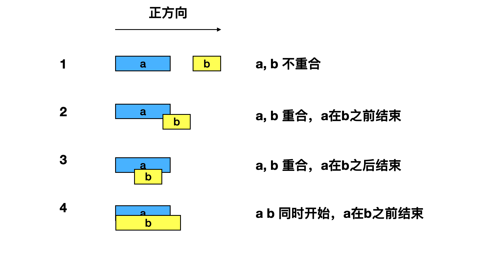
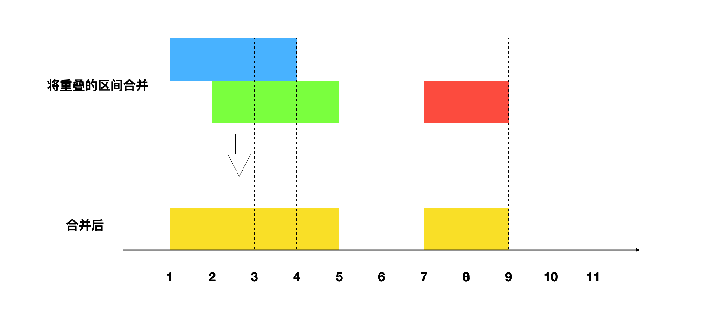
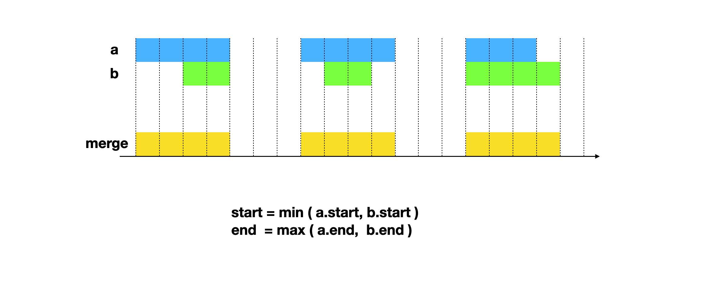
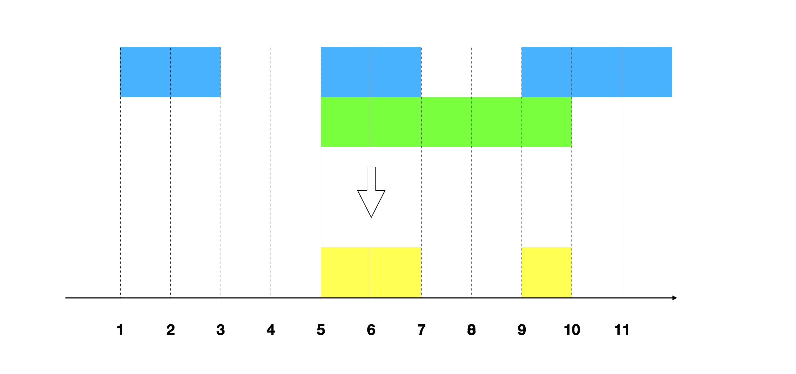
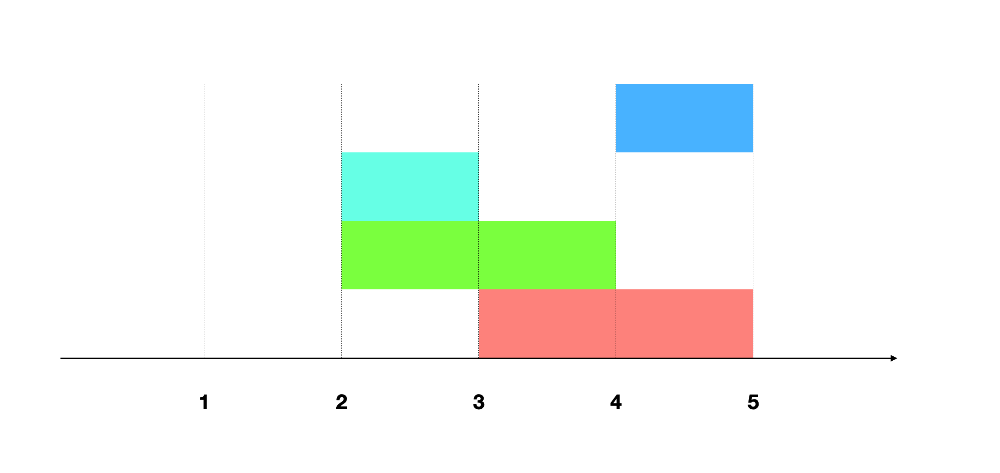
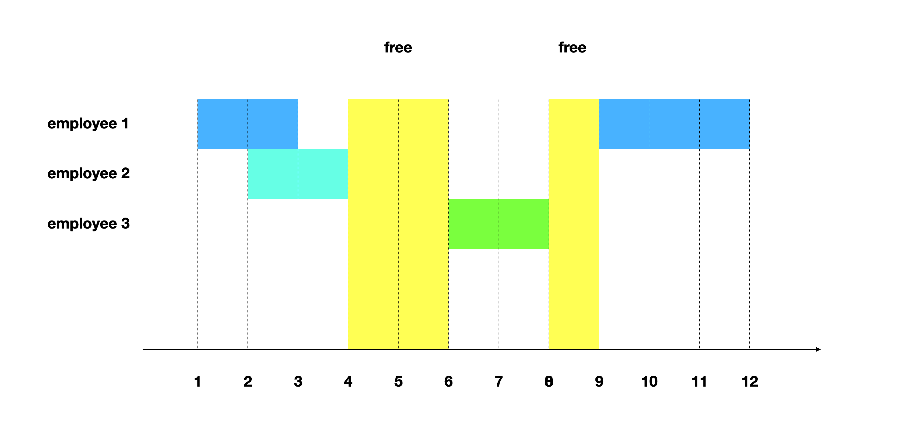
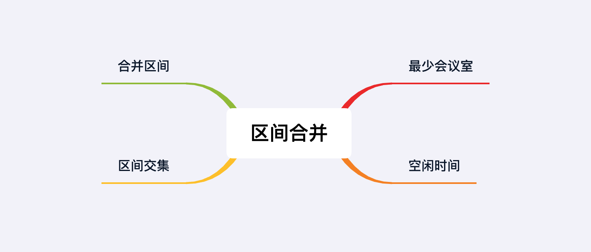

## 章节导读

上一章我们学习了滑动窗口这种技巧，滑动窗口会沿着固定的方向，在一维数组（或者字符串string）上移动。在二维数组上有一种类似的题型，区间类问题。区间类问题一般基于嵌套数组（二维数组），每个单独的数组代表一个区间（时间点、位移、位置...），需要我们按照一定顺序遍历区间，同时进行添加、删除、查询等等操作。

## 核心算法——区间合并

区间合并类问题有两个基本元素：

1. 正方向的描述：正方向可以是时间、位置、起止点等概念
2. 区间：每个区间必须是闭合的，有开始有结束

给出a、b两个不同的区间，它们之间有多种可能的情况。我们根据给定的正方向，将区间给定先后顺序，可以将分类简化。



## 1.案例: 合并区间

> 给出多个闭合区间，合并所有重叠的部分。
>
> 输入: [[1,4], [2,5], [7,9]]
> 输出: [[1,5], [7,9]]

### 思路分析

我们先根据题意画出示意图，示例中区间[1,4]和[2,5]有重合部分，所以合并成了区间[1,5]



不难看出，区间合并的四种情况中有三种是可以合并的。合并后的区间起点是两个原有区间的最小值，终点是原有区间的最大值。



我们可以先将区间按照起点排序，这样就只需要比较终点的值。

1. 将区间按照起点排序
2. 如果a，b区间重合（b.start <= a.end），那么将a b合并：start = a.start, end = max(a.end, b.end)
3. 重复执行步骤2直到结束

### 代码实现

```java
public int[][] merge(int[][] intervals) {
    // 将区间按照起点排序
    // 数组第0位是起点，第1位是终点
    // 创建Comparator比较器，比较数组第0位
    Arrays.sort(intervals, Comparator.comparing(i -> i[0]));
    // 建立一个链表记录合并好的结果
    LinkedList<int[]> list = new LinkedList<>();
    for (int[] i : intervals) {
        // 找到上一个区间，如果与当前区间重合（curt.start <= last.end）
        if (!list.isEmpty() && i[0] <= list.getLast()[1] ) {
            // 合并进前一个区间，start不变，end = max(a.end, b.end)
            list.getLast()[1] = Math.max(i[1], list.getLast()[1]);
        } else {
            // 否则这是一个不需要合并的区间
            list.add(i);
        }
    }
    // 返回结果
    return list.toArray(new int[list.size()][]);
}
```

### 分析
时间复杂度O(n logn)，对n个区间排序。空间复杂度O(n)，用额外的list保存了结果。

## 2.案例: 区间交集

> 给出两组区间，找到两组区间的交集。每组区间之内互不相交，并按照开始时间排序。
>
> 输入: arr1=[[1, 3], [5, 7], [9, 12]], arr2=[[5, 10]]
> 输出: [5, 7], [9, 10]

### 思路分析

本题是前一题的变种题，画出示意图，这次我们需要的不是两个重叠区间的外边缘，而是内边缘



我们可以得出区间合并的规律：
+ start = min(a.start, b.start)
+ end = max(a.end, b.end)

算法的流程与上一题类似：

1. 初始化两个指针，根据区间的结束时间，谁小移谁
2. 如果a，b区间重合，那么按规则合并
3. 重复执行步骤2直到结束

### 代码实现

```java
public int[][] intervalIntersection(int[][] A, int[][] B) {
    // 初始化两个指针
    int i = 0, j = 0;
    List<int[]> list = new ArrayList<>();
    while (i < A.length && j < B.length) {
        // a，b区间重合
        if (overlap(A[i], B[j]))
            // 按规则合并
            list.add(intersect(A[i], B[j]));

        // 区间的结束时间，谁小移谁
        if (A[i][1] < B[j][1]) {
            i++;
        } else {
            j++;
        }
    }
    return list.toArray(new int[list.size()][]);
}

// 判断区间a，b是否有交集
private boolean overlap(int[] a, int[] b) {
    return a[0] < b[0] ? a[1] >= b[0] : overlap(b, a);
}

// 计算区间a，b的交集
private int[] intersect(int[] a, int[] b) {
    return new int[]{Math.max(a[0], b[0]), Math.min(a[1], b[1])};
}
```

### 分析
时间复杂度O(n)，输入的区间已经排序好了，只需要遍历一遍，无需额外排序。空间复杂度O(n)，用额外的list保存了结果。

## 3.案例: 最少会议室

> 给定一系列的会议时间间隔，包括起始和结束时间[[s1,e1],[s2,e2],...] (si < ei)，计算所需的最少会议室数量。
>
> 输入: [[4,5], [2,3], [2,4], [3,5]]
> 输出: 2

### 思路分析

先根据范例画出示意图，如果之间应用区间合并算法，我们会发现所有的区间都合并进了[2,5]，这表示4个区间重合。



实际上我们并不需要4个会议室，[2,3]与[3,5]并不重合，因此我们只需要记录互斥的会议个数。仅当两个会议互斥时，才新增一个会议室。我们需要同时利用会议的开始时间和结束时间两个信息。先将会议按照开始时间排序，每一个会议开始时，我们要检查有多少会议还没有结束。

1. 将会议按照开始时间排序
2. 初始化一个最小堆，按照结束时间排序当前正在进行的会议
3. 遍历所有会议，每一个会议开始时，我们要检查有多少会议正在进行
4. 将已经结束的会议从最小堆弹出
5. 计算当前正在进行的会议
6. 重复3 - 5，直至结束

### 代码实现

```java
public int minMeetingRooms(int[][] intervals) {
    // 将会议按照开始时间排序
    Arrays.sort(intervals, Comparator.comparing(i -> i[0]));
    int minRoom = 0;
    // 初始化一个最小堆，按照结束时间排序当前正在进行的会议
    // 创建Comparator比较器，比较数组第1位，即结束时间
    PriorityQueue<int[]> minHeap = new PriorityQueue<>(Comparator.comparing(i -> i[1]));
    // 遍历所有会议
    for (int[] i : intervals) {
        // 加入当前会议
        minHeap.offer(i);
        // 将已经结束的会议从最小堆弹出
        while (!minHeap.isEmpty() && minHeap.peek()[1] <= i[0])
            minHeap.poll();
        // 计算最多需要多少个会议室
        minRoom = Math.max(minRoom, minHeap.size());
    }
    return minRoom;
}
```

### 分析
时间复杂度O(n logn)，对n个区间排序。空间复杂度O(n)，用额外的heap

## 4.案例: 空闲时间

> 有k个工作人员，用一个二维列表表示他们的工作时间。找到所有员工共同的空闲时间。当前的工作时间已经按开始时间排序
>
> 输入: [[[1,3], [9,12]], [[2,4]], [[6,8]]]
> 输出: [4,6], [8,9]

### 思路分析1

我们可以按照区间合并的思路来解决本题



1. 将所有区间按开始时间排序
2. 将重叠的区间合并
3. 找到合并后的区间之间的间隔

### 代码实现1

```java
public List<Interval> employeeFreeTime(List<List<Interval>> schedule) {
    // 获得所有区间
    List<Interval> flatten = new ArrayList<>();
    for (List<Interval> s : schedule) {
        flatten.addAll(s);
    }
    // 将所有区间按开始时间排序
    Collections.sort(flatten, Comparator.comparing(i -> i.start));
    // 将重叠的区间合并
    LinkedList<Interval> list = new LinkedList<>();
    for (Interval i : flatten) {
        if (!list.isEmpty() && i.start <= list.getLast().end ) {
            list.getLast().end = Math.max(i.end, list.getLast().end);
        } else {
            list.add(i);
        }
    }
    List<Interval> ans = new ArrayList<>();
    // 找到合并后的区间之间的间隔
    for (int i = 1; i < list.size(); i++) {
        int start = list.get(i - 1).end;
        int end = list.get(i).start;
        ans.add(new Interval(start, end));
    }
    return ans;
}
```

### 思路分析2

解法1需要O(n logn)的时间复杂度消耗和O(n)的空间复杂度消耗，尤其是我们创建了三个列表来缓存中间结果。

我们其实在之前的章节中见过类似的题目：链表的k路合并。本题更像是k路合并在区间上的应用。

我们创建一个Node class，来完成k路合并。Node包含了当前的区间，相关的员工eid，和对应员工工作时间的下标。

```java
class Node {
    Interval interval;
    int eid, idx;

    public Node(Interval interval, int eid, int idx) {
        // 当前的区间
        this.interval = interval;
        // 员工eid
        this.eid = eid;
        // 对应工作时间的下标
        this.idx = idx;
    }
}
```

1. 创建一个最小堆，按照开始时间排序
2. 将每个员工的第1段工作时间加入最小堆
3. 从最小堆中取出最早的区间，记下它的结束时间
3. 每次从最小堆中取出一个区间，与当前已知的结束时间比较，更新已知的结束时间
4. 将Node移至下一位，将下一段工作时间加入最小堆
5. 重复3-4，直至结束

### 代码实现2
```java
public List<Interval> employeeFreeTime(List<List<Interval>> schedule) {
    List<Interval> ans = new ArrayList<>();
    // 创建一个最小堆，按照开始时间排序
    PriorityQueue<Node> minHeap = new PriorityQueue<>((a, b) -> a.interval.start - b.interval.start);
    for (int i = 0; i < schedule.size(); i++) {
        // 将每个员工的第1段工作时间加入最小堆
        minHeap.offer(new Node(schedule.get(i).get(0), i, 0));
    }
    // 最早区间的结束时间
    int lastEnd = minHeap.peek().interval.end;
    while (!minHeap.isEmpty()) {
        // 每次从最小堆中取出一个区间
        Node curt = minHeap.poll();
        // 当前区间的开始时间晚于lastEnd，说明二者不重合，中间有空闲时间
        if (curt.interval.start > lastEnd) {
            // 获得空闲时间
            ans.add(new Interval(lastEnd, curt.interval.start));
        }
        // 更新已知最晚的结束时间
        lastEnd = Math.max(lastEnd, curt.interval.end);

        List<Interval> freeTime = schedule.get(curt.eid);
        // 如果当前员工还有下一段工作时间，加入最小堆
        if (curt.idx + 1 < freeTime.size()) {
            minHeap.offer(new Node(freeTime.get(curt.idx + 1), curt.eid, curt.idx + 1));
        }
    }
    return ans;
}
```

### 分析
时间复杂度O(n logk)，空间复杂度O(k)，k是员工总数。最小堆消耗了O(k)空间，并且执行了n次O(logk)的插入与删除操作。

## 总结

本章我们学习了区间类问题。区间类问题特征比较明显，一般使用嵌套列表或二维数组，每个单独的数组代表一个区间。解法也比较普适，需要我们按照一定顺序（起点或者终点）排序，然后遍历所有区间。



## 习题

1. 给定一系列的会议时间间隔，包括起始和结束时间[[s1,e1],[s2,e2],...] (si < ei)，判断一个人是否可以参加所有会议。
2. 给定一些区间，找到需要移除的最小区间数，以使其余的区间不重叠。
3. 给出一个无重叠的按照区间起始端点排序的区间列表。在列表中插入一个新的区间，你要确保列表中的区间仍然有序且不重叠（如果有必要的话，可以合并区间）。
