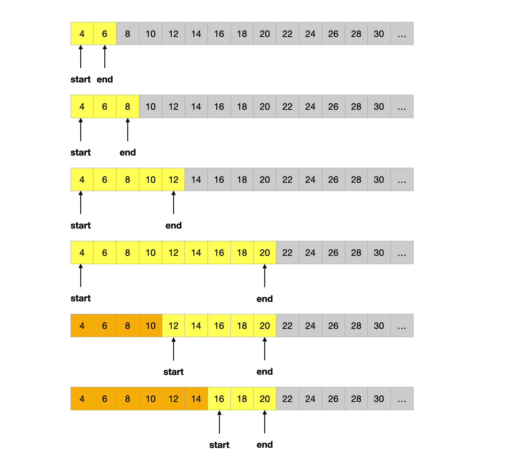
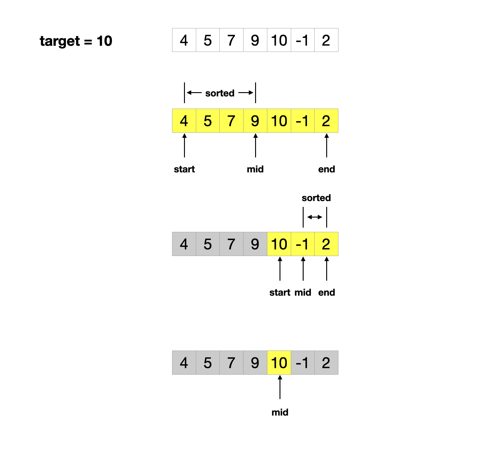

## 章节导读

数组类问题中，搜索是最常见的问题之一。面试官通常会给出一个数组、链表或者矩阵，然后要求面试者高效地查询特定元素。这一类问题中，最经典的解法就是二分法。二分法思路简单，但是非常高效，并且能有效考察面试人员的编码水平。

## 核心算法——二分搜索算法

二分搜索法是一种经典的算法，能在有序数组中以O(logn)的效率搜索特定的元素。

搜索过程从数组的中间元素开始，如果中间元素正好是要查找的元素，则搜索过程结束；如果给定元素大于或者小于中间元素，则在数组大于或小于中间元素的那一半中查找。这种搜索算法每一次比较都使搜索范围缩小一半。


*图片由algorithm-visualizer制作*

二分搜索算法：

1. 初始化left和right，分别指向首位和末位
2. 找到中间位置mid
3. 如果mid不是我们要找到target
3.1. 如果target比mid指向的值小，说明target的位置在mid左侧，更新right的值
3.2. 如果target比mid指向的值大，说明target的位置在mid右侧，更新left的值
4. 如果mid指向我们要找到target，返回mid的值
5. 重复2-4步，直到退出循环

实际上，二分搜索不只对有序数组有效，任何有序的可比较的集合都可以纳入二分法的适用范围，比如习题2的适用二分法开平方。

## 1.案例: 二分搜索法

> 给定一个已排序的数组，找到target对应的下标。如果target不存在，返回-1
>
> 输入: nums = [0, 1, 21, 33, 45, 45, 61, 71, 72, 73], target = 33
> 输出: 3

### 思路分析1

二分法的思路虽然简单，但是90%的人并不能将它写对，很多人甚至会在边界条件上花上好几个小时。根据高德纳在《计算机程序设计的艺术》中所说：1946年就有公开发布的二分法算法，但是直到1962年才有人写出没有bug的二分法程序。

这里我们先一段曾经java内置的binarySearch算法为例，分析二分法的实现难点。为了简化流程，我对它做了一些修改。

### 代码实现1

```java
public int search(int[] nums, int target) {
    // 指定搜索范围
    int left = 0, right = nums.length - 1;
    while (left <= right) {
        // 找到中间位置
        int mid = (left + right) / 2;
        if (nums[mid] == target) { // 找到目标元素
            return mid;
        } else if (nums[mid] < target) { // 目标元素在mid右侧
            left = mid + 1; // 抛弃mid左侧的搜索范围
        } else { // 目标元素在mid左侧
            right = mid - 1; // 抛弃mid右侧的搜索范围
        }
    }
    // 未找到目标元素
    return -1;
}
```

这段代码来自乔恩·本特利的《编程珠玑》，其中第6行存在整数溢出的问题，并且超过20年无人察觉。本特利也是java语言库的贡献者，这段有bug的代码在java中存在9年才被修复。

第6行
```java
int mid = (left + right) / 2;
```
如果left和right都是很大整数，二者相加超过了整数范围的上限，那么就会导致整型溢出错误。
本特利2006年在自己的博客中表示这里应该改成
```java
int mid = left + (right - left) / 2;
```
但是同时他表示，自己依然不能确定这段代码已经没有bug了。（其实2008年，他还真的又找到了一个bug）

### 思路分析2

将二分法的算法变成代码实现，这个过程中存在太多模糊的地方：

+ 如何设置终止条件？应该是 left < right 还是 left <= right ？
+ 如何确定边界left和right？
+ 如何更新边界？left = mid 还是 left = mid + 1, right = mid 还是 right = mid - 1 ?
+ ......

基于以上事实，二分法可以说是最难实现的算法之一。因此要向大家额外介绍一种二分法的模板，这段模板可以避免off-by-one error。

### 代码实现2

```java
public int search(int[] nums, int target) {
    // 指定搜索范围
    int left = 0, right = nums.length - 1;
    // 放宽结束条件
    while (left + 1 < right) {
        // 避免整型溢出
        int mid = left + (right - left) / 2;
        if (nums[mid] == target) { // 找到目标元素
            return mid;
        } else if (nums[mid] < target) { // 目标元素在mid右侧
            // 放宽边界收缩
            left = mid;
        } else { // 目标元素在mid左侧
            // 放宽边界收缩
            right = mid;
        }
    }
    // 通过额外的两次比较判断边界
    if (nums[left] == target)   return left;
    if (nums[right] == target)   return right;
    // 未找到目标元素
    return -1;
}
```

这段模板通过放宽边界来避免off-by-one error。每次边界的更新相对宽松，仅仅将mid的值赋值给left和right。所以当终止条件 left + 1 < right 达成时，还有两个元素未被访问。此时再通过额外两次比较从left和right中找到目标元素。

### 分析
时间复杂度O(logn)，空间复杂度O(1)。二分法存在多种模板，但是没有人可以保证某种模板适用于所有题型，读者在面试时需要根据题目自行调整算法。

## 2.案例: 数字范围

> 给定一个升序数组nums和一个值target。找出target在nums中的开始位置和结束位置。如果不存在，返回[-1, -1]。
>
> 输入: [4, 6, 6, 6, 9], 6
> 输出: [1, 3]

### 思路分析

本题是在二分搜索法上的延伸，我们只需要扩展二分法的第四步算法，让它适应搜索开始位置和结束位置两种模式。

1. 初始化left和right，分别指向首位和末位
2. 找到中间位置mid
3. 如果mid不是我们要找到target
3.1. 如果target比mid指向的值小，说明target的位置在mid左侧，更新right的值
3.2. 如果target比mid指向的值大，说明target的位置在mid右侧，更新left的值
4. 如果mid指向我们要找到target
4.1. 要找到第一个出现的target，我们更新right的值，来寻找左侧（mid之前）出现的target
4.2. 要找到最后一个出现的target，我们更新left的值，来寻找右侧（mid之后）出现的target
5. 重复2-4步，直到退出循环

### 代码实现


```java
public int[] searchRange(int[] nums, int target) {
    int[] ans = new int[]{-1, -1};
    if (nums == null || nums.length == 0)
        return ans;
    // 分别找到target在nums中的开始位置和结束位置
    ans[0] = find(nums, target, true);
    ans[1] = find(nums, target, false);
    return ans;
}

int find(int[] nums, int target, boolean first) {
    // 初始化left和right，分别指向首位和末位
    int idx = -1, left = 0, right = nums.length - 1;
    while (left <= right) {
        // 找到中间位置mid
        int mid = left + (right - left) / 2;
        if (target < nums[mid]) { // 如果target比mid指向的值小
            // 更新right的值
            right = mid - 1;
        } else if (nums[mid] < target) { // 如果target比mid指向的值大
            // 更新left的值
            left = mid + 1;
        } else { // mid指向要找到target
            // 记录下当前的下标
            idx = mid;
            if (first) { // 寻找第一个出现的target
                // 更新right的值，寻找mid之前出现的target
                right = mid - 1;
            } else { // 寻找最后一个出现的target
                // 更新left的值，寻找mid之后出现的target
                left = mid + 1;
            }
        }
    }
    // 返回idx记录的下标
    return idx;
}
```

### 分析
时间复杂度O(logn)，空间复杂度O(1)

## 3.案例: 二分查找无限长度升序数组

> 给定一个无限长度的升序数组，找到数组中是否存在target的值。如果存在，返回target的下标；否则返回-1。（提供ArrayReader.get(index)接口来查询）
>
> 输入: [4, 6, 8, 10, 12, 14, 16, 18, 20, 22, 24, 26, 28, 30...], target = 16
> 输出: 6

### 思路分析

本题代表了二分搜索的一个变种：当题目没有给定搜索边界时，如何进行搜索。

我们反向利用二分法的思路，通过每次翻倍边界向外扩张，直到找到一个有效的边界。



一旦确定了上下边界，我们再向内收缩，使用二分法查找。

### 代码实现

```java
public int search(ArrayReader reader, int target) {
    // 初始化上下边界
    int start = 0, end = 1;
    // 持续翻倍边界向外扩张，直到将target包含边界内
    while (reader.get(end) < target)
        end *= 2;

    // 在上下边界内，使用二分法查找。
    while (start <= end) {
        int mid = start + (end - start) / 2;
        if (reader.get(mid) == target) {
            return mid;
        } else if (reader.get(mid) < target) {
            start = mid + 1;
        } else {
            end = mid - 1;
        }
    }
    return -1;
}
```

### 分析
时间复杂度O(logn)，空间复杂度O(1)

## 4.案例: 搜索旋转排序数组

> 给定一个旋转排序数组nums和一个值target，找出target在nums中的索引，否则返回-1。
>
> 输入: [4, 5, 7, 9, 10, -1, 2], 10
> 输出: 4

### 思路分析

本题是二分搜索的另一个变种：在旋转数组上搜索。旋转数组在局部上依然保持了升序的性质，仅在部分地方造成了中断。对于这类题目，我们依然使用二分法的思路，但是要在升序中断的地方做出相应的修改。



1. 初始化left和right，分别指向首位和末位
2. 找到中间位置mid
3. 如果mid指向我们要找到target，返回mid
4. 如果mid不是我们要找到target，判断保持升序的部分
4.1. 如果nums[left] <= nums[mid]，说明left到mid之间依然保持升序
4.2. 否则，说明mid到right之间保持升序
5. 判断target是否位于保持升序的区间内，更新对应的边界
6. 重复2-5步，直到退出循环


### 代码实现

```java
public int search(int[] nums, int target) {
    // 初始化left和right，分别指向首位和末位
    int left = 0, right = nums.length - 1;
    while (left <= right) {
        // 找到中间位置mid
        int mid = (left + right) / 2;
        // 找到目标元素，返回mid
        if (nums[mid] == target) {
            return mid;
        }

        if (nums[left] <= nums[mid]) { // 说明[left, mid]保持升序
            // target位于[left, mid]内
            if (nums[left] <= target && target <= nums[mid]) {
                right = mid - 1;
            } else {
                left = mid + 1;
            }
        } else { // 说明[mid, right]保持升序
            // target位于[mid, right]内
            if (nums[mid] <= target && target <= nums[right]) {
                left = mid + 1;
            } else {
                right = mid - 1;
            }
        }
    }
    return -1;
}
```

### 分析
时间复杂度O(logn)，空间复杂度O(1)

## 总结

本章我们学习了二分法和它的变种。二分法思路简单，但是在实现过程中会有很多暗藏的bug。想要一次性写出bug-free的版本，还需要读者多加练习。


## 习题

1. 给定一串排序的letters小写字母数组，给定一个目标字母target，找出letters中大于目标字母的最小字母。
2. 实现int sqrt(int x)函数，计算并返回x的平方根。
3. 给定一个旋转排序且可能有重复值的数组nums和一个值target，找出target在nums中的索引，否则返回-1。
