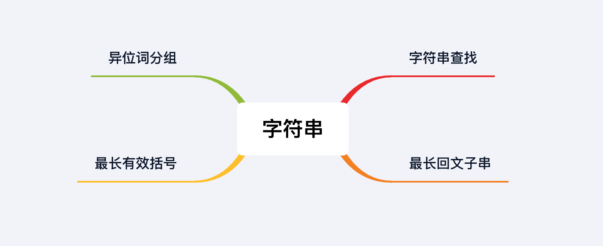

## 章节导读

之前我们已经学习了很多数组上的解题技巧：两根指针、滑动窗口等，这些技巧同样可以应用在string类题目上。有的读者可能会将string类问题当成单独的一个分类，其实并无必要。String类问题应当看成数组类问题的延伸，我们会在接下来的章节里介绍在string上使用动态规划、pattern match等高级技。在这些题中string和数组的区别非常模糊，我们可以认为他们就是等价的。

## 1.案例: 字符串查找

> 对于给定字符串s1和s2，返回s2在s1中出现的第一个位置。如果不存在，则返回-1。
>
> 输入: s1 = "abcdabcdefg"，s2 = "bcd"
> 输出: 1

### 思路分析1

本题是字符串类问题中最经典的一道题，要求判断一个字符串是否包含另一个字符串。这种题目存在很多经典的算法，有些算法本身已经包含在内置函数中。比如java中就内置了indexOf函数，实现了KMP算法，能够在O(n)的时间内得出结果。

即使不知道KMP算法也并不是问题，本题的暴力解法也很容易想到，消耗了O(n<sup>2</sup>)的时间。如果在面试时遇到这样的题目，那么重点应该放在bug-free和沟通上。先向面试官提出暴力解法，并写出代码，然后再根据面试官的要求进行优化。

brute froce:

1. 在s1的每一个位置，尝试与s2进行匹配
2. 如果当前位置的s1的子字符串不能匹配上s2，那么移到下一位
3. 如果匹配成功返回当前坐标
4. 直到s1结尾都没有匹配成功，返回-1

### 代码实现1

```java
public int strStr(String haystack, String needle) {
    if (needle.length() == 0) {
        return 0;
    }
    for (int i = 0; i < haystack.length() - needle.length() + 1; i++) {
        // 在s1的每一个位置，尝试与s2进行匹配
        if (check(haystack, i, needle))
            return i; // 匹配成功返回当前坐标
    }
    //直到s1结尾都没有匹配成功，返回-1
    return -1;
}

private boolean check(String haystack, int idx, String needle) {
    // 将s1的子字符串的每一位与s2比较
    for (int i = 0; i < needle.length(); i++) {
        if (haystack.charAt(idx + i) != needle.charAt(i))   return false;
    }
    return true;
}
```

### 思路分析2

KMP算法并不常见，并且用处有限。以致于面试者如果在面试中真的写出了KMP算法，反倒会被怀疑背过答案。这里介绍Robin Karp解法，利用了滑动窗口和hash的思路，也能够在O(n)的时间内得出结果，与KMP算法一样高效。

首先我们要将字符串当成数组来理解，将原题简化：
给出数组num1 = [1, 2, 3, 4, 5, 6]和num2 = [3, 4, 5]，判断数组num1是否包含num2.

对于简化后的题目，我们马上能够判断出，应该将数组转化成等价的数字来处理。
我们按照十进制的算法将nums2转化成数字：[3, 4, 5] = 3 * 10<sup>2</sup> + 4 * 10<sup>1</sup> + 5 * 10<sup>0</sup> = 345。我们将这个数字称为num2的指纹fingerprint。

然后我们利用滑动窗口的方法，在num1上滑动，并且每次将子数组转化成数字hash，代表子数组的对应数字。当滑动窗口移动的时候，我们需要做两件事：

1. 将之前的数字x10，并加上新的数字
2. 将最高位的数字x10<sup>3</sup>，从新的数字中减去

我们将第二步中10<sup>3</sup>称为bound，代表最高位的权重。比如从[1, 2, 3]移动到[2, 3, 4]时，通过这两步变化，我们可以在O(1)的时间内，得到新的值

1. 123 * 10 + 4 = 1234
2. 1243 - 1 * 10<sup>3</sup> = 234


重复上面的步骤，我们可以在index=2时，找到num2在num1中的对应位置。这就是Robin Karp算法的基本思路。

现在我们回到字符串，将字母a-z看做0-25的数字，那么字符串就对应了一个26进制的数字。


我们只需要对上面的思路做一点修改：

1. 将字母a-z看做0-25的数字，将字符串成一个字母数组，再转化成一个26进制的数字
2. 对这个数字取余，防止整型溢出。取余的数字需要足够大。（有乘法必定取余；有减法，加上mod后取余）
3. 因为我们使用了取余，节省了空间。当hash等于fingerprint时，我们还需要额外进行验证，防止hash碰撞


### 代码实现2

```java
public int strStr(String s1, String s2) {
    if (s2.length() == 0)   return 0;
    if (s2.length() > s1.length())    return -1;

    // 将字符串看做26进制的数字
    int base = 26;
    // 设置一个取余的数字，防止整型溢出
    int mod = 9997;
    int bound = 1, fingerprint = 0, hash = 0;
    for (int i = 0; i < s2.length(); i++) {
        // 计算出s2的fingerprint
        fingerprint = (fingerprint * base + s2.charAt(i) - 'a') % mod;
        // 计算出s1子字符串的hash
        hash = (hash * base + s1.charAt(i) - 'a')  % mod;
        // 计算出最高位的权重bound
        bound = bound * base  % mod;
    }
    for (int i = 0; i <= s1.length() - s2.length(); i++) {
        // 当hash等于fingerprint时，进行额外进行验证
        if (hash == fingerprint && check(s1, i, s2))
            // 如果找到，返回当前坐标
            return i;
        // 退出循环
        if (i == s1.length() - s2.length())     break;
        // 将之前的数字 * base，并加上新的数字
        hash = (hash * base + s1.charAt(i + s2.length()) - 'a') % mod; // 有乘法必定取余
        // 将最高位的数字 * bound，从新的数字中减去
        hash = (hash + mod - (s1.charAt(i) - 'a') * bound % mod) % mod; // 有减法，加上mod后取余
    }
    return -1;
}
```

### 分析
时间复杂度O(n)，空间复杂度O(1)

## 2.案例: 最长回文子串

> 给出一个字符串，求出它的最长回文子串。
>
> 输入: abaxyzzyxf
> 输出: xyzzyx

### 思路分析

本题与上一题类似存在已知且有效的算法。上一题Robin Karp解法因为使用了滑动窗口的思路，还算值得学习。本题的算法用处有限也不常见，因此不值得刻意背算法。应该先向面试官提出暴力解法，并写出代码，然后再根据面试官的要求进行优化。

本题的暴力解法也很容易想到，消耗了O(n<sup>2</sup>)的时间。即在每一个位置向两侧扩展，判断当前位置上的回文子串长度。最后找到全局最长的回文子串。

需要注意的是，回文子串有两种：

1. 长度为奇数，如果aba
2. 长度为偶数，如果abba

### 代码实现

```java
public String longestPalindrome(String s) {
    int start = 0, len = 0, longest = 0;
    // 在每个位置判断当前位置上的回文子串长度
    for (int i = 0; i < s.length(); i++) {
        // 假设回文子串长度为偶数，计算当前位置的回文子串长度
        len = find(s, i, i + 1);
        if (len > longest) { // 与当前最长长度比较
            // 更新长度与起始位置
            longest = len;
            start = i - len / 2 + 1;
        }
        // 假设回文子串长度为奇数，计算当前位置的回文子串长度
        len = find(s, i, i);
        if (len > longest) { // 与当前最长长度比较
            // 更新长度与起始位置
            longest = len;
            start = i - len / 2;
        }
    }
    return s.substring(start, start + longest);
}

private int find(String s, int left, int right) {
    // 从给定的初始位置，向左右扩展，计算最长回文子串的长度
    while (left >= 0 && right < s.length()) {
        if (s.charAt(left) != s.charAt(right)) {
            break;
        }
        left--;
        right++;
    }
    return right - left - 1;
}
```

### 分析
时间复杂度O(n<sup>2</sup>)，空间复杂度O(1)

## 3.案例: 异位词分组

> 给定一个字符串数组, 将异位词(指相同字符不同排列的字符串)分组
>
> 输入: ["yo", "act", "flop", "tac", "foo", "cat", "oy", "olfp"]
> 输出: [["yo", "oy"], ["flop", "olfp"], ["act", "tac", "cat"], ["foo"]]

### 思路分析

本题是一道高频考题，由此可见一部分面试题的难度其实很低。本题的关键在于将单词按照字符分布分类，并且不同单词如果有相同的字符分布，它们应该分到同一类。只要找到一种分类方式就可以解决本题。最简单的方法是将每个单词转化成字符的数组，然后对这个数组排序。将排序后的字符数组重新转化成字符串，作为分类的标准。这样一来，不同分布相同字符的单词就可以分到同一类，比如“ab”和“ba”排序后都是“ab”。

### 代码实现

```java
public List<List<String>> groupAnagrams(String[] strs) {
    // 建立一个map来存储分类
    HashMap<String, List<String>> map = new HashMap<>();
    // 对每一个字符串
    for (String str : strs) {
        // 将字符串转化成字符数组
        char[] s = str.toCharArray();
        // 将字符数组排序
        Arrays.sort(s);
        // 将排序后的字符数组重新转化成字符串，作为分类的key
        String key = new String(s);
        map.putIfAbsent(key, new ArrayList<>());
        // 将拥有相同key的单词加入同一个列表
        map.get(key).add(str);
    }
    // 返回分类后的结构
    return new ArrayList<>(map.values());
}
```

### 分析
时间复杂度O(n logk)，空间复杂度O(n)，k是最长的字符串长度

## 4.案例: 最长有效括号

> 给出一个只包含'('和')'的字符串，找出其中最长的左右括号正确匹配的合法子串。
>
> 输入: "(()))("
> 输出: 4

### 思路分析

本题有多种解法，个人认为其中最易于理解的是使用stack。


1. 将输入的string看做一个字符数组。
2. 对每一个字符，判断是左括号还是右括号。
3. 如果是左括号，将当前的下标加入stack。
4. 如果是右括号，从stack中将栈顶元素删除：
4.1. 如果删除后栈顶为空，说明栈中没有可匹配的左括号，将当前下标加入stack
4.2. 否则用当前下标减去栈顶的元素，代表着从当前位置向前追溯，最后一个匹配无效的位置，中间的长度就是有效的长度

### 代码实现

```java
public int longestValidParentheses(String s) {
    int ans = 0;
    // 新建一个stack，在栈中加入-1，指向0位的前一位，作为匹配无效的位置
    // 使用双括号初始化法，作为面试时向面试官“炫技”
    Stack<Integer> stack = new Stack<Integer>(){{push(-1);}};
    // 将输入的string看做一个字符数组
    for (int i = 0; i < s.length(); i++) {
        // 对每一个字符，判断是左括号还是右括号
        if (s.charAt(i) == '(') {
            // 如果是左括号，将当前的下标加入stack
            stack.push(i);
        } else {
            // 如果是右括号，从stack中将栈顶元素删除
            stack.pop();
            if (stack.isEmpty()) { // 如果删除后栈顶为空
                // 说明栈中没有可匹配的左括号，将当前下标加入stack
                stack.push(i);
            } else {
                // 用当前下标减去栈顶的元素，就是有效的长度
                // 记录全局最长有效长度
                ans = Math.max(ans, i - stack.peek());
            }
        }
    }
    return ans;
}
```

### 分析
时间复杂度O(n)，空间复杂度O(n)

## 总结

本章介绍了常见的字符串类的题目。大部分纯字符串的考题都需要转化成字符数组来处理，并且难度并不高。而高难度的字符串题目，仅仅是将字符串作为表现形式，本质上是动态规划、模式匹配、滑动数组等类型的题目。因此我们并不将字符串作为单独的章节，而是和高阶数组作为同一类题目。


