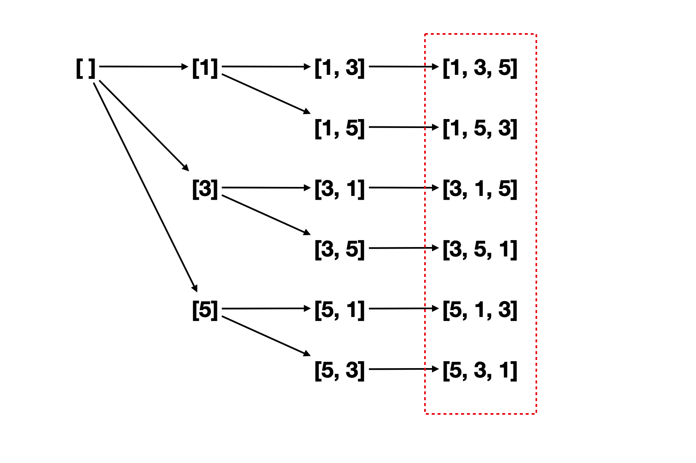
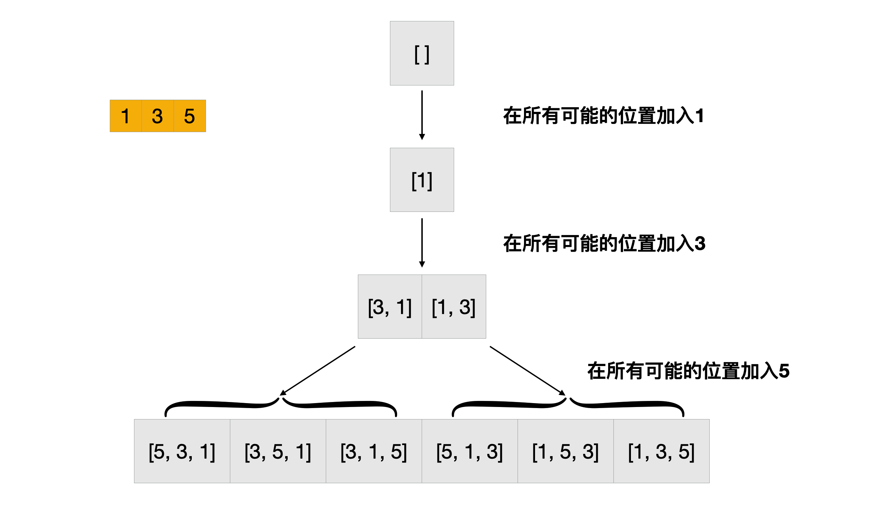
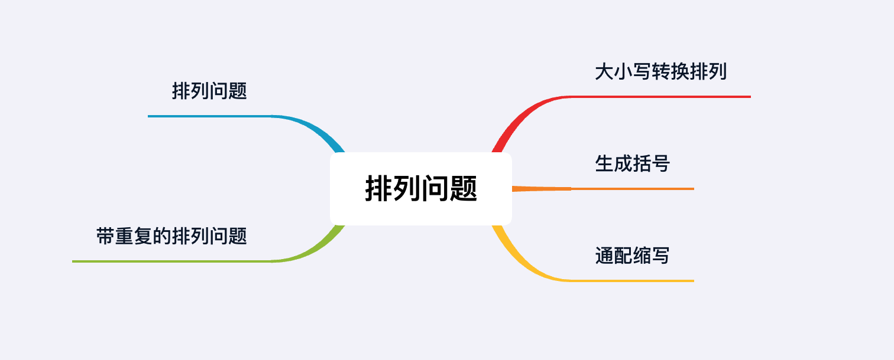

## 章节导读

上一章我们学习了组合/子集问题，本章我们学习Permutation排列问题。Permutation类问题可以看做组合/子集问题的衍生。同样，以数学理论仅仅是题目的背景，题目本身依然围绕DFS/BFS等算法出题。逻辑上，排列问题的理解难度略低于组合/子集问题。因此，在面试过程中排列问题更加常见。

## 核心算法——排列问题

排列问题一般表述成从n个元素中取出k个元素，可选的排列数量为P<sub>n</sub><sup>k</sup>。排列问题一般需要考虑元素的顺序，以及取出的元素是否可以重复。在算法题中，排列问题一般会以全排列（从n个元素中取出n个）的形式出现，比如输出n个元素所有的排序可能。一般来说n个不同的元素，会有n!种排列形式。

## 1.案例: 排列问题

> 给定一个组整数，返回其所有的排列。
>
> 输入: [1,3,5]
> 输出: [1,3,5], [1,5,3], [3,1,5], [3,5,1], [5,1,3], [5,3,1]

### 思路分析1

排列问题可以看做子集问题的升级和变种。对于全排列，假设给定[1,3,5]，我们可以按顺序穷举：

1. 首先固定第一位为1，如果第二位取3，最后一位只能是5；如果第二位取5，第三位就只能是3
2. 接下来将第一位变成3，重复上一步的过程穷举后两位分别是1和5的情况
3. 最后将第一位变成5，穷举后两位分别是1和3的情况



算法：

1. 初始化一个boolean数组记录每个数字是否已被使用
2. 对给出的数组进行dfs：如果当前顺序的元素个数和nums的相同，代表遍历完毕，将当前顺序加入答案
3. 遍历nums，找出未被使用的元素，挨个标记为已使用，将其加入当前顺序，并递归调用dfs
4. dfs返回后，回溯状态，重新标记为未使用

### 代码实现1

```java
public List<List<Integer>> permute(int[] nums) {
    List<List<Integer>> ans = new ArrayList<>();
    List<Integer> res = new ArrayList<>();
    // 初始化一个boolean数组记录每个数字是否已被使用
    dfs(nums, new boolean[nums.length], ans, res);
    return ans;
}

private void dfs(int[] nums, boolean[] visited, List<List<Integer>> ans, List<Integer> res) {
    // 当前顺序的元素个数和nums的相同，将当前顺序加入答案
    if (res.size() == nums.length) {
        ans.add(new ArrayList<>(res));
        return;
    }
    // 遍历nums
    for (int i = 0; i < nums.length; i++) {
        // 跳过已使用的元素
        if (visited[i])
            continue;
        // 标记为已使用
        visited[i] = true;
        // 将其加入当前顺序
        res.add(nums[i]);
        // 递归调用dfs
        dfs(nums, visited, ans, res);
        // 回溯状态
        res.remove(res.size() - 1);
        // 重新标记为未使用
        visited[i] = false;
    }
}
```

### 思路分析2

与子集类问题相似，BFS也可以解决一部分排序问题。我们依然以[1, 3, 5]为例：

1. 初始空集[]
2. 在所有可能的位置加入1，得到[1]
3. 在所有可能的位置加入3，得到[3, 1], [1, 3]
4. 在所有可能的位置加入5，得到[5, 3, 1], [3, 5, 1], [3, 1, 5], [5, 1, 3], [1, 5, 3], [1, 3, 5]



### 代码实现2

```java
public List<List<Integer>> permute(int[] nums) {
    List<List<Integer>> res = new ArrayList<>();
    Queue<List<Integer>> queue = new LinkedList<>();
    // 加入初始空集
    queue.offer(new LinkedList<>());
    // 遍历nums的每一个数字
    for (int n : nums) {
        int size = queue.size();
        for (int i = 0; i < size; i++) {
            List<Integer> permutation = queue.poll();
            // 在所有可能的位置加入当前元素
            for (int j = 0; j <= permutation.size(); j++) {
                List<Integer> copy = new LinkedList<>(permutation);
                copy.add(j, n);
                // 当前序列已经包含所有元素，加入答案
                if (copy.size() == nums.length) {
                    res.add(copy);
                } else {
                    queue.offer(copy);
                }
            }
        }
    }
    return res;
}
```

### 分析
时间复杂度O(n * n!)，空间复杂度O(n * n!)。排列问题的规模根据输入大小，成阶乘函数增长。

## 2.案例: 排列问题2

> 给定一个组可能重复的整数，返回其所有的排列。
>
> 输入: [1,2,2]
> 输出: [[1,2,2], [2,1,2], [2,2,1]]

### 思路分析

本题是排列问题的进阶版本——带重复元素的全排列问题。与子集问题和一般排列问题的区别在于，带重复的全排列问题不能用BFS解决，只能依靠通用的DFS解法配合剪枝。

1. 首先对数组进行排序，以使得重复元素相邻。
2. 初始化一个visited数组，标记访问过的数字。
3. 使用dfs进行递归遍历：
3.1. 如果当前顺序的元素个数和nums的相同，将当前顺序加入答案
3.2. 遍历nums中的每个元素，如果相同的元素已经访问过，跳过该元素；否则找出未被使用的元素，挨个标记为已使用，将其加入当前顺序，并递归调用dfs

### 代码实现

```java
public List<List<Integer>> permuteUnique(int[] nums) {
    Arrays.sort(nums);
    List<List<Integer>> ans = new ArrayList<>();
    List<Integer> res = new ArrayList<>();
    // 初始化一个boolean数组记录每个数字是否已被使用
    dfs(nums, new boolean[nums.length], ans, res);
    return ans;
}

private void dfs(int[] nums, boolean[] visited, List<List<Integer>> ans, List<Integer> res) {
    // 当前顺序的元素个数和nums的相同，将当前顺序加入答案
    if (res.size() == nums.length) {
        ans.add(new ArrayList<>(res));
        return;
    }
    // 遍历nums
    for (int i = 0; i < nums.length; i++) {
        // 跳过已使用的元素
        if (visited[i])
            continue;
        // 相同的元素在之前已经被访问过
        if (i != 0 && nums[i] == nums[i - 1] && !visited[i - 1]) {
            // 跳过该元素
            continue;
        }
        // 标记为已使用
        visited[i] = true;
        // 将其加入当前顺序
        res.add(nums[i]);
        // 递归调用dfs
        dfs(nums, visited, ans, res);
        // 回溯状态
        res.remove(res.size() - 1);
        // 重新标记为未使用
        visited[i] = false;
    }
}
```


### 分析
时间复杂度O(n * n!)，空间复杂度O(n * n!)。排列问题的规模根据输入大小，成阶乘函数增长。

## 3.案例: 大小写转换

> 给定一个字符串S，将任意字符切换大小写可得到一个新的字符串。返回所有可生成的新字符串。
>
> 输入: "ab7c"
> 输出: "ab7c", "Ab7c", "aB7c", "AB7c", "ab7C", "Ab7C", "aB7C", "AB7C"

### 思路分析

本题可以用通用的DFS模板解决。稍微具有迷惑性的地方在于给定的字符串中混有数字。当我们忽略数字时，会发现本题是简单的排列问题。

1. 遍历数组，对每一位元素
2. 遇到数字直接进入下一位
3. 遇到大写/小写字母：
3.1. 分支1：进入下一位
3.2. 分支2：切换大写/小写字母后，进入下一位

我们可以将3.1步和第2步合并

### 代码实现

```java
public List<String> letterCasePermutation(String S) {
    List<String> ans = new ArrayList<>();
    dfs(0, S, ans);
    return ans;
}

void dfs(int idx, String s, List<String> ans) {
    // 到达结尾，将当前序列加入结果
    if (idx == s.length()) {
        ans.add(s);
        return;
    }
    // （3.1步和第2步合并）原有的字符不变，进入下一位
    dfs(idx + 1, s, ans);
    // 3.2 如果当前是字母
    if (Character.isLetter(s.charAt(idx))) {
        char[] cs = s.toCharArray();
        // 切换大写/小写字母
        cs[idx] = Character.isUpperCase(cs[idx]) ?
            Character.toLowerCase(cs[idx]) : Character.toUpperCase(cs[idx]);
        // 进入下一位
        dfs(idx + 1, new String(cs), ans);
    }
}
```

### 分析
时间复杂度O(n * 2<sup>n</sup>)，空间复杂度O(n * 2<sup>n</sup>)

## 4.案例: 生成括号

> 给定整数n，写一个函数以生成n 对括号所有组合
>
> 输入: N=3
> 输出: ((())), (()()), (())(), ()(()), ()()()

### 思路分析

本题可以划分到排列问题中，用通用的DFS模板解决。相比于普通的排列问题，本题有额外的限制条件：左右括号相互对应，右括号不能出现在左括号之前。由此我们可以得到两个限制条件：

1. 括号的数目不能超过n
2. 只有左括号个数超过右括号，才能添加右括号

算法思路：根据约束条件，使用dfs递归搜索：

1. 如果当前括号序列满足条件，将当前序列加入结果
2. 如果左括号个数超过右括号，尝试在末尾添加右括号，dfs递归
3. 如果左括号个数不超过n，尝试在末尾添加左括号，dfs递归

### 代码实现

```java
public List<String> generateParenthesis(int n) {
    List<String> ans = new ArrayList<>();
    dfs(0, 0, n, "", ans);
    return ans;
}

private void dfs(int left, int right, int n, String curt, List<String> ans) {
    // 序列满足条件，将当前序列加入结果
    if (left == n && right == n) {
        ans.add(curt);
        return;
    }
    // 左括号个数超过右括号
    if (left > right) {
        // 添加右括号，dfs递归
        dfs(left, right + 1, n, curt + ")", ans);
    }
    // 左括号个数不超过n
    if (left < n) {
        // 添加左括号，dfs递归
        dfs(left + 1, right, n, curt + "(", ans);
    }
}
```

### 分析
具体分析过程超过了面试的范围，只需要知道本题的时空复杂度上限为：时间复杂度O(n * 2<sup>n</sup>)，空间复杂度O(n * 2<sup>n</sup>)

## 5.案例: 通配缩写

> 给定一个单词，写一个能够给出所有缩写的函数
>
> 输入: "BAT"
> 输出: "BAT", "BA1", "B1T", "B2", "1AT", "1A1", "2T", "3"

### 思路分析

通过DFS对所有缩写的可能进行搜索。遍历字符串，搜索每一位字符进行和不进行缩写操作后可能的情况，直到最后一位。

1. 缩写：更新已经缩写的字符数，递归的进入下一位
2. 不缩写：将当前已经缩写的字符数加入字符串的最后，缩写的字符数重置为0，递归的进入下一位


### 代码实现

```java
public List<String> generateAbbreviations(String word) {
    List<String> ans = new ArrayList<>();
    dfs(word, 0, "", 0, ans);
    return ans;
}

private void dfs(String word, int idx, String curt, int count, List<String> ans) {
    // 到达结尾
    if (idx == word.length()) {
        // 如果末位的字母被缩写，将缩写的数字加入字符串末尾
        if (count != 0)
            curt = curt + count;
        // 将结果加入
        ans.add(curt);
        return;
    }
    // 更新已经缩写的字符数，递归的进入下一位
    dfs(word, idx + 1, curt, count + 1, ans);

    // 将当前已经缩写的字符数加入字符串的最后
    if (count != 0)
        curt += count;
    // 缩写的字符数重置为0，递归的进入下一位
    dfs(word, idx + 1, curt + word.charAt(idx), 0, ans);
}
```

### 分析
时间复杂度O(n * 2<sup>n</sup>)，空间复杂度O(n * 2<sup>n</sup>)

## 总结

从这两章的学习中，我们可以发现相比于BFS算法，backtracing方法能够适应更多复杂的需求，解决几乎所有排列组合问题。而熟练掌握backtracing的前提在于扎实的代码基础和对递归函数有深刻的理解。对于这类题目，希望读者能够反复练习，掌握backtracing的技巧。



https://leetcode.com/problems/expression-add-operators/
