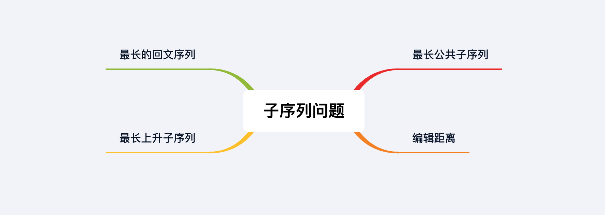

## 章节导读

在之前的章节里，我们已经初步学习了动态规划类问题。这是面试算法题中最难的一类问题。然而面试算法题的考察面较小，70%以上的动态规划问题可以被划分进两个大类：背包/子集和问题，子序列/模式匹配问题。本章我们就来看子序列/模式匹配问题。

## 核心算法——子序列问题

子序列/模式匹配问题是面试中常考的经典动态规划类问题。一般表现为给出一个数组或字符串，找出符合某个模式的子串/子序列。或者给出两个数组或字符串，要求二者按照某种规则匹配。这类问题的解题思路相对固定，前者一般使用一维数组，后者使用二维数组。每次需要将原问题分解成子问题，子问题的性质和原问题相同但是规模较小。我们可以通过解决单步子问题来递推到原问题。

## 1.案例: 最长公共子序列

> 给出两个字符串，找到最长公共子序列(LCS)，返回最长公共子序列的长度。
>
> 输入: str1 = "ZXVVYZW", str2 = "XKYKZPW"
> 输出: 4

### 思路分析

最长公共子序列问题是一类经典的动态规划问题。一般要求在两个序列中找到最长公共子序列（子序列不需要是连续的子串）。假设我们有两个序列X & Y，我们想要找到X & Y的最长公共子序列LCS(X, Y)，需要动态规划的思想，将原问题分解成子问题。

对于两个序列X & Y，每一步我们只需要考虑他们的最后一位：（假设下标分别为n & m）X<sub>n</sub> & Y<sub>m</sub>

1. 如果X<sub>n</sub> = Y<sub>m</sub>，说明X的最后一位与Y的最后一位相同，那么该元素一定是公共子序列的一部分，LCS(X<sub>n</sub>, Y<sub>m</sub>) = LCS(X<sub>n - 1</sub>, Y<sub>m - 1</sub>) + 1
2. 如果X<sub>n</sub> != Y<sub>m</sub>，说明X的最后一位与Y的最后一位不同，该元素不属于公共子序列。我们需要排除X<sub>n</sub>或者Y<sub>m</sub>，LCS(X<sub>n</sub>, Y<sub>m</sub>) = max ( LCS(X<sub>n</sub>, Y<sub>m - 1</sub>), LCS(X<sub>n - 1</sub>, Y<sub>m</sub>))

我们用二维的dp数组来记录状态，dp[i][j]代表X序列前i个与Y序列的前j个的LCS长度


*图片由visualgo制作*

### 代码实现

```java
public int longestCommonSubsequence(String text1, String text2) {
    int m = text1.length(), n = text2.length();
    // 初始化二维dp数组
    int[][] dp = new int[m + 1][n + 1];
    // 动态规划
    for (int i = 0; i < m; i++) {
        for (int j = 0; j < n; j++) {
            // X的最后一位与Y的最后一位相同
            if (text1.charAt(i) == text2.charAt(j)) {
                // LCS(Xn, Ym) = LCS(Xn - 1, Ym - 1) + 1
                dp[i + 1][j + 1] = dp[i][j] + 1;
            } else { // X的最后一位与Y的最后一位不同
                // LCS(Xn, Ym) = max(LCS(Xn, Ym - 1), LCS(Xn - 1, Ym))
                dp[i + 1][j + 1] = Math.max(dp[i + 1][j], dp[i][j + 1]);
            }
        }
    }
    // 返回LCS(X, Y)
    return dp[m][n];
}
```

### 分析
时间复杂度O(nm)，空间复杂度O(nm)，n表示序列1的长度，m表示序列2的长度

## 2.案例: 最长的回文序列

> 给定字符串s, 找出在s中的最长回文子序列的长度.
>
> 输入: bbbab
> 输出: 4

### 思路分析

本题是LCS最长公共子序列问题的变种题。一个比较取巧的解法是将给出的字符串s，进行反转，分别得到正向和反向的字符串s和s'。然后利用上一题的方法求s和s'的LCS长度，即为s中的最长回文子序列的长度。

```java
public int longestPalindromeSubseq(String s) {
    return longestCommonSubsequence(s, (new StringBuilder(s)).reverse().toString());
}
```

这种方法比较取巧，我们另外介绍一种解法，依然利用动态规划的思想，将原问题分解成子问题。

我们用二维的dp数组来记录状态，dp[i][j]代表s[i...j]中最长回文序列的长度。初始化dp，长度为0时，dp[i][i] = 1。对于dp[i][j]，

1. 如果s[i] = s[j]，说明s[i...j]的首尾对应，该元素属于回文序列的一部分，因此dp[i][j] = dp[i + 1][j - 1] + 2
2. 如果s[i] != s[j]，说明该元素不属于回文序列，我们需要排除s[i]或者s[j]，dp[i][j] = max (dp[i + 1][j], dp[i][j - 1])

最后从dp[0][s.length - 1]得到结果


*图片由visualgo制作*

### 代码实现

```java
public int longestPalindromeSubseq(String s) {
    int length = s.length();
    int[][] dp = new int[length][length];
    // 初始化dp，dp[i][i] = 1
    for (int i = 0; i < length; i++)
        dp[i][i] = 1;
    // 动态规划
    for (int i = length - 1; i >= 0; i--) {
        for (int j = i + 1; j < length; j++) {
            // s[i] = s[j]，该元素属于回文序列的一部分
            if (s.charAt(i) == s.charAt(j)) {
                dp[i][j] = dp[i + 1][j - 1] + 2;
            } else { // s[i] != s[j]
                // 排除s[i]或者s[j]
                dp[i][j] = Math.max(dp[i + 1][j], dp[i][j - 1]);
            }
        }
    }
    // 最终结果
    return dp[0][length - 1];
}
```

### 分析
时间复杂度O(n<sup>2</sup>)，空间复杂度O(n<sup>2</sup>)

## 3.案例: 莱文斯坦编辑距离

> 给定两个单词word1和word2，计算出将word1转换为word2的最少操作次数。总共有三种操作方法：插入/删除/替换
>
> 输入: str1 = "abc", str2 = "yabd"
> 输出: 2

### 思路分析

本题是最常考的动态规划题之一，也是一道经典的二维dp题。取巧的解法依然是利用LCS最长公共子序列，先计算出两个单词的最长公共子序列。将s1转换成s2的过程中，LCS最长公共子序列是可以在转换前后保持不变的部分。换而言之，余下的字符都是需要编辑的，计算余下的字符个数，即为Levenshtein编辑距离。这里需要的是最长公共子序列，案例1仅仅计算了最长公共子序列的长度，所以需要对解法进行修改。这种方法实际上比较麻烦。因此我们另外介绍一种动态规划的解法，依然将原问题分解成子问题。

使用二维的dp数组来记录状态，dp[i][j]为word1前i个字符到word2的前j个字符的转化的最小编辑距离。对于每一步，

1. 如果word1[i] = word2[j]，说明word1[i]到word2[j]不需要转移，只要word1的前i-1个能转换到word2的前j-1个即可，所以dp[i][j] = dp[i-1][j-1]
2. 如果word1[i] != word2[j]，说明word1[i]到word2[j]需要转移，这时候有三种可能的操作：插入/删除/替换：
2.1. 给word1插入一个和word2最后的字母相同的字母，即 dp[i][j - 1] + 1
2.2. 删除word1的最后一个字母，即 dp[i - 1][j] + 1
2.3. 把word1的最后一个字母替换成word2的最后一个字母，即 dp[i - 1][j - 1] + 1

我们要选择三种中的最优情况 dp[i][j] = 1 + min(dp[i][j - 1], dp[i - 1][j], dp[i - 1][j - 1])


*图片由visualgo制作*

### 代码实现

```java
public int minDistance(String word1, String word2) {
    int m = word1.length(), n = word2.length();
    int[][] dp = new int[m + 1][n + 1];
    // 初始化dp，空字符串转化到长度为i的字符串距离为i
    for (int i = 0; i <= m; i++)
        dp[i][0] = i;
    for (int i = 0; i <= n; i++)
        dp[0][i] = i;

    // 动态规划
    for (int i = 0; i < m; i++) {
        for (int j = 0; j < n; j++) {
            // word1[i]到word2[j]不需要转移
            if (word1.charAt(i) == word2.charAt(j)) {
                // word1的前i-1个转换到word2的前j-1个
                dp[i + 1][j + 1] = dp[i][j];
            } else { // word1[i]到word2[j]需要转移
                // 选择插入/删除/替换，三种中的最优情况
                dp[i + 1][j + 1] = 1 + Math.min(dp[i][j], Math.min(dp[i + 1][j], dp[i][j + 1]));
            }
        }
    }
    // 最终结果
    return dp[m][n];
}
```

### 分析
时间复杂度O(nm)，空间复杂度O(nm)，n表示word1的长度，m表示word2的长度

## 4.案例: 最长上升子序列

> 给定一个整数序列，找到最长上升子序列（LIS），返回LIS的长度
>
> 输入: [4,2,4,5,3,7]
> 输出: 4 // [2,4,5,7]

### 思路分析

要寻找所有子序列中最长的那个，可以将原问题分解到每一步的子问题。在每一步，我们只需要找到当前最长的子序列。最后就能获得全局最长的子序列。

使用一个一维dp数组记录状态，dp[i]代表nums[0...i]之间以nums[i]结尾的最长子序列。初始时，每个位置以自己作为序列 dp[i] = 1。我们在每个位置上，遍历nums[0...i-1]找到能转移到nums[i]的序列，在最大长度上加1。可以得到递推公式 dp[i] = max {dp[j], 0 <= j <= i - 1} + 1


*图片由visualgo制作*

### 代码实现

```java
public int lengthOfLIS(int[] nums) {
    int[] dp = new int[nums.length];
    int ans = 0;
    // 动态规划
    for (int i = 0; i < nums.length; i++) {
        // 每个位置以自己作为序列
        dp[i] = 1;
        // 遍历nums[0...i-1]
        for (int j = 0; j < i; j++) {
            // 找到能转移到nums[i]的序列
            if (nums[j] < nums[i])
                // 最大长度上加1
                dp[i] = Math.max(dp[i], dp[j] + 1);
        }
        // 全局最长子序列
        ans = Math.max(dp[i], ans);
    }
    return ans;
}
```

### 分析
时间复杂度O(n<sup>2</sup>)，空间复杂度O(n)

## 总结

本章我们学习了子序列问题，这类问题的出题模式固定一般会给定1-2个数组或字符串，解法固定可以使用1维或2维dp数组。这类题目一旦掌握了套路就可以快速解决，思路固定，代码实现相对简单。


