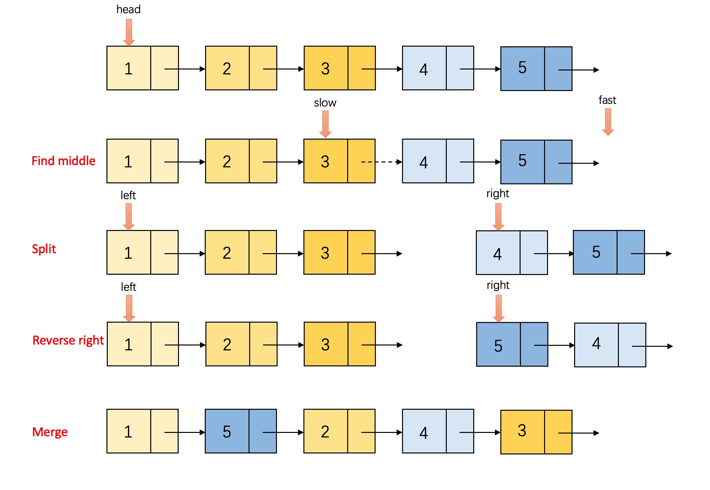
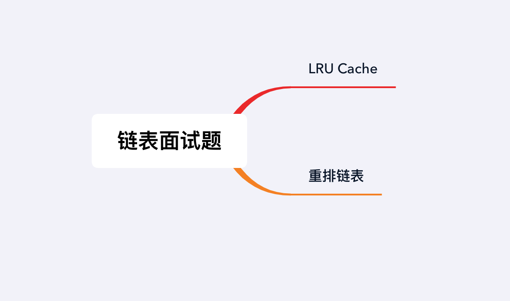

## 章节导读

上一篇文章中，我们学习了常用的链表技巧和两种经典考察模板：快慢指针和翻转链表。这节课我们来看看真正面试时会遇上什么样的算法题。

## 1.案例: Google 面试题 LRU Cache

LRU（Least Recently Used），即最近最少使用，是操作系统中一种常用的页面置换算法。

> 为LRU（最近最少使用）缓存策略设计一个数据结构，支持以下操作：
> + LRUCache(int capacity) : 初始化
> + int get(int key) 获取数据: 如果缓存中存在key，则获取其数据值，否则返回-1。
> + void put(int key, value) 写入数据: 如果key还没有在缓存中，则写入其数据值。当缓存达到上限，它应该在写入新数据之前删除最近最少使用的数据用来腾出空闲位置。
> 
> 所有操作在O(1)时间内完成

### 思路分析

这道题是真正的经典高频考题，它从一个真实的场景出发，要求实现一个理论化的数据结构。

最基本功能只有两个：存和取。LRU算法会丢弃最近最少使用的数据，缓存最近使用最多的。每次存取数据会触发一次更新，该数据会变成最近使用的数据。

我们很容易想到应该用链表来维护使用顺序。将数据在链表中按照使用时间排序，越近期使用的数据越靠近head，tail附近则是即将过期的数据。另外我们还需要一个Map来保存key与数据间的关系。

Java中存在一个现有的数据结构LinkedHashMap，是对LRU cache的实现。LinkedHashMap提供了完整的get/put API，所有操作在O(1)时间内完成。然而面试中，面试官会要求我们从头实现一个数据结构。

### API分析

对于这类复杂的题目，最好的设计方法叫做自顶向下。先设计高层API，再逐层向下细化。全部实现后，再自底向上优化。

以LRU Cache为例，最高层的API只有构造，get，put三个

```java
class LRUCache {
    public LRUCache(int capacity) {
    // TODO
    }
    
    public int get(int key) {
    // TODO
    }
    
    public void put(int key, int value) {
    // TODO
    }
}
```

我们先依次实现顶层API

#### 构造

LRU的构造函数包含了一个最大容量，一个链表和一个Map结构。
我们在构造时用capacity记录LRU Cache最大容量，双链表保存数据和Map结构记录映射关系

```java
class LRUCache {
    // 定义Node class作为链表的基本元素，用于保存数据
    class Node {
        int key, val;
        Node prev, next;
        Node(int k, int v) {
            key = k;
            val = v;
        }
    }
    
    int capacity; // LRU cache的最大容量
    HashMap<Integer, Node> map; // 保存key与数据之间的映射关系
    Node head, tail; 
    
    public LRUCache(int capacity) {
        this.capacity = capacity;
        map = new HashMap<>();
        
        // 建立双链表
        head = new Node(0, 0);
        tail = new Node(0, 0);
        head.next = tail;
        tail.prev = head;
    }
}
```

#### put

put会接收一个key/value对，储存到内存中。
1. 检查key是否已经存在内存中。如果已经存在删除旧的数据，加入新的数据。
2. 将新的数据加入LRU Cache：创建链表的一个节点保存新加入的数据。
3. 将新创建的节点放到插入head之后的位置
4. 在map中建立key与新节点的对应关系
5. 检查加入新数据后，LRU Cache是否超出设定的最大容量。如果超过，删除快要过期的数据（距离head最远的节点）

为了在O(1)时间内删除最后一个节点，我们需要利用双链表的tail指针。

```java
public void put(int key, int value) {
    if (map.containsKey(key)) {
        remove(map.get(key)); // 调用辅助函数remove删除一个节点
    }

    Node node = new Node(key, value);
    map.put(key, node); // 建立key与新节点的对应关系
    add(node); // 调用辅助函数add在head之后插入新节点

    if (map.size() > capacity) { //删除快要过期的数据
        Node last = tail.prev;
        remove(last);
        map.remove(last.key);
    }
}
```

自顶向下设计的优势在于，我们可以先假定存在某种函数，稍后再着手实现

#### get

get会从LRU Cache中根据key查询数据，并将查到的数据更新为最近访问过的数据。如果没有key对应的数据，则返回-1。
1. 在map中查询，是否存在key的对应节点。如果不存在，则返回-1。
2. 取得对应的节点，更新为最近访问的数据。
3. 返回对应节点保存的数据

```java
public int get(int key) {
    if (!map.containsKey(key)) {
        return -1;
    }

    Node node = map.get(key); // 取得对应的节点
    
    // 将对应节点更新为最近访问的数据
    // 实际操作等价于，将原节点从旧的位置删除，重新插入到第一位（head之后）
    remove(node); // 调用辅助函数remove
    add(node); // 调用辅助函数add
    
    return node.val;
}
```

#### add & remove

设计完顶层API，我们发现需要额外两个辅助函数add & remove。本题中add & remove只是简单的链表操作。实际工程中，我们经常会需要在辅助函数中，再调用更底层的辅助函数，所以常常会有多层设计。

```java
public void add(Node node) {
    Node next = head.next;
    node.prev = head;
    node.next = next;
    head.next = node;
    next.prev = node;
}

public void remove(Node node) {
    Node prev = node.prev;
    Node next = node.next;

    prev.next = next;
    next.prev = prev;
}
```

### 代码实现

完成了自顶向下的设计，接下来我们开始自底向上优化。根据上面分析的API，我们发现LRU Cache由两个基本对象组成：Map和双链表。

更进一步双链表需要定义Node节点和add & remove函数。

因此我们将双链表抽象出来单独实现

```java
// 定义Node作为链表的基本元素，用于保存数据
class Node {
    int key, val;
    Node prev, next;

    Node(int k, int v) {
        key = k;
        val = v;
    }
}

class List {
    Node head, tail;
    
    // 建立双链表
    List() {
        head = new Node(0, 0);
        tail = new Node(0, 0);
        head.next = tail;
        tail.prev = head;
    }

    // 提供添加节点的API
    public void addToHead(Node node) {
        Node next = head.next;
        node.prev = head;
        node.next = next;
        head.next = node;
        next.prev = node;
    }
    
    // 提供删除节点的API
    public void remove(Node node) {
        Node prev = node.prev;
        Node next = node.next;
        prev.next = next;
        next.prev = prev;
    }
}
```

经过自底向上的优化，算法的主体只包含关键的构造，get和put三个部分。链表的操作被交给List对象单独完成。
```java
class LRUCache {
    int capacity;
    HashMap<Integer, Node> map;
    List list;

    public LRUCache(int capacity) {
        this.capacity = capacity;
        map = new HashMap<>();
        list = new List();
    }

    public int get(int key) {
        if (!map.containsKey(key)) {
            return -1;
        }

        Node node = map.get(key);
        list.remove(node);
        list.add(node);
        return node.val;
    }

    public void put(int key, int value) {
        if (map.containsKey(key)) {
            list.remove(map.get(key));
            map.remove(key);
        }

        Node node = new Node(key, value);
        map.put(key, node);
        list.add(node);

        if (map.size() > capacity) {
            Node last = list.tail.prev;
            list.remove(last);
            map.remove(last.key);
        }
    }
}
```

### 分析
所有操作在O(1)时间内完成。通过LRU Cache这道经典面试题，我们经历了完整的实现流程，先自顶向下分析再自底向上优化，相当于给出了两种可行的答案。实际面试时，给出任何一种解法都可以，但是优化后的解法更能够向面试官证明你的算法功底和工程能力。

## 2.案例：facebook 面试题 重排链表

> 给定一个单链表L: L0→L1→…→Ln-1→Ln,
> 重新排列后为：L0→Ln→L1→Ln-1→L2→Ln-2→…
> 必须在不改变节点值的情况下进行原地操作

### 思路分析

这道题需要各种技巧的融合，包含了dummy node, 快慢指针, 翻转链表，合并链表。

1. 找到给定链表的中间节点
2. 将链表按中位拆分成left, right两个小链表
3. 将right链表翻转
4. 交替取出left, right的表头，合并成新的链表



### 代码实现

我们再次使用自顶向下设计。先实现顶层API

```java
public void reorderList(ListNode head) {
    if (head == null || head.next == null) {
        return;
    }

    ListNode middle = findMiddle(head); // 找到给定链表的中间节点
    ListNode right = middle.next; // 将链表按中位拆分成
    middle.next = null;

    right = reverse(right); // 将right链表翻转

    head = merge(head, right);// 合并成新的链表
}
```

此时的函数主体基本接近于伪代码形式，只描述了过程，而没有实现具体的行为。从这段代码来看，我们需要实现三个辅助函数：findMiddle, reverse, merge

#### findMiddle

我们在上一节中，讲解过快慢指针法，并且用快慢指针实现了环检测算法。findMiddle同样需要使用快慢指针：
+ 慢指针每次走一步，快指针每次走两步。
+ 快指针走到结尾时，慢指针的位置就是中间点。

```java
ListNode findMiddle(ListNode head) {
    ListNode slow = head, fast = head;
    while (fast != null && fast.next != null){
        slow = slow.next;
        fast = fast.next.next;
    }
    return slow;
}
```

类似地，如果将两根指针的速度改为慢指针快指针每次走一步，快指针快指针每次走N步。快指针走到结尾时，慢指针的位置为N分之一点。共同点是快慢指针起点相同，速度成比例。

#### reverse & merge

翻转指针和合并链表都已经在上一节讲解过，这里不再赘述

```java
ListNode reverse(ListNode head) {
    ListNode curt = null;
    while (head != null) {
        ListNode next = head.next;
        head.next = curt;
        curt = head;
        head = next;
    }
    return curt;
}

ListNode merge(ListNode left, ListNode right) {
    ListNode dummy = new ListNode(0);
    ListNode tail = dummy;
    while (right != null) {
        tail.next = left;
        left = left.next;
        tail = tail.next;

        tail.next = right;
        right = right.next;
        tail = tail.next;
    }
    tail.next = left;

    return dummy.next;
}
```

### 分析
时间复杂度O(N)，空间复杂度O(1)。每个辅助函数都消耗时间复杂度O(N)和空间复杂度O(1）。

## 总结

本章我们使用了两道面试真题作为案例，体验了面试中真实算法题的难度，并且引入了自顶向下/自底向上两种分析&实现的方式。



## 习题

1. Google 面试题：为LFU（最近最低频率使用）缓存策略设计一个数据结构，支持以下操作：
+ get(key): 如果缓存中存在key，则获取其数据值，否则返回-1。
+ put(key, value): 如果key还没有在缓存中，则写入其数据值。当缓存达到上限，它应该在写入新数据之前删除最近最低频率使用的数据来腾出空闲位置。
2. 给定一个单链表和数值x，划分链表使得所有小于x的节点排在大于等于x的节点之前。(保留两部分内链表节点原有的相对顺序)
3. 给定一个非空单链表，返回链表的中间节点。如果有两个中间节点，则返回第二个中间节点。