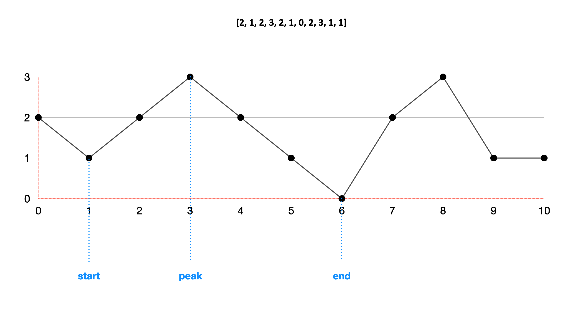
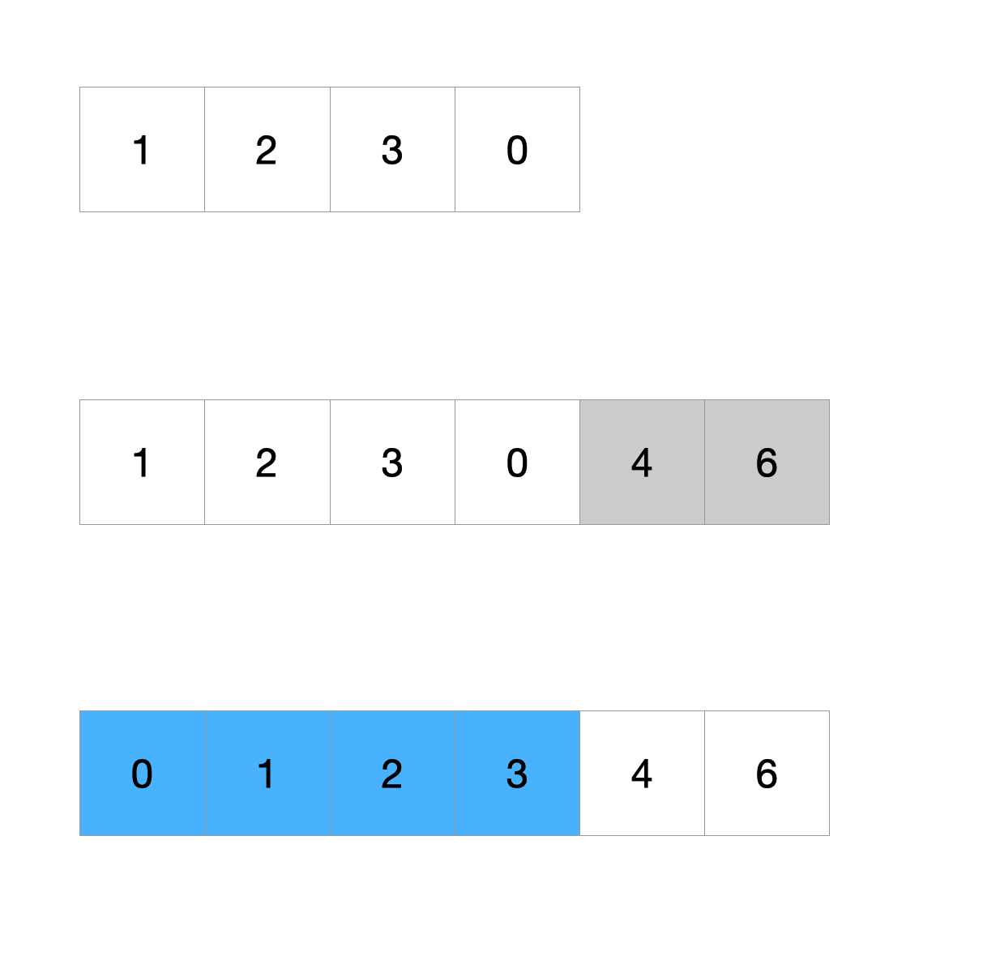
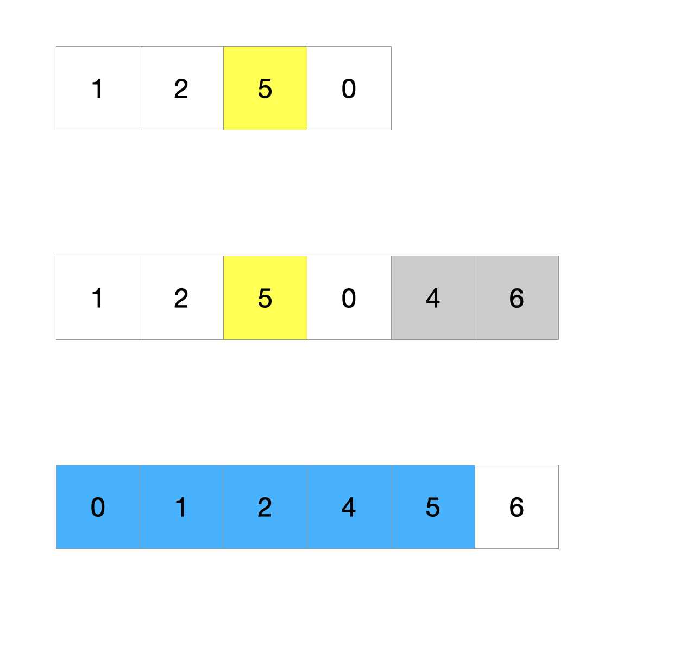
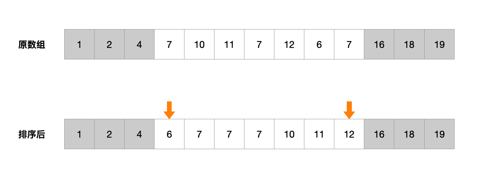
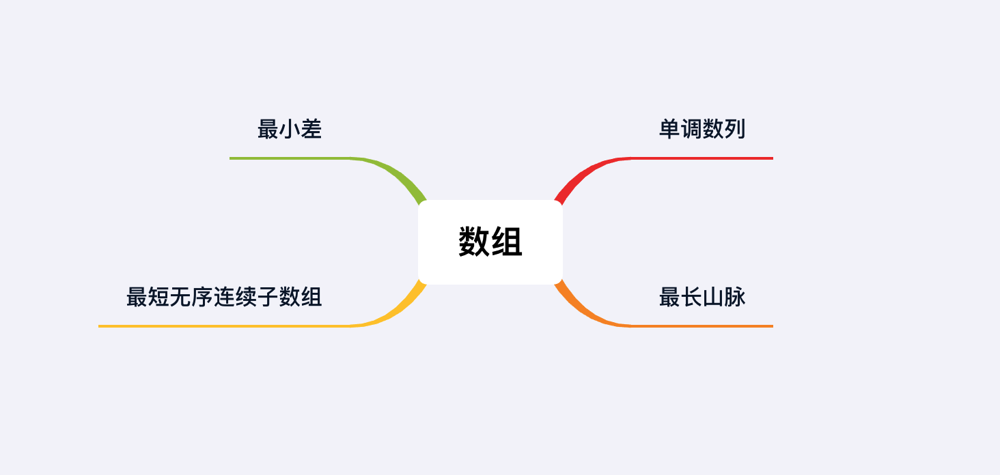

## 基础知识——数组

数组是由相同类型的元素的集合所组成的数据结构，物理层面上计算机会分配一块连续的内存来存储这些元素。数组中每个元素在内存中相邻，所有的元素存储在一个连续的内存块中。逻辑层面上，用户可以利用元素的索引可以计算出该元素对应的存储地址。

最简单的数据结构类型是一维数组。它是最简单易学、最广泛使用的数据类型，也是最古老和最重要的数据结构之一。可以说是面试必考，工作必会。

## 1.案例: 单调数列

> 判断数组是否具有单调性（单调递增或单调递减）
> 
> 输入: [-1, -5, -10, -1100, -1100, -1101, -1102, -9001]
> 输出: true
> 
> 输入: [1,3,2]
> 输出: false

### 思路分析

数组类的题有一部分与本题类似，需要我们比较相邻两个元素。因此我拿这道题作为一道开胃菜，分享给大家体验一下数组类算法题的出题思路。

题目要求我们确定数组是否具有单调性。我们可以先假设数组是单调增的，因此在每个位置A[i] <= A[i + 1]。遍历一遍数组，检查在每一个i是否都有A[i] <= A[i + 1]。类似地，如果数组是单调减的，那么每个位置A[i] >= A[i + 1]。

我们用dec和inc两个flag代表数组的单调性，遍历数组，判断每个位置上是否符合单调性。如果所有位置都符合，那么至少有一个flag始终为true，返回其中一种结果。

### 代码实现

```java
public boolean isMonotonic(int[] A) {
    boolean inc = true, dec = true;

    for (int i = 1; i < A.length; i++) {
        inc &= A[i-1] <= A[i];
        dec &= A[i-1] >= A[i];
    }
    return inc || dec;
}
```

### 分析
时间复杂度O(n)，空间复杂度O(1)

## 2.案例: 数组中的最长山脉

> 写出一个方法，对于给定的整数数，返回数组中最长山峰的长度
> 
> 山峰在数组中被定义为：峰顶左侧的值，严格单调增；右侧的值，严格单调减。一个山峰至少要由三个数字组成
> 
> 输入: [1, 2, 3, 3, 4, 0, 10, 6, 5, -1, -3, 2, 3]
> 输出: 6

### 思路分析1

本题要求我们找到一个山峰peak。对于peak而言，向左和向右都是递减的。反过来说，找到两个序列，序列1从左往右递增，序列2从右往左递增，两个序列相交的点就是peak。我们只需要找到所有peak中，两个序列长度和最长的那个。

我们可以通过添加辅助数组的方式，来简化解法。

1. 创建一个辅助数组1，从左往右计算每个位置递增序列的长度
2. 创建一个辅助数组2，从右往左计算每个位置递增序列的长度
3. 在每个位置，将数组1的值和数组2的值相加，和最大的位置即为peak的位置
4. 返回最大的和

### 代码实现1

```java
public int longestMountain(int[] A) {
    int[] leftPeak = leftToRight(A); // 从左往右计算
    int[] rightPeak = RightToLeft(A); // 从右往左计算
    int longest = 0;
    for (int i = 0; i < A.length; i++) {
        if (leftPeak[i] == 0 || rightPeak[i] == 0) {
            continue;
        }
        longest = Math.max(longest, leftPeak[i] + rightPeak[i] + 1); // 最大的和
    }
    return longest;
}
```

两个帮助计算递增序列的辅助函数拥有相同的逻辑
```java
private int[] leftToRight(int[] array) {
    int[] ans = new int[array.length];
    for (int i = 1; i < ans.length; i++) {
        if (array[i] > array[i - 1]) {
            ans[i] = ans[i - 1] + 1;
        }
    }
    return ans;
}

private int[] RightToLeft(int[] array) {
    int[] ans = new int[array.length];
    for (int i = ans.length - 2; i >= 0; i--) {
        if (array[i] > array[i + 1]) {
            ans[i] = ans[i + 1] + 1;
        }
    }
    return ans;
}
```
### 分析
时间复杂度O(n)，空间复杂度O(n)

大部分题目都可以通过添加有限个辅助数组来简化难度，这暗示了大部分数组题的空间消耗等价于输入数组的大小。所以一般空间复杂度不超过O(n)。因此对于数组题的优化，大部分只要找到O(1)空间复杂度的解法。

### 思路分析2

解法1通过添加辅助数组的方式，简化了算法的难度，但是消耗了额外的空间。实际上我们可以只消耗O(1)的空间。我们使用三个指针start, end, peak来指向每个山峰的起点、终点和峰值。通过比较三个指针的位置来判断当前山峰是否符合要求。

假设我们有输入数组nums = [2, 1, 2, 3, 2, 1, 0, 2, 3, 1, 1]，我们可以画成下图。在遍历数组的过程中，对于每个山峰，我们记下起点start、终点end和峰值peak的位置。



这样我们只需要使用O(1)的额外空间。

### 代码实现 2

```java
public int longestMountain(int[] A) {
    int ans = 0, end = 0;
    while (end < A.length) {
        int start = end; // 记下起点位置
        while (end + 1 < A.length && A[end] < A[end + 1]) // 向上爬，寻找峰值
            end++;

        int peak = end; // 记下峰值位置
        while (end + 1 < A.length && A[end] > A[end + 1]) // 向下走，寻找终点
            end++;

        if (start < peak && peak < end) // 比较起点、峰值和终点的位置，如果符合条件，记下当前最大值
            ans = Math.max(ans, end - start + 1);
        if (start == end) // 如果是平坡，将指针向前移动一步，防止死循环
            end++;
    }
    return ans;
}
```

### 分析
时间复杂度O(n)，空间复杂度O(1)

### 思路分析3

解法2使用了start, end, peak三根指针。还有一种解法与之类似，但是使用了up和down两个状态，来代替三根指针。通过比较up和down的值来判断当前状态。这里作为解法2的补充，不作为主要解题方法。

### 代码实现3

```java
public int longestMountain(int[] A) {
    int ans = 0, up = 0, down = 0;
    for (int i = 1; i < A.length; i++) {
        if (down > 0 && A[i - 1] < A[i] || A[i - 1] == A[i]) // 1. 下坡结束，出现上坡 2. 遇到平坡
            up = down = 0; // 将之前的记录清零
        if (A[i - 1] < A[i]) // 上坡
            up++; 
        if (A[i - 1] > A[i]) // 下坡
            down++;
        if (up > 0 && down > 0 && up + down + 1 > ans) // 更新当前最大值
            ans = up + down + 1;
    }
    return ans;
}
```

### 分析
时间复杂度O(n)，空间复杂度O(1)

## 3.案例: 最小差

> 给定两个数组，找到一对数字（两个数组各取一个），他们的差值最小。返回这两个数组。
> 
> 输入:
> arrayOne = [-1, 5, 10, 20, 28, 3]
> arrayTwo = [26, 134, 135, 15, 17]
> 输出: 2

### 思路分析

我们需要在两个数组里，各取一个数字。这明显暗示了我们需要使用Two Pointers技巧。Two Pointers是数组题的经典考点之一，我们会在下一章深入体会Two Pointers技巧的多种使用方式。本题需要用的Two Pointers技巧的一个变种，根据使用方法通常称为“谁小移谁”（滑稽）。

1. 将两个数组分别排序
2. 使用两根指针，分别指向数组第一位，同时开始遍历
3. 比较两根指针指向的值，如果二者差值小于当前最小值，那么更新最小值
4. 移动二者之间较小的那个
5. 直到任意一个数组遍历结束

### 代码实现

```java
public int smallestDifference(int[] arr1, int[] arr2) {
    Arrays.sort(arr1);
    Arrays.sort(arr2);
    int diff = Integer.MAX_VALUE;
    for (int i = 0, j = 0; i < arr1.length && j < arr2.length; ) {
        if (Math.abs(arr1[i] - arr2[j]) < diff) {
            diff = Math.abs(arr1[i] - arr2[j]); // 更新最小值
        } else if (arr1[i] < arr2[j]) { // 移动两根指针当中较小的那个
            i++;
        } else {
            j++;
        }
    }
    return diff;
}
```

### 分析
时间复杂度O(n logn)，空间复杂度O(1)

由于使用了内置的排序方法，所以消耗了O(n logn)的时间复杂度

## 4.案例: 最短无序连续子数组

> 给定一个整数数组，找到一个连续子数组。按升序对这个子数组进行排序，会使整个数组呈现升序。返回最短子数组的长度。
> 
> 输入: array = [1, 2, 4, 7, 10, 11, 7, 12, 6, 7, 16, 18, 19]
> 输出: [3, 9]

### 思路分析 1

这题需要一点逆向思维。我们可以添加额外的辅助数组，来降低解题的难度。

先复制一份数组的副本，进行排序，得到升序的数组。然后将升序数组和原数组进行比较，就能知道哪些部分是需要排序的。

### 代码实现 1

```java
public int findUnsortedSubarray(int[] nums) {
    int[] arr = Arrays.copyOf(nums, nums.length); // 复制数组
    Arrays.sort(arr); // 排序

    int left = 0; // 从左往右，找到第一个需要排序的位置
    while (left < nums.length && arr[left] == nums[left])
        left++;

    int right = nums.length -1; // 从右往左，找到第一个需要排序的位置
    while (right >= 0 && arr[right] == nums[right]) 
        right--;

    return left <= right ? right - left + 1: 0; // 如果数组已经是升序，返回0；否则返回长度
}
```

### 分析
时间复杂度O(n logn)，空间复杂度O(n)

由于使用了内置的复制和排序方法，所以消耗了O(n logn)的时间和O(n)的空间

### 思路分析 2

有了解法1的思考方向，我们可以对解法进一步优化。我们进一步分析原数组与排序后数组的关系。仔细回看原数组与排序后的数组。

以数组[1, 2, 3, 0]为例，我们可以看出正确的顺序是[0, 1, 2, 3]，需要排序的子数组范围为0~3之间。此时我们在数组最后添加两个数字[4, 6]作为一个新的输入数组，通过重排0~3之间的子数组，我们依然可以获得一个升序数组。



我们将原数组的第三个数字变成5，重复上面的步骤，在数组最后添加两个数字[4, 6]作为一个新的输入数组。此时重排0~3之间的子数组已经不行了。我们需要重排0~4之间的子数组。



这两个例子说明了两件事：

1. 已经排序好的部分也会受到未排序子数组的影响，所以不能用来确定边界
2. 需要排序的子数组的边界，是由子数组中的最大值和最小值确定的

有了上面两个推论，算法部分就好办了

1. 遍历数组，在未排序的部分中，找到子数组最大值和最小值
2. 利用子数组最大值和最小值确定需要排序的子数组的边界
3. 根据边界，返回子数组的长度




### 代码实现 2

```java
public int findUnsortedSubarray(int[] nums) {
    if (nums == null || nums.length <= 1)
        return 0;

    int max = Integer.MIN_VALUE, min = Integer.MAX_VALUE;
    for (int i = 0; i < nums.length; i++) // 遍历数组
        if (!sorted(nums, i)) { // 找到未排序的部分，确定最大值和最小值
            min = Math.min(min, nums[i]);
            max = Math.max(max, nums[i]);
        }

    int left = 0; // 从左往右，找到最小值的位置，即为左边界
    while (left < nums.length && nums[left] <= min)
        left++;
    
    int right = nums.length - 1; // 从右往左，找到最大值的位置，即为右边界
    while (right >= 0 && max <= nums[right])
        right--;
    // 如果数组已经是升序，返回0；否则返回长度
    return left < right ? right - left + 1 : 0;
}

boolean sorted(int[] nums, int i) {
    if (i == 0)     return nums[i] <= nums[i + 1];
    if (i == nums.length - 1)   return nums[i - 1] <= nums[i];
    return nums[i - 1] <= nums[i] && nums[i] <= nums[i + 1];
}
```

### 分析
时间复杂度O(n)，空间复杂度O(1)

这种解法只使用了两根指针，最多需要遍历三遍数组，所以时间复杂度O(n)，空间复杂度O(1)。本题大部分时间复杂度O(n)的解法都是这种解法的变种。优化之后可以在一次遍历中，同时确定左右边界，但是可读性会差于现在的解法。

## 总结

本章我们初步认识了数组，体会了数组类算法题的出题方式



## 习题

1. 给出两个非空整数数组，判断第二个数组是否是第一个数组的子序列。
输入: 
array1 = [5, 1, 22, 25, 6, -1, 8, 10]
array2 = [1, 6, -1, 10]
输出: true


