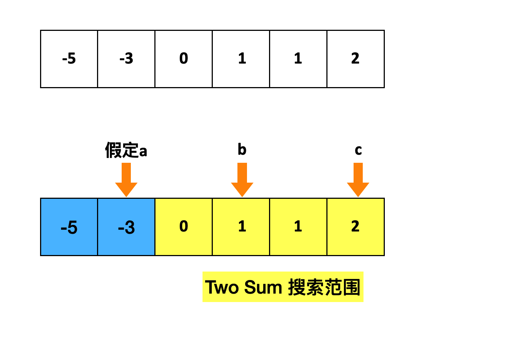
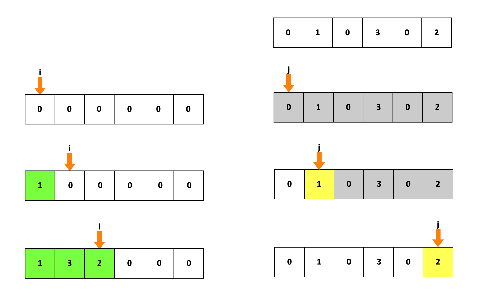
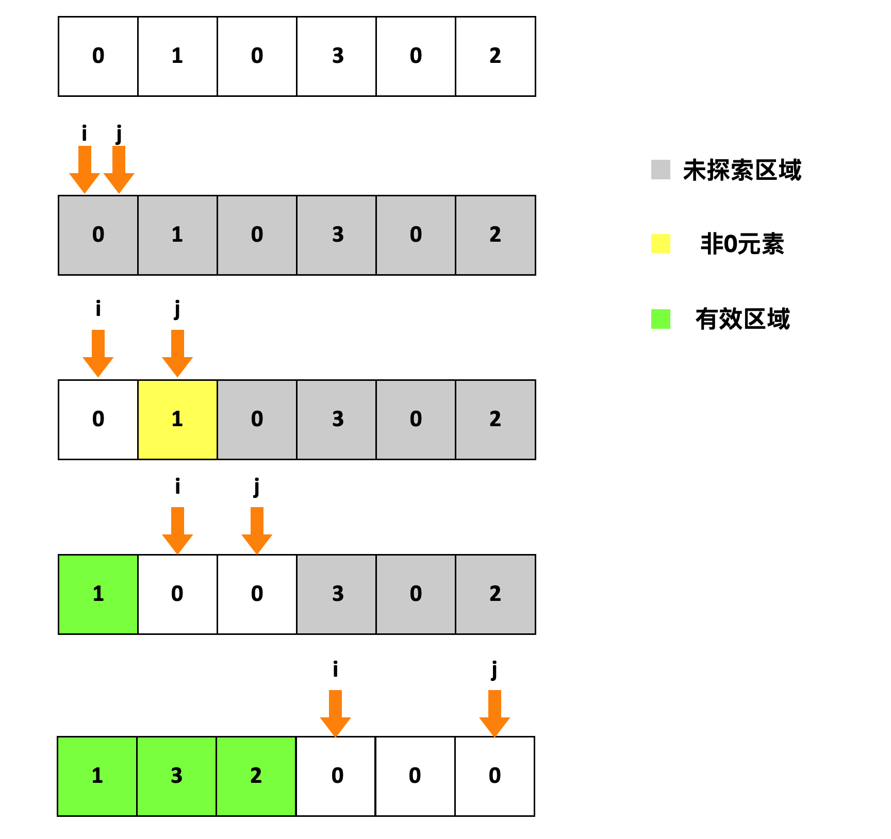
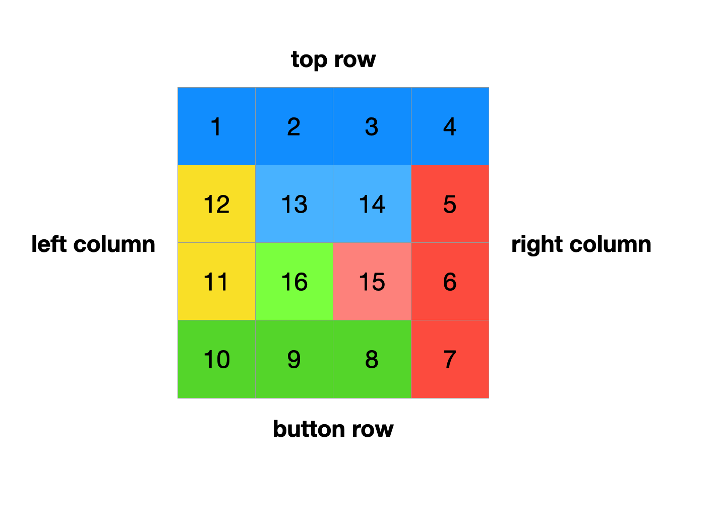
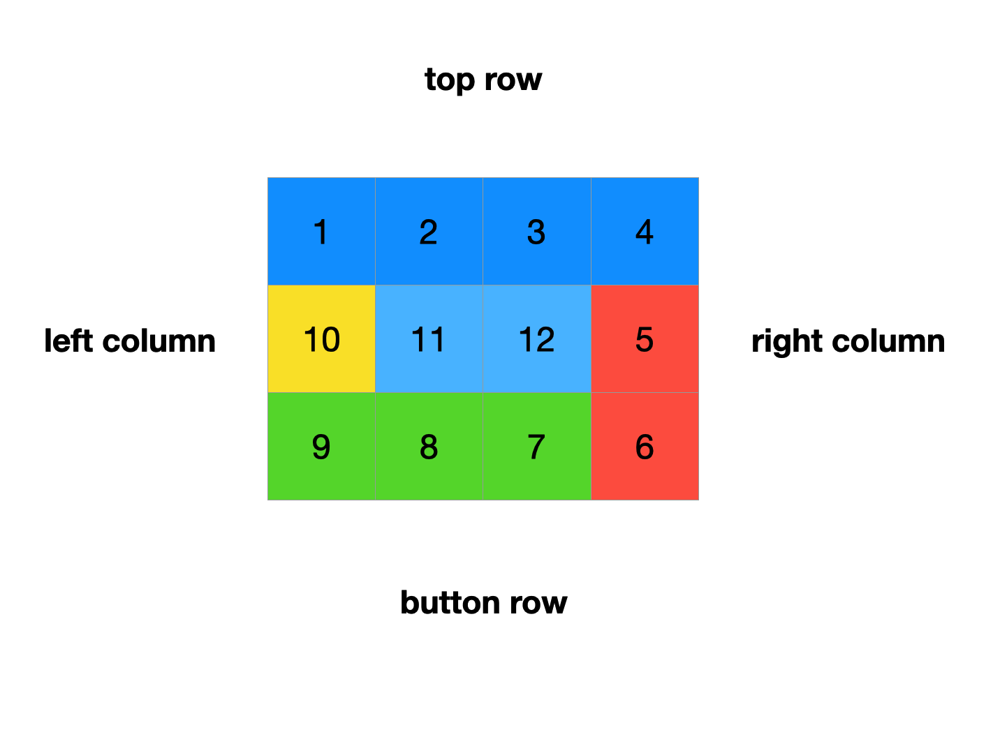
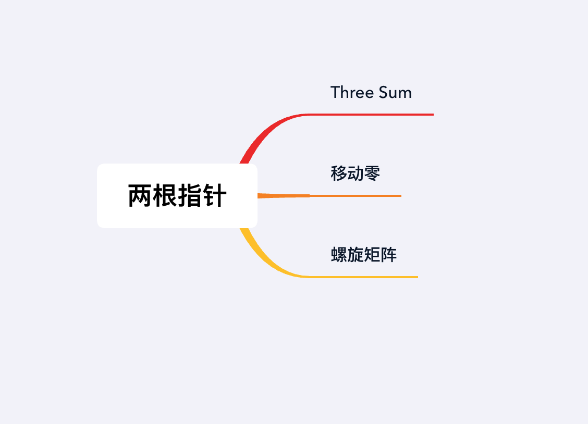

## 章节导读

上一篇文章中，我们学习了一些数组的基本问题。这节课我们来看数组的经典技巧——Two Pointers，该方法是经典高频考点之一。

## 核心算法——两根指针

两根指针法在解决已排序的数组或链表类问题时非常有效，可以帮助我们快速找到满足特定条件的一个或一部分元素（可以是一对元素甚至一段连续的子数组）。最经典的案例就是我们在第一节见过的Two Sum。

在解决Two Sum的时候，我们挨个访问元素（使用第一根指针），然后再在余下的元素上遍历（使用第二根指针）来找到满足条件的一对元素。这种做法需要消耗O(n<sup>2</sup>)的时间。如果给定是数组是已经排序的，那么最高效的做法是将两根指针一个指向头一个指向尾。这样每次只需要移动两个指针中的一个，只需要消耗O(n)的时间。可见两根指针法的核心并不在于使用了几根指针，而在于利用已有的排序。

## 1.案例：Three Sum

> 给出一个有n个整数的数组，在数组中找到三个整数a, b, c，找到所有使得a + b + c = 0的三元组。（答案不能包含重复的三元组）

我们在第一章已经见识过了Two Sum这道题。Three Sum是Two Sum的一种follow-up版本。

### 思路分析

最简单的思路自然是考虑暴力解法，使用三重循环遍历所有组合，再对结果去重。最差的时间消耗是O(n<sup>3</sup>)。

考虑到我们已经掌握了Two Sum的三种解法，我们可以尽量将Three Sum问题归约到Two Sum，将未知问题转化为已知问题，利用Two Sum的解法。回顾Two Sum问题（1.2节）的解法3，我们利用了排序和两根指针法，消耗了O(NlogN)的时间和O(1)的空间解决了Two Sum。

Three Sum问题需要我们找到符合条件的三元组a，b，c。我们可以假设a < b < c，只需要将其中一个元素固定下来，就可以对接下来的两个元素运用Two Sum的解法。

1. 将原数组排序
2. 遍历每一个数字，在当前位置 i 上，假设这就是我们要找的a
3. 对于 i 右侧的数组，调用TwoSum去找b和c。等价于在 i 到数组结尾之间，寻找两个数字b，c，使得b + c = -a



### 代码实现

```java
public List<List<Integer>> threeSum(int[] nums) {
    Arrays.sort(nums); // 排序数组
    List<List<Integer>> ans = new ArrayList<>();
    for (int i = 0; i < nums.length - 2; i++) {
        if (i != 0 && nums[i] == nums[i-1]) 
          continue; // 避免搜索重复的数字
        twoSum(nums, i, ans); // 调用Two Sum
    }
    return ans;
}

private void twoSum(int[] nums, int i, List<List<Integer>> ans) {
    // 确定Two Sum 搜索范围
    int left = i + 1;
    int right = nums.length - 1;

    // 两根指针法解Two Sum问题
    while (left < right) {
        int sum = nums[left] + nums[right] + nums[i];
        if (sum == 0) { // 存在一个可行解
            ans.add(Arrays.asList(nums[i], nums[left], nums[right]));
            left++;
            right--;
            while (left < right && nums[left] == nums[left - 1]) {
                left++; // 避免搜索重复的数字
            }
        } else if (sum < 0) {
            left++;
        } else {
            right--;
        }
    }
}
```

### 分析
时间复杂度O(n<sup>2</sup>)，空间复杂度O(1)

排序消耗时间O(n logn)，调用n次Two Sum每次消耗O(n)，总计O(n logn + n<sup>2</sup>)等价于O(n<sup>2</sup>)。

## 2.案例: 移动零

> 给定一个数组 nums，将 0 移动到数组的最后面，非零元素保持原数组的顺序
> 要求：1.必须在原数组上操作 2.最小化操作数

### 思路分析

这道题一开始会有无从下手的感觉，仔细思考之后会发现题目相对比较简单。下手实现的时候又会感觉非常棘手。

最直观的解法可以用排序，然后在遍历时直接找到所有非零的元素。但是这种方法不满足题目给出的两条要求。

我们可以先放宽一部分条件：假设我们可以利用一个额外的数组作为辅助数组。我们可以遍历元素组，每次找到一个非0的元素，就将它添加到新的数组中

1. 初始化一个新的数组aux
2. 将指针i指向数组aux, 指针j指向原数组nums
3. 遍历nums, 每当找到一个非0的元素，就将nums[j]添加到新的数组中aux[i]；更新i
4. 直到j结束遍历，数组aux就是我们要的数组



接下来我们重复利用已有的数组，将以上的操作在同一个数组上完成。这里要用到的技巧是Two Pointers的变种。利用两根指针，将同一个数组分成三个区域。同样使用指针i, j。区间[0, i) 保存非0元素，区间[j, n]保存未访问的数据。

1. 初始化指针i，j，指向数组下标0
2. 指针j遍历数组
3. 如果发现非0元素，交换i与j指向的数字，更新i的位置
4. 直到j结束遍历



### 代码实现

```java
public void moveZeroes(int[] nums) {
    int i = 0; // 指向有效的区间
    for (int j = 0; j < nums.length; j++) {
        if (nums[j] == 0)   // 寻找非0元素
            continue;

        swap(nums, i, j); // 将非0元素加入有效区间
        i++; // 更新有效区级的范围
    }
}
```

这里要注意交换数组内两个位置数字的方法
```java
void swap(int[] nums, int i, int j) {
    if (i == j) 
        return;
    int temp = nums[i];
    nums[i] = nums[j];
    nums[j] = temp;
}
```

### 分析
时间复杂度O(n)，空间复杂度O(1)

这种方法属于Two Pointers技巧的变种之一，根据使用方法通常称为“两个挡板”😓…指针i与j在这里的作用，类似于挡板，在同一个数组里隔离开多个区域。要注意的是挡板和区间的关系：指向位置i的挡板，分隔的是i-1与i之间的位置。

## 3.案例: 螺旋矩阵

> 给定一个m x n的矩阵，按照螺旋顺序，返回该矩阵中的元素。
> 输入:
> [[ 1, 2, 3 ],
>  [ 4, 5, 6 ],
>  [ 7, 8, 9 ]]
> 输出: [1, 2, 3, 6, 9, 8, 7, 4, 5]

### 思路分析1

这是一道简单的算法题，但是难度在于写出bug free的解法。如果在面试中第一次见到这类题目，大概率会遇上off-by-one error。原本在一维数组中，使用Two pointers技巧就很容易弄不清数组的边界。到了二维数组，我们使用了四根指针，写出bug的几率大大增加。

本题的逻辑非常简单，我们先用普通解法梳理清楚逻辑，再介绍一种能够bug-free的解法。

从样例分析，我们需要四个不同的循环将上下左右四条边界按各自的方向遍历。

这里要注意的是矩阵的形状，通常很容易被联想正方形，实际上更可能是矩形，尤其要考虑到conner case 输入可能是一个竖着的长条。如果我们直接使用四个循环去遍历每个边界，很可能会出现重复访问。这里我使用四种颜色代表四个遍历的方向。





从图上看，当我们处在外边界的时候，可以正确地依次访问四个方向。但是到了内部靠近中心的位置，就不需要走完全部四个循环了。因此我们需要设置好终止条件。

1. 使用left, right, top, down四根指针作为四个边界（挡板），分别作为各个边界的起点和终点。
2. 按照顺序在四条边界获取数据，每条边界遍历完成后，更新指针，指向新的边界
3. 以top <= down && left <= right 作为循环条件，防止重复访问

### 代码实现1

```java
public List<Integer> spiralOrder(int[][] matrix) {
    if (matrix == null || matrix.length == 0 || matrix[0].length == 0){
        return new ArrayList<>();
    }
    List<Integer> ans = new ArrayList<>();

    int left = 0, right = matrix[0].length - 1, top = 0, down = matrix.length - 1;
    while (left <= right && top <= down) {
        // top row 从左到右添加元素
        for (int i = left; i <= right; i++)
            ans.add(matrix[top][i]);
        top++; // 完成top row, 将top指针下移
        
        // right column 从上往下添加元素
        for (int i = top; i <= down; i++)
            ans.add(matrix[i][right]);
        right--; // 完成right column, 将right指针左移

        //根据3x4矩阵的示意图，最后一圈访问完top row就已经可以结束了
        if (top > down || left > right) // 判断是否满足提前终止的条件
            break;
            
        // botton row 从右往左添加元素
        for (int i = right; i >= left; i--)
            ans.add(matrix[down][i]);
        down--; // 完成botton row, 将botton指针上移

        // left column 从下往上添加元素
        for (int i = down; i >= top; i--)
            ans.add(matrix[i][left]);
        left++; // 完成leftt column, 将left指针右移
    }
    return ans;
}
```

### 思路分析2

上面这种解法是最常见、最容易想到的解法。这道题的另一种解法是使用递归，将每一圈交给一个单独的函数来处理。

1. 检查给定的四个挡板是否满足top <= down && left <= right
2. 如果四条边界组成是一条竖着的一维矩阵（left等于right），遍历1维矩阵，结束程序
3. 如果四条边界组成是一条横着的一维矩阵（top等于down），遍历1维矩阵，结束程序
4. 如果以上两条都不符合，说明输入是一个有效的二维矩阵，使用四个循环遍历
5. 将缩小一圈的矩阵作为新的输入回到步骤1

从上面的逻辑可以看出，递归写法与循环写法是等价的。区别在于递归写法更方便的细化了边界条件，即使时第一次写也可以做到bug-free。

### 代码实现2

```java
public List<Integer> spiralOrder(int[][] array) {
    if (array == null || array.length == 0 || array[0].length == 0){
        return new ArrayList<>();
    }
    List<Integer> ans = new ArrayList<>();
    helper(array, 0, array[0].length - 1, 0, array.length - 1, ans);
    return ans;
}

void helper(int[][] array, int left, int right, int top, int down, List<Integer> ans) {
    // 如果不满足循环条件，直接退出函数
    if (left > right || top > down)
        return;

    // 如果四条边界组成是nx1的矩阵（一条竖着的一维矩阵）
    if (left == right) {
        for (int i = top; i <= down; i++)
            ans.add(array[i][left]);
        return;
    }

    // 如果四条边界组成是1xn的矩阵（一条横着的一维矩阵）
    if (top == down) {
        for (int i = left; i <= right; i++)
            ans.add(array[top][i]);
        return;
    }

    // 使用四个循环遍历四条边界
    for (int i = left; i <= right; i++)
        ans.add(array[top][i]);
    top++;

    for (int i = top; i <= down; i++)
        ans.add(array[i][right]);
    right--;

    for (int i = right; i >= left; i--)
        ans.add(array[down][i]);
    down--;

    for (int i = down; i >= top; i--)
        ans.add(array[i][left]);
    left++;

    // 将下一圈交给下一个函数来处理
    helper(array, left, right, top, down, ans);
}
```

### 优化

考虑到coding-style和readable，我们可以将一部分边界条件和判断进行合并。从而减少代码行数，作为面试时的加分项。

循环写法while部分的优化：
```java
while (left <= right && top <= down) {
    for (int i = left; i <= right; i++)
        ans.add(matrix[top][i]);

    for (int i = top + 1; i <= down; i++)
        ans.add(matrix[i][right]);

    for (int i = right - 1; i >= left && top != down; i--)
        ans.add(matrix[down][i]);

    for (int i = down - 1; i > top && left != right; i--)
        ans.add(matrix[i][left]);

    top++;
    right--;
    down--;
    left++;
}
```

递归写法helper部分的优化：
```java
void helper(int[][] array, int left, int right, int top, int down, List<Integer> ans) {
    if (left > right || top > down)
        return;

    for (int i = left; i <= right; i++)
        ans.add(array[top][i]);

    for (int i = top + 1; i <= down; i++)
        ans.add(array[i][right]);

    for (int i = right - 1; i >= left && top != down; i--)
        ans.add(array[down][i]);

    for (int i = down - 1; i > top && left != right; i--)
        ans.add(array[i][left]);

    helper(array, left + 1, right - 1, top + 1, down - 1, ans);
}
```

### 分析
时间复杂度O(n)，空间复杂度O(1)

输入矩阵的大小是MxN，每个位置只会被访问一次，时间复杂度为O(MxN)。由于复杂度分析是相对于输入大小而言，这里输入大小n就是矩形的大小MxN。所以时间复杂度为O(n)。

## 总结

这一节我们学习了数组的经典考察模板：Two Pointers。两根指针法具有多个变种，但是作用上都是帮助我们在多个位置同时、连续地访问数据。



## 习题
1. 给定一个排序数组，在原数组中“删除”重复出现的数字，使得每个元素只出现一次，并且返回“新”数组的长度。不要使用额外的数组空间，必须在不使用额外空间的条件下原地完成。
2. 给定一个排序的数组 A，返回每个数字的平方组成的新数组，按增序排序。
3. 给一个包含 n 个整数的数组, 找到和与给定整数 target 最接近的三元组，返回这三个数的和。
4. 给定一个正整数数组。返回连续的子数组个数，每个子数组中元素的乘积小于k。
5. 给定一个包含红，白，蓝且长度为n的数组，将数组元素进行分类使相同颜色的元素相邻，并按照红、白、蓝的顺序进行排序。(使用整数 0，1 和 2 分别代表红，白，蓝。)