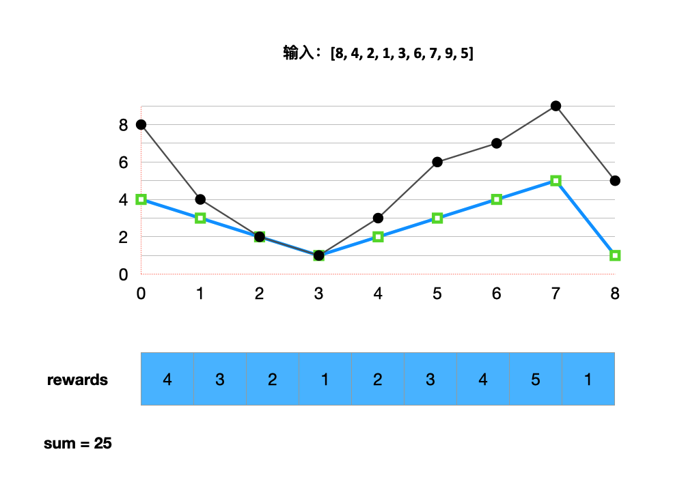
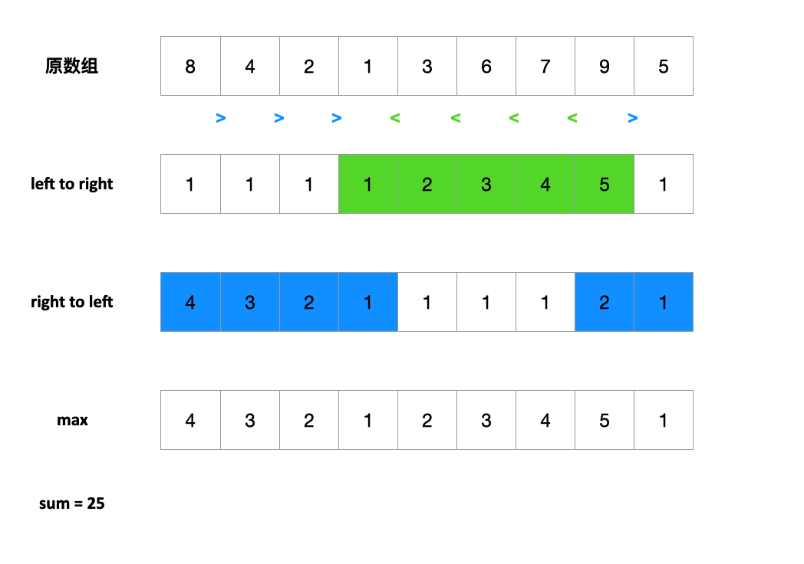
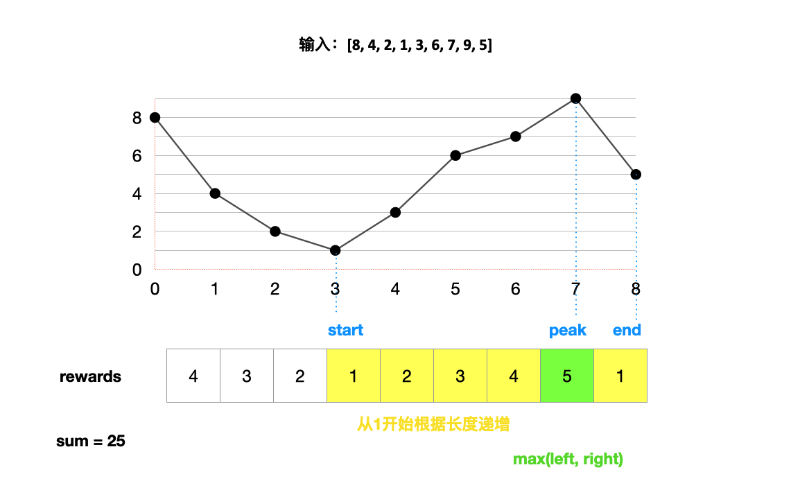
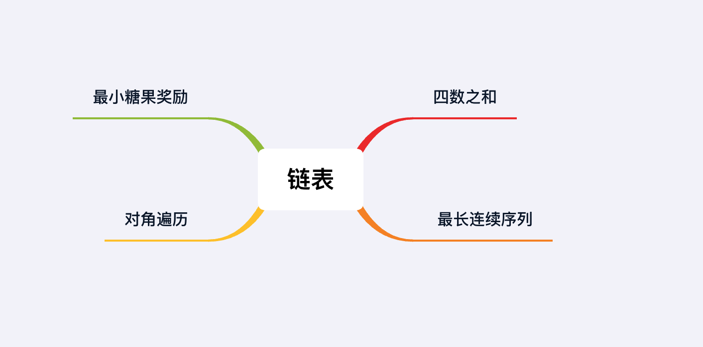

## 章节导读

上一节我们学习了数组的经典考察模板：Two Pointers。这节课我们来看面试中出现过的真题。

## 1.案例: 四数之和

> 
> 输入: array = [7, 6, 4, -1, 1, 2], target = 16
> 输出: [[7, 6, 4, -1], [7, 6, 1, 2]]

### 思路分析

Four Sum是Three Sum的follow-up题。类似Two Sum，我们可以尽量将Four Sum问题归约到Three Sum，再利用Three Sum的解法。

在Three Sum中，我们可以假设a < b < c，先将其中一个元素a固定下来，然后利用Two Sum去寻找b和c。

Four Sum同理，假设a < b < c < d，先确定a，然后利用Three Sum去寻找b, c, d。

1. 将原数组排序
2. 遍历每一个数字，在当前位置 i 上，假设这就是我们要找的a
3. 对于 i 右侧的数组，调用ThreeSum去找b，c，d。

### 代码实现

```java
public List<List<Integer>> fourSum(int[] nums, int targetSum) {
    List<List<Integer>> ans = new ArrayList<>();
    if (nums == null || nums.length < 4) 
        return ans;
    Arrays.sort(nums);

    for (int i = 0; i < nums.length - 3; i++) {
        if (i != 0 && nums[i - 1] == nums[i])	continue; // 避免重复解
        // Three Sum
        for (int j = i + 1; j < nums.length - 2; j++) {
            if (j != i + 1 && nums[j - 1] == nums[j])	continue; // 避免重复解
            // Two Sum
            twoSum(targetSum - nums[i] - nums[j], nums, i, j, ans);
        }
    }
    return ans;
}

void twoSum(int target, int[] array, int i, int j, List<List<Integer>> ans) {
    int left = j + 1;
    int right = array.length - 1;

    while (left < right) {
        int sum = array[left] + array[right];
        if (sum == target) {
            ans.add(Arrays.asList(array[i], array[j], array[left], array[right]));
            left++;
            right--;
            while (left < right && array[left - 1] == array[left])
                left++; // 避免重复解
            while (left < right && array[right + 1] == array[right])
                right--; // 避免重复解
        } else if (sum < target) {
            left++;
        } else {
            right--;
        }
    }
}
```

### 分析
时间复杂度O(n<sup>3</sup>)，空间复杂度O(1)。

Three Sum 时间复杂度O(n<sup>2</sup>)，空间复杂度O(1)。调用了n次Three Sum，最终时间复杂度O(n<sup>3</sup>)，空间复杂度O(1)。

思考题：比较Three Sum和Four Sum，我们可以发现一些共同点。如果面试官要求你写出一个通用的kSum算法，k>=2

## 2.案例: 最长连续序列

> 给定一个未排序的数组，找出最长连续序列，返回长度。
> 
> 输入: array = [1, 11, 3, 0, 15, 5, 2, 4, 10, 7, 12, 6]
> 输出: 8

### 思路分析 1

前面我们已经见过了很多种数组算法题。一个通用的规律是，我们可以利用排序或者辅助数组来降低算法的难度。

这题也是相同的道理，我们使用排序来降低难度。

1. 将数组排序
2. 遍历数组，记录每个连续序列的长度（跳过重复的数字）
3. 返回最长的序列长度

### 代码实现 1

```java
public int longestConsecutive(int[] nums) {
    if (nums.length <= 1)
        return nums.length;

    Arrays.sort(nums);
    int len = 1;
    int count = 1;
    for (int i = 1; i < nums.length; i++) {
        if (nums[i - 1] == nums[i]) continue;

        if (nums[i - 1] + 1 == nums[i])
            count++;
        else 
            count = 1;
        len = Math.max(len, count);
    }
    return len;
}
```

### 分析
时间复杂度O(n logn)，空间复杂度O(1)。由于使用了排序，所以我们额外消耗了O(n logn)的时间复杂度。

### 思路分析2

如果不使用排序，那么我们就需要一种快速访问当前数值前一位或后一位的方法。这里我们需要引入Set。

Set对应着集合的概念，每个元素在集合中只出现一次。Set提供了add/remove/contains等API，并且非常高效消耗均为O(1)。之前我们在Two Sum的时候有一种解法就是利用了Set快速查询元素的功能，本题也是一样。

我们初始化一个Set，将所有元素装入Set。再次遍历原数组，对于每个数，我们分别向上下游拓展，挨个访问比它大的数和小的数。我们可以想象一根数轴，我们以数字n为原点，分别向左右扩展，检查每个数字是否被包含在集合中。对于每个存在集合中的数字，我们要移出集合，避免重复访问。最后我们根据数轴上的左右边界，确定连续序列的长度

### 代码实现2

```java
public int longestConsecutive(int[] nums) {
    HashSet<Integer> set = new HashSet<>();
    for (int n : nums)
        set.add(n);

    int len = 0;
    for (int n : nums) {
        if (!set.contains(n)) continue;

        set.remove(n); // 从集合中移除，避免重复访问
        int left = n - 1, right = n + 1;
        while (set.contains(left))  
          set.remove(left--); // 在数轴上向左查询
        while (set.contains(right)) 
          set.remove(right++); // 在数轴上向右查询

        len = Math.max(right - left - 1, len);
    }
    return len;
}
```

### 分析
时间复杂度O(n)，空间复杂度O(n)

我们利用了Set这种数据结构，消耗了额外O(n)的空间，但是同时将时间复杂度降到了O(n)。解法1和2并没有严格的高下之分，二者在时间-内存上做了取舍。

## 3.案例: 最小糖果奖励

> 给定一组学生的成绩，希望按照成绩给予奖励。有两条规则：
> + 每个学生至少得到一份奖励
> + 成绩更高的学生必须得到严格高于相邻学生的奖励数目
> 
> 输入: [8, 4, 2, 1, 3, 6, 7, 9, 5]
> 输出: 25

### 思路分析 1

这道题是2018年Google的一道面试题。出题人曾表示这道题至少有4种不同的解法，不过几乎没有人可以在45分钟内做出来。但是由于近两年面试者逐步提高对刷题能力的重视，并且候选人刷题量普遍提升，这道题已经可以作为一道常规题来看待了。

大部分人在看到这道题时会感到无从下手，因为本题不同于典型的算法题，尝试套用动态规划或者二叉树等解法注定无功而返（这也侧面说明刷题模板并不是万能的）。

本题的难点在于定义相邻两个学生分数和奖励的对应关系。



通过作图分析，我们可以发现一些规律：如果我们将先后连续的两个学生的分数用a，b来表示，奖励用A，B表示。如果a < b，那么B = A + 1；否则B = 1。

这里我们假设学生b之和他前一位的学生a作比较，实际上本题要求每个学生和他相邻的两个学生比较。所以我们先将相邻关系拆解成两个约束条件：1.和左侧的学生比较 2.和右侧的学生比较




### 代码实现 1

```java
public int candy(int[] ratings) {
    // 从左往右
    int[] left = new int[ratings.length];
    Arrays.fill(left, 1);
    for (int i = 1; i < ratings.length; i++) 
        if (ratings[i - 1] < ratings[i])
            left[i] = left[i-1] + 1;
    
    // 从右往左
    int[] right = new int[ratings.length];
    Arrays.fill(right, 1);
    for (int i = ratings.length - 2; i >= 0; i--) 
        if (ratings[i] > ratings[i + 1]) 
            right[i] = right[i + 1] + 1;

    // 取最大值求和
    int sum = 0;
    for (int i = 0; i < ratings.length; i++) 
        sum += Math.max(left[i], right[i]);

    return sum;
}
```

### 分析
时间复杂度O(n)，空间复杂度O(n)

这种解法通过将一个复杂的提交拆解成两个等价的条件来简化算法难度，是一种简洁、明确的解法。代码可读性高。由于使用了额外的数组作为辅助，所以消耗了O(n)的空间。

### 思路分析 2

本题存在一种使用O(1)空间，O(n)时间的解法。但是想到这种解法需要一定的题量和高超的联想能力。本题实际上是我们在数组第一节讲过的“数组中的最长山脉”的变种。

我们可以利用寻找山脉的算法，在数组的每一段找到start，peak，end。

+ left代表了从start到peak的数组，right代表了从peak到end的数组。
+ left和right部分的reward分别是从1开始的递增序列
+ peak的值是left和right长度的最大值



### 代码实现 2

```java
public int candy(int[] ratings) {
    if(ratings.length < 2)
        return ratings.length;

    int end = 0, sum = 0;
    // 寻找山脉
    while(end < ratings.length) {
        // 跳过平坡
        if(end + 1 < ratings.length && ratings[end] == ratings[end+1]) {
            sum++;
            end++;
            continue;
        }

        int start = end;
        while (end + 1 < ratings.length && ratings[end] < ratings[end+1])
            end++; // 上坡

        int peak = end;
        while(end + 1 < ratings.length && ratings[end] > ratings[end+1])
            end++; // 下坡

        if(start == end) {
            sum++; // end没有继续移动，到达结尾
            break;
        }

        int left = peak - start;
        int right = end - peak;
        sum += accumulate(left) + accumulate(right) + Math.max(left, right);
    }
    return sum;
}

int accumulate(int num) {
    // 连续累积和公式：（首项 + 末项）x 项数 / 2
    return (1 + num) * num / 2;
}
```

### 分析
时间复杂度O(n)，空间复杂度O(1)

虽然这种解法在空间上更优，但是寻找山脉的算法在面试时并不容易写正确。解法2仅作为解法1的补充。

## 4.案例: 对角遍历

> 给定M×N的矩阵，要求以对角线顺序返回所有元素
> 
> 输入:
> array = [
>   [1,  3,  4, 10],
>   [2,  5,  9, 11],
>   [6,  8, 12, 15],
>   [7, 13, 14, 16],
> ]
> 输出: [1, 2, 3, 4, 5, 6, 7, 8, 9, 10, 11, 12, 13, 14, 15, 16]

### 思路分析

本题的难点并不在思路上，而在于实现过程中不出错。数组类题目中，最容易出现的是off-by-one error，数组越界，等等。

对于这类正确的想法应该是尽量避免在一次迭代中使用太多指针，可以分解成多个步骤去完成。然后在将相同的部分合并。

1. 先沿着第一行，斜向左下遍历
2. 再沿着最末一列，斜向左下遍历
3. 将偶数位出现的line翻转
4. 全部添加入res数组

### 代码实现

```java
public int[] findDiagonalOrder(int[][] matrix) {
    if (matrix == null || matrix.length == 0) return new int[0];
    
    int n = matrix.length;
    int m = matrix[0].length;
    List<List<Integer>> ans = new ArrayList<>();
    
    // 先沿着第一行，斜向左下遍历
    for (int i = 0; i < m; i++) {
        ArrayList<Integer> line = new ArrayList<>(); // 将每一行缓存在line中
        int r = 0;
        int c = i;
        
        while (r < n && c >= 0)
            line.add(matrix[r++][c--]);

        ans.add(line); // 将line存入ans列表
    }

    // 沿着最末一列，斜向左下遍历
    for (int i = 1; i < n; i++) {
        ArrayList<Integer> line = new ArrayList<>();
        int r = i;
        int c = m - 1;

        while (r < n && c >= 0)
            line.add(matrix[r++][c--]);

        ans.add(line);
    }

    // 将偶数位出现的line翻转
    for (int i = 0; i < ans.size(); i++) {
        if (i % 2 == 0) {
            Collections.reverse(ans.get(i));
        }
    }

    //全部添加入res数组
    int[] res = new int[n*m];
    int i = 0;
    for (List<Integer> line : ans) {
        for (int num : line) {
            res[i++] = num;
        }
    }

    return res;
}
```

有了上面的算法，我们再对于重复的部分进行合并。我们可以省略重复的循环部分，因为大部分逻辑相同。再省略掉ans缓存中间结果。最后会有如下代码

```java
public int[] findDiagonalOrder(int[][] matrix) {
    if (matrix == null || matrix.length == 0) return new int[0];
    int n = matrix.length;
    int m = matrix[0].length;

    int[] res = new int[n*m];
    int k = 0;

    for (int i = 0; i < n + m - 1; i++) {
        int r = i < m ? 0 : i - m + 1;
        int c = i < m ? i : m - 1;

        ArrayList<Integer> line = new ArrayList<>();
        while (r < n && c >= 0)
            line.add(matrix[r++][c--]);

        if (i % 2 == 0)
            Collections.reverse(line);
        for (int j = 0; j < line.size(); j++)
            res[k++] = line.get(j);
    }
    return res;
}
```

### 分析
时间复杂度O(n)，空间复杂度O(n)

我们的输出和输入的大小一致，而且每个位置最多只访问常数次。所以最终时间复杂度O(n)，空间复杂度O(n)

## 总结

本章我们使用了4道真题作为案例，分析了面试中比较简单的一类数组题。在随后的章节中，我们会见到更多的数组类算法题模板和数组的进阶考法。



## 习题

1. 给一个包含n个数的整数数组S，在S中找到所有使得和为给定整数target的k元组