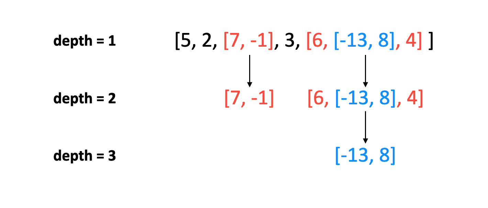
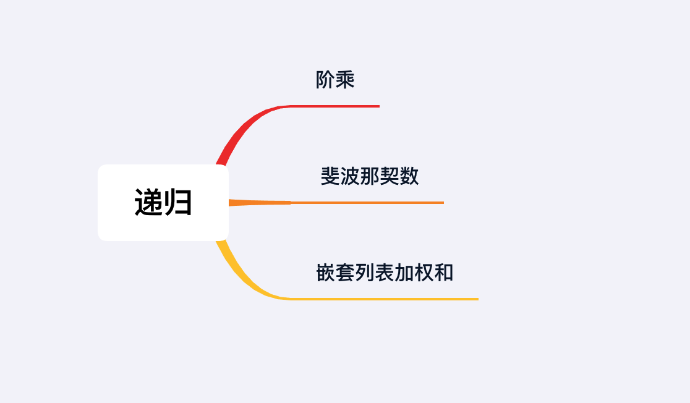

## 章节导读

之前，我们已经学习了数组和链表这两种最基础的数据结构。从本章开始，我们引入递归。递归不是一种结构，也不是一种算法，而是一种方法。一旦掌握了递归，大部分人的编程水平会有一个明显的提升。很多人会在这里遇到第一个理解上的难点：无法在想象中展开递归调用。本章我们会用几个案例，让大家体会一下递归的使用方法。

## 1.案例: 阶乘

> 给定一个正整数n，返回它的阶乘n!的值。n!定义为 1 * 2 * 3 * .... * (n - 1) * n
> 
> 输入: 5
> 输出: 120

### 思路分析 & 代码实现

假设这个阶乘(factorial)函数的名字叫做 fact(int n)。


*图片由visualgo制作*

首先我们要仔细描述阶乘的定义：fact(n) = 1 * 2 * 3 * .... * (n - 1) * n = fact(n-1) * n

我们可以写出第一版的代码：

#### 版本1

```java
public int fact(int n) {
    if (n == 1)     
        return 1;
    return n * fact(n - 1);
}
```

在纸上模拟CPU调用的顺序：

> fact(5)
> = 5 * fact(4)
> = 5 * (4 * fact(3))
> = 5 * (4 * (3 * fact(2)))
> = 5 * (4 * (3 * (2 * fact(1))))
> = 5 * (4 * (3 * (2 * 1)))
> = 5 * (4 * (3 * 2))
> = 5 * (4 * 6)
> = 5 * 24
> = 120

看起来问题不大，调用关系比较简单。虽然式子越展开越长，但是纸上模拟的过程相对比较清晰易懂。为了解决式子越展开越长的问题，我们将它改写成第二版代码：

#### 版本2

```java
public int fact(int n) {
    return fact(n, 1);
}

int fact(int n, int acc) {
    if (n == 1) {
        return acc;
    }
    return fact(n - 1, n * acc);
}
```

这一次我们补充了一个acc字段来存储当前的连乘结果，将 n * fact(n - 1) 改写成了 fact(n - 1, n * acc)，两种结构等价 。然后再次在纸上模拟调用顺序：

> fact(5, 1)
> = fact(4, 5)
> = fact(3, 20)
> = fact(2, 60)
> = fact(1, 120)
> = 120

这次我们发现，式子的展开长度保持不变。对比两个版本，我们可以观察到，递归本质在于调用自身，但是不限于在函数体中部调用。即使在函数结束时调用自身，也满足递归的条件。

第一版的代码中，return语句需要先等待fact(n - 1)的结果，才能得到fact(n)的结果。第二版的代码中，return语句用一个新的fact(n - 1, n * acc)调用代替了原本的fact(n, acc)，无需等待结果。这二者的差异导致版本2的代码不会随着调用展开越来越长。而这种展开会隐性的消耗栈内存空间。

两个版本代码的共性在于，递归调用的结束，依赖于某个基础条件的完成（在本例中就是n = 1）。这一点类似于高中所学的数学归纳法：

1. 证明当n = 1时命题成立。
2. 假设n = k时命题成立，如果可以推导出在n = k + 1时命题也成立（k为任意自然数），那么原命题在自然数集上成立

数学归纳法适用于将解决一个问题转化为解决它的子问题，同时子问题与原问题存在相同的逻辑。递归也是同理。

### 分析

从这个案例中我们可以发现递归的一些规律。
1. 递归需要在函数体中再次调用函数本身。
2. 如果返回值，依赖于下层递归结束并返回，那么随着调用展开，式子会越来越长。并且这种展开会消耗栈内存空间。
3. 递归的结束依赖于一个基础条件的达成，这一点与数学归纳法相同。

## 2.案例: 斐波那契数

> 斐波那契数：通常用F(n)表示斐波那契数列的第n个数字，每个数字由前两位相加得到，起始两位为0和1
> 
> 输入: n = 6
> 输出: 5

### 思路分析 & 代码实现

我们先给出斐波那契数的数学描述：

> F(0) = 0
> F(1) = 1
> F(n) = F(n - 1) + F(n - 2)
> n为自然数

有了数学描述，就可以写出等价的代码

#### 版本1

```java
public int fib(int N) {
    if (N <= 1) {
        return N;
    }

    return fib(N - 1) + fib(N - 2);
}
```

与阶乘算法不同的是，这次的 fib(n) 依赖于 fib(n - 1) 和 fib(n - 2)。这说明：
1. fib在执行过程中会多次调用fib来解决子问题
2. fib的执行结果依赖于子问题的返回值，所以会不停消耗栈空间
3. fib(n) 调用执行了 fib(n - 1) 和 fib(n - 2)，但是 fib(n - 1) 会再次调用 fib(n - 2) 和 fib(n - 2)。说明一部分子问题被重复调用了。


*图片由visualgo制作*

第三点有一个有效的解决办法叫做记忆化，可以一种提高程序运行效率，是一种经典的时间存储平衡方案。通过储存函数的返回值，当这个结果再次被需要时将其从缓存提取，而不用再次计算来节省计算时间。

#### 版本2(自顶向下记忆化)：

```java
HashMap<Integer, Integer> map = new HashMap<>();
public int fib(int N) {
    if (N <= 1)     
      return N;
    if (map.containsKey(N))
      return map.get(N);  // 从缓存中提取存在的结果 

    int res = fib(N - 1) + fib(N - 2);
    map.put(N, res); // 将结果存入缓存
    return res;
}
```

每次调用fib(n)时，会首先在缓存map中检查是否已经存在对应的返回值。如果存在直接返回；否则会计算新的结果，存入缓存中，然后返回。这样一来 fib(n - 1) 再次调用 fib(n - 2) 时，会利用已经缓存好的结果，省去重复计算的消耗。

然而，这种做法依旧不能避免展开式越来越长。至少在第一次计算的时候，需要将整个计算链完全展开。这是自顶向下记忆化做法的一个弊端，在计算 fib(n) 时我们会调用 fib(n - 1)，而此时 fib(n - 1) 并没有被计算过，所以不在缓存中。CPU只能先计算 fib(n - 1)，而这又依赖 fib(n - 2)，CPU会一路递归调用直至 fib(1)。如果这时候栈空间不足，就会导致栈溢出问题。

因此，我们可以使用自底向上的记忆方式：从n = 2开始计算斐波那契数列，直到计算到n。

#### 版本3(自底向上记忆化，动态规划)：

```java
public int fib(int N) {
    if (N <= 1) 
        return N;

    int[] fibSeq = new int[N + 1];
    fibSeq[1] = 1;

    for (int i = 2; i <= N; i++) 
        fibSeq[i] = fibSeq[i - 1] + fibSeq[i - 2];
    return fibSeq[N];
}
```

版本3的代码已经没有了递归的影子，这种解法叫做动态规划，我们会在之后单独用一个章节来详细分析。我们可以从这里发现一些新的规律：

1. 递归和循环迭代可以相互转换
2. 递归调用自身，是因为需要依赖子问题的返回结果；如果能有别的方法得到子问题的结果，那么可以不需要递归

最后这里对版本3的代码提出一些优化，作为补充。版本3的代码中，使用了一个长度为N + 1的额外数组。原本的递推公式 F(n) = F(n - 1) + F(n - 2) 说明，第n项的值并不依赖于整个数组，而只依赖于前两项。我们可以通过对下标取余来压缩数组的长度

#### 版本4(自底向上记忆化，动态规划，压缩数组)：

```java
public int fib(int N) {
    if (N <= 1) 
        return N;
    
    int[] fibSeq = new int[2]; // 将数组长度限定为2
    fibSeq[1] = 1;

    for (int i = 2; i <= N; i++) // 通过对下标对2取余来压缩数组
        fibSeq[i % 2] = fibSeq[(i - 1) % 2] + fibSeq[(i - 2) % 2];
    return fibSeq[N % 2];
}
```

### 分析

案例2向我们展示了递归和它的一系列变化方式，我们从中也总结了一些规律：

1. 递归会在函数执行中调用函数自身，大多数时候需要等待子调用的执行结果。本质上是将原问题，拆分成更小的子问题。
2. 递归在等待子调用的时候，代价是消耗栈空间。栈空间消耗完，会触发栈溢出错误。
3. 记忆化可以帮助我们减少重复调用。

但是纸上得来终觉浅，即使总结了规律，并不代表我们就学会了递归。大部分时候，我们需要反复练习才能掌握递归的正确用法。

## 3.案例: 嵌套列表加权和

> 给一个嵌套的列表, 返回列表中所有整数根据深度加权后的和. 每一个元素可能是一个整数或一个列表(其元素也可能是整数或列表)
> 比如[x, [y, [z]]] 对应 x + 2 * y + 3 * z.
> 
> 输入: array = [5, 2, [7, -1], 3, [6, [-13, 8], 4]]
> 输出: 27

### 思路分析

这道题是典型的递归类问题。题目明示了我们列表是嵌套的，并且嵌套的列表具有和原列表相同的结果，说明原问题的解依赖于子问题的解。

根据题目，每层的加权和由两个因素决定：1.整数和 2.深度



我们可以定义一个递归函数weightedSumHelper。从第一层开始，遍历所有元素。如果发现嵌套列表，那么递归的调用weightedSumHelper，并且深度加一。如果发现是整数，那么乘以深度后，累加入整数和。最后将加权和返回.

### 代码实现

```java
public int weightedSum(List<Object> array) {
    return weightedSumHelper(array, 1); // 递归函数
}

int weightedSumHelper(List<Object> array, int depth) {
    int sum = 0;
    for (Object obj : array) {
        if (obj instanceof ArrayList) { // 如果发现是嵌套列表
            List<Object> list = (ArrayList<Object>) obj;
            sum += weightedSumHelper(list, depth + 1); // 递归的调用weightedSumHelper
        } else {
            sum += (int)obj * depth; // 乘以深度后，累加入整数和
        }
    }
    return sum;
}
```

### 分析
时间复杂度O(n)。本题中我们只是遍历了输入列表，没有创建额外的数据结构。

每次递归之间，存在状态改变：array参数代表的列表会越来越短，depth代表的深度越来越大。直到满足终止条件：array为空。

需要注意的是，有的题库中会创建额外的数据结构来描述嵌套列表的状态（比如NestedInteger / NestedList）。在真正面试时，需要向面试官确认，是否存在这种额外的数据结构和API。面试官有可能给出否定的回答，所以一定要知道编程语言提供的判断类型的关键词，在Java中，我们可以使用 instanceof 来判断一个对象的类型；这也是工业界的标准做法。

## 总结

这节课我们使用了三个非常简单的案例来体会递归的一些特性。接下来我们会见识到递归在面试题中的普遍应用。



## 习题

1. 给一个嵌套的列表, 返回列表中所有整数根据深度加权后的和.每一个元素可能是一个整数或一个列表(提供有NestedInteger结构和isInteger()等API)