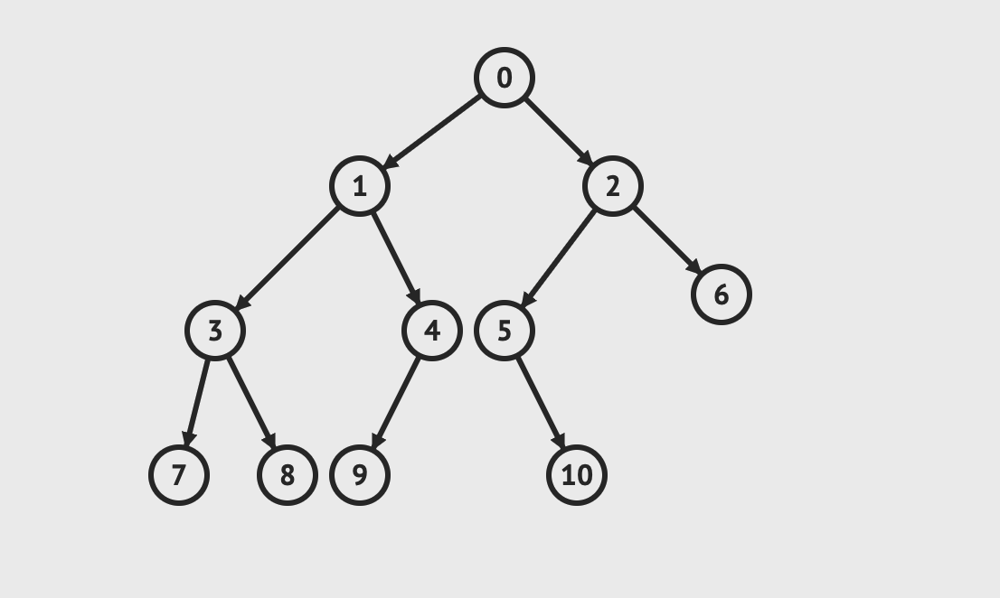
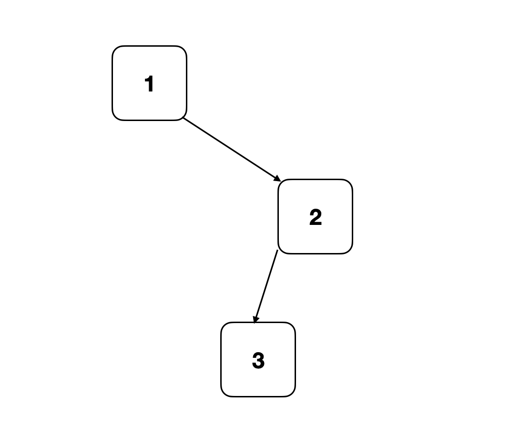
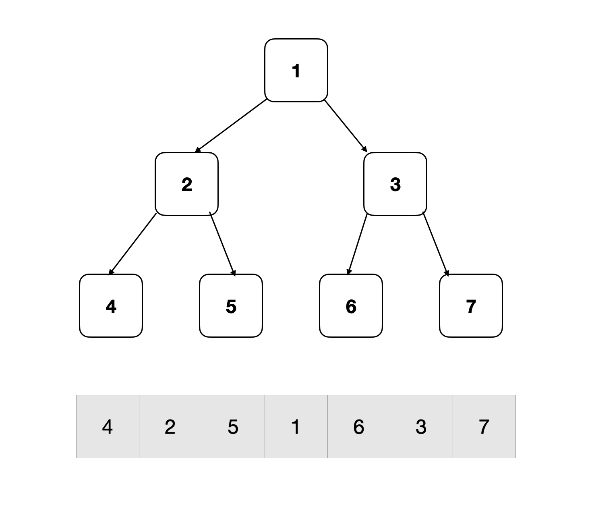
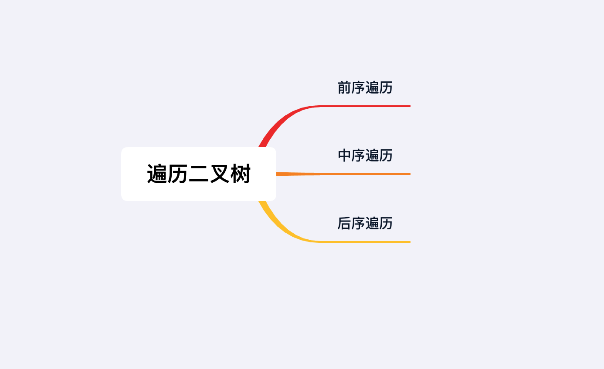

## 章节导读

在前面的章节里，我们学习了链表和数组两种数据结构。他们的共同点是其中保存的元素符合某种顺序：存在第一个和最后一个元素，并且可以通过指针指向前一位或者后一位来遍历整个集合。这一类结构一般称为线性结构。

从本章开始，我们要开始接触非线性结构，这里我们从二叉树开始。

## 基础知识——二叉树

树类结构，是链表结构的衍生。二叉树是每个节点存在最多两个分支的树结构。（单链表则是每个节点只存在单一分支next）


*图片由visualgo制作*

最顶端的节点一般称为根节点，最底层的节点（没有左右分支）则称为叶子节点。二叉树的节点有左、右次序之分，通常分支被称作“左子树”或“右子树”。

> 思考题：双链表算二叉树么？单链表呢？

### 二叉树节点的表示方法

```java
public class TreeNode {
    int val;
    TreeNode left, right;

    TreeNode(int val) {
        this.val = val;
    }
}
```

## 基础知识——深度优先搜索

本章我们重点介绍一种遍历树的算法：DFS深度优先搜索。它也是树类问题中最常见的面试考察模板。

DFS的特点就是深度优先，在树上的每个位置都会优先往深处走（先左后右），直到叶子节点，再逐层返回。


DFS通常可以使用递归写法：

1. 给定某个节点（如果当前节点为null，则返回）
2. 在本节点上进行操作
3. 递归地访问左子树
4. 递归地访问右子树

模板代码：

```java
void dfs(TreeNode node) {
  if (node == null) return;
  
  doSomething(node); // do something 代表在节点上的操作
  dfs(node.left); // 递归地访问左子树
  dfs(node.right); // 递归地访问右子树
}
```

要注意do something的操作可能发生在递归访问左右子树之前或者之后。根据do something位置的不同，dfs算法可以衍生出前序遍历、中序遍历、后序遍历三种算法。

## 1.案例: 二叉树的前序遍历

> 给出一棵二叉树，返回其节点值的前序遍历。
> 
> 输入: 
> 输出: [1, 2, 3]

### 思路分析

前序遍历的名字暗示了访问顺序，算法会按照中左右的顺序：首先访问根节点（当前节点），然后遍历左子树，最后遍历右子树。

```java
void dfs(TreeNode node) {
  if (node == null) return;
  
  doSomething(node); // 访问根节点
  dfs(node.left); // 遍历左子树
  dfs(node.right); // 遍历右子树
}
```
在遍历左、右子树时，仍然先访问根节点（当前节点），然后遍历左子树，最后遍历右子树。


*图片由algorithm-visualizer制作*

整体上看，前序遍历会先沿左分支走到树的底部，访问完左子树，再通过回溯，回到上一层，然后访问右子树。

### 代码实现

```java
public List<Integer> preorderTraversal(TreeNode root) {
    List<Integer> list = new ArrayList<>();
    dfs(root, list);
    return list;
}

void dfs(TreeNode node, List<Integer> list) {
    if (node == null)   return;

    list.add(node.val); // 访问当前节点
    dfs(node.left, list); // 遍历左子树
    dfs(node.right, list); // 遍历右子树
}
```

前序遍历有一种等价的写法，使用了stack和循环。在这里作为补充，建议在纸上模拟CPU调用，可以帮助理解。

首先存入当前节点值，然后先将右子树压入栈中，再将左子树压入栈中。对栈中元素遍历访问。

```java
public List<Integer> preorderTraversal(TreeNode root) {
    Stack<TreeNode> stack = new Stack<TreeNode>();
    List<Integer> preorder = new ArrayList<Integer>();
    if (root == null)   return preorder;
    
    stack.push(root); // 存入当前节点值
    while (!stack.empty()) {
        TreeNode node = stack.pop();
        preorder.add(node.val);
        if (node.right != null) stack.push(node.right); // 将右子树压入栈中
        if (node.left != null)  stack.push(node.left); // 将左子树压入栈中
    }

    return preorder;
}
```

### 分析
时间复杂度O(n)，空间复杂度O(n)

## 2.案例: 二叉树的中序遍历

> 给出一棵二叉树,返回其中序遍历
> 
> 输入: 
> 输出: [1, 3, 2]

### 思路分析

中序遍历会按照左中右的顺序首先遍历左子树，然后访问根节点，最后遍历右子树


*图片由algorithm-visualizer制作*

整体上看，由于中序遍历符合左中右的顺序，所以相当于沿着树的横向方向，挨个访问节点



### 代码实现

```java
public List<Integer> inorderTraversal(TreeNode root) {
    List<Integer> list = new ArrayList<>();
    dfs(root, list);
    return list;
}

void dfs(TreeNode node, List<Integer> list) {
    if (node == null)   return;

    dfs(node.left, list); // 遍历左子树
    list.add(node.val); // 访问当前节点
    dfs(node.right, list); // 遍历右子树
}
```

中序遍历也有一种使用了stack和循环的等价写法。在这里作为补充，建议在纸上模拟CPU调用，可以帮助理解。

首先访问左子树，将左子树存入栈中。每次检查栈顶元素，如果右子树为空，取出栈顶元素，如果取出的元素为新栈顶元素右子树，一直弹出至当前元素不为栈顶元素右子树(说明右子树根节点已经被访问过)。如果节点右子树不为空，访问右子树，继续循环遍历左子树，存入栈中。

```java
public List<Integer> inorderTraversal(TreeNode root) {
    Stack<TreeNode> stack = new Stack<>();
    ArrayList<Integer> result = new ArrayList<>();
    while (!stack.isEmpty() || root != null) {
        while (root != null) {
            stack.push(root);
            root = root.left;
        }

        root = stack.pop();
        result.add(root.val);
        root = root.right;
    }
    return result;
}
```

### 分析
时间复杂度O(n)，空间复杂度O(n)

## 3.案例: 二叉树的后序遍历

> 给出一棵二叉树，返回其节点值的后序遍历。
> 
> 输入: 
> 输出: [3, 2, 1]

### 思路分析

后序遍历会按照左右中的顺序：首先遍历左子树，然后遍历右子树，最后访问根节点。


*图片由algorithm-visualizer制作*

后序遍历在遍历左、右子树时，仍然先遍历左子树，然后遍历右子树，最后遍历根节点。后序遍历同样也有一种使用了stack和循环的等价写法。但是相比于前序和中序遍历，后序遍历的迭代写法难度较大，代码量长，所以从未作为面试考点出现过，只需要掌握递归式写法。

### 代码实现

```java
public List<Integer> postorderTraversal(TreeNode root) {
    List<Integer> list = new ArrayList<>();
    dfs(root, list);
    return list;
}

void dfs(TreeNode node, List<Integer> list) {
    if (node == null)   return;

    dfs(node.left, list); // 遍历左子树
    dfs(node.right, list); // 访问当前节点
    list.add(node.val); // 遍历右子树
}
```

### 分析
时间复杂度O(n)，空间复杂度O(n)

## 4.案例: 二叉树迭代器

> 设计实现一个二叉树的迭代器：
> + 元素按照中序遍历的顺序被访问
> + next()返回树中下一个元素

### 思路分析

这道题其实就是要求改写中序遍历的stack写法。我们在之后会专门有一个章节来介绍Stack，现在我们只需要知道Stack是一种后进先出的数据结构，包含有push（压栈）和pop（弹出）两个主要API。

+ 构造时首先访问左子树，将左子树存入栈中。
+ next函数每次获取栈顶元素。如果节点右子树不为空，访问右子树，继续循环遍历左子树，存入栈中。
+ hasNext可以通过检查栈是否为空来获得。


### 代码实现

```java
class BSTIterator {
    Stack<TreeNode> stack;
    public BSTIterator(TreeNode root) {
        stack = new Stack<>(); 
        while (root != null) { // 将左子树存入栈中
            stack.push(root);
            root = root.left;
        }
    }

    public int next() {
        TreeNode curt = this.stack.pop(); // 获取栈顶元素
        if (curt.right != null) { // 如果栈顶元素存在右分支
            TreeNode root = curt.right; 
            while (root != null) { // 将右分支的左子树存入栈中
                stack.push(root);
                root = root.left;
            }
        }
        return curt.val; // 返回栈顶元素
    }

    public boolean hasNext() {
        return stack.size() > 0;
    }
}
```

### 分析

本题的本质是改写中序遍历的stack写法，所以平均时间复杂度为O(1)

## 总结

前序、中序和后序遍历分别对应一种使用了stack和循环的写法。但是从2018年以来，stack写法作为考点出现的频率越来越低。取而代之的，是在2018年出现了以Morris遍历法作为考点。

