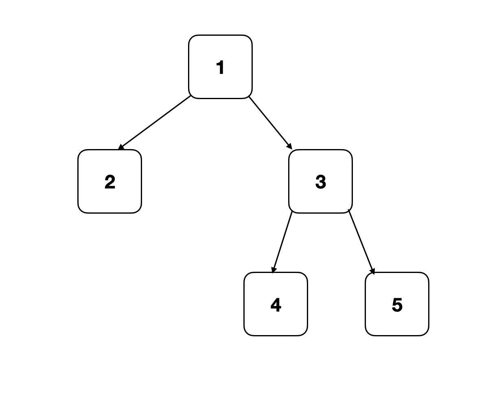

## 章节导读

上一节我们学习了树的DFS遍历，并且介绍了前序、中序和后序遍历三种遍历的递归写法。这节课我们来看面试中出现过的DFS经典面试题。

## 1.案例: 最大深度

> 给定一棵二叉树，找出最大深度。
>
> 输入: 
> 输出: 3

### 思路分析

这是一道入门级DFS题，主要是让大家熟悉一下这类题的通用套路。

题目要求我们求一颗树的最大深度。深度由所有节点中最远的那个决定。但是在一开始，给定的输入只有root节点，我们没有办法直接确定哪个节点是全局最深的节点。所以我们需要利用DFS遍历全局，获得最深的节点的信息。


想要获得整个树的最大深度，一个重要的前提是我们能够确切的知道每个节点的深度。而每个节点的深度又是由它的左右子树深度决定的，这样一来我们就发现了递归模式：树的深度等价于根节点的深度，而根节点的深度由左右子树的深度决定。接下来我们可以通过DFS收集节点的深度信息。

1. 对于给定的节点，如果该节点为空，那么该节点深度为0
2. 如果节点不为空，那么深度是左右子树中的最大深度+1

### 代码实现

```java
public int maxDepth(TreeNode root) {
    if (root == null) // 如果该节点为空
        return 0; // 节点深度为0

    int left = maxDepth(root.left); // 获得左子树深度
    int right = maxDepth(root.right); // 获得右子树深度
    return Math.max(left, right) + 1; // 左右子树中的最大深度+1
}
```

### 分析

时间复杂度O(n)，空间复杂度O(n)，n是树的大小，即节点的个数。

本题中我们利用dfs访问了所有的节点，所以消耗了O(n)的时间。空间上，二叉树的结构并不确定，最差情况下，二叉树可能退化成一根链表，我们需要一路访问到最远的节点，然后才能返回。所以空间复杂度为O(n)

## 2.案例: 路径和

> 给定一棵二叉树和求和，确定树上是否具有根到叶路径，使得沿路径的所有值相加等于给定的总和。
>
> 输入:
> 
> 输出: true

### 思路分析

本题与上一题相比，出现了一些变化。我们既需要从上向下传递信息(目标和target sum)，又需要从下向上传递信息(路径path)。来自下层的信息我们可以通过递归获得；来自上层的信息，我们需要从上层函数传参获得。

1. 从根节点开始调用dfs
2. 如果遇到的是叶子节点，检查sum与当前节点的值是否相等
2. 如果遇到的节点不是叶子节点：
3.1. 从给定的sum中，减去当前节点的值
3.2. 递归地将左右子树传入

### 代码实现

```java
public boolean hasPathSum(TreeNode root, int sum) {
    if (root == null)
        return false;

    if (root.left == null && root.right == null) // 如果遇到的是叶子节点
        return root.val == sum; // 检查sum与当前节点的值是否相等

    // 递归地将左右子树传入，并且将target sum向下传参
    boolean left = hasPathSum(root.left, sum - root.val);
    boolean right = hasPathSum(root.right, sum - root.val);
    return left || right; // 判断左右子树是否存在该路径
}
```

### 分析
时间复杂度O(n)，空间复杂度O(n)

## 3.案例: 二叉树最大路径和

> 给出一棵二叉树，寻找一条路径使其路径和最大，路径可以在任一节点中开始和结束（路径和为两个节点之间所在路径上的节点权值之和）
>
> 样例: 
> 输出: 18

### 思路分析

从题目看，要求我们在一颗树中，找到路径和的路径，并且该路径可能不经过根节点。

本题与之前相比，不仅需要从左右子树收集信息，还需要一个额外的变量让我们保留全局信息。因为DFS最终会将所有的信息汇总到根节点，而最大路径可能不经过根节点，所以我们在遍历过程中需要额外的ans字段来保存全局结果。


需要注意的是，最大路径一定会横跨某个节点。我们以该节点作为中心，分割两条边，作为最大路径的两个分支。每经过一个节点，除了递归地访问左右子树，我们需要额外的两步操作。

1. 将经过当前节点的最大路径与全局最大路径ans作比较
2. 向上返回经过当前节点路径的最大分支

### 代码实现

```java
int ans;
public int maxPathSum(TreeNode root) {
    ans = Integer.MIN_VALUE;
    dfs(root);
    return ans;
}

int dfs(TreeNode node) {
    if (node == null)
        return 0;

    int left = dfs(node.left);
    int right = dfs(node.right);

    ans = Math.max(ans, node.val + left + right); // 将经过当前节点的最大路径与全局最大路径ans作比较
    return Math.max(0, node.val + Math.max(left, right)); // 返回经过当前节点路径的最大分支
}
```

### 分析
时间复杂度O(n)，空间复杂度O(n)

## 4.案例: 翻转二叉树

> 翻转一棵二叉树。（左右子树交换）
>
> 样例: 

### 思路分析

本题也是一道入门级DFS题，但是是另一种类型。之前我们见到的题目都不要求改变二叉树的形状。而本题要求我们翻转（左右子树交换）一颗二叉树。DFS访问每个节点时，我们可以先交换当前节点的左右子树，然后递归地再去交换每个子树下的分支。

### 代码实现

```java
public TreeNode invertTree(TreeNode root) {
    if (root == null)
        return root;

    // 交换左右子树
    TreeNode right = root.right;
    root.right = root.left;
    root.left = right;

    // 递归地交换每个子树下的分支
    invertTree(root.left);
    invertTree(root.right);

    return root;
}
```

由于交换子树的过程和递归调用直接没有操作上的冲突，所以我们也可以先递归地交换子树下的分支，再交换当前节点的左右子树。

```java
public TreeNode invertTree(TreeNode root) {
    if (root == null)
        return root;

    TreeNode left = invertTree(root.left);
    TreeNode right = invertTree(root.right);

    root.left = right;
    root.right = left;
    return root;
}
```

### 分析
时间复杂度O(n)，空间复杂度O(n)

## 5.案例: 将二叉树拆成链表

> 将一棵二叉树按照前序遍历拆解成为一个链表。(用二叉树的 right 指针，来表示链表中的 next 指针。)
>
> 样例: 

### 思路分析

这道题结合了链表与二叉树的考点。与上一题相同，要求我们改变二叉树的结构，并且用right指针来充当next指针。题目要求的顺序是前序遍历，所以本题的关键在于遍历二叉树的同时，完成链表的拼接。

这类问题有四种通用的解法。但是从面试的角度出发，我认为应该选择最稳妥、最常见的方法：递归dfs或者stack+循环遍历。

### 代码实现

DFS递归的解法需要联想到我们之前在链表中学的dummy node方法。我们需要一个额外的dummy node 来标记新的链表的位置，在dfs前序遍历的过程中，不断将新的节点插入新链表的结尾，直到遍历完成。

并且由于我们并不真的需要表头的位置，所以可以省去dummy head，只保留last指针指向新链表的结尾。

```java
TreeNode last = null;
public void flatten(TreeNode root) {
    if (root == null)   return;

    TreeNode left = root.left;
    TreeNode right = root.right;

    if (last != null) {
        last.right = root;
        last.left = null;
    }
    last = root;
    flatten(left);
    flatten(right);
}
```

另一种方法是使用stack+循环。与上一个方法类似，在拼接新链表的过程中，我们只需要新链表的结尾节点和即将加入链表的节点。刚巧在stack遍历的过程中，当前节点正是新链表的结尾节点，而stack最顶端的节点是即将加入链表的节点。

```java
public void flatten(TreeNode root) {
    if (root == null)   return;

    Stack<TreeNode> stack = new Stack<>();
    stack.push(root);
    while (!stack.empty()) {
        // 使用stack完成前序遍历
        TreeNode node = stack.pop();
        if (node.right != null) stack.push(node.right);
        if (node.left != null)  stack.push(node.left);

        // 将当前节点与下一个需要加入的节点连接
        node.left = null;
        node.right = stack.isEmpty() ? null : stack.peek();
    }
}
```

### 分析
时间复杂度O(n)，空间复杂度O(n)

## 总结

这节课我们学习了二叉树的经典考察模板DFS遍历。下节课我们会开始接触另一种经典考察模板BFS遍历


## 习题

1. 给定一棵二叉树和一个和，找到所有从根到叶路径和等于给定和的路径。
2. 给定一棵二叉树，每个就节点包含0-9的数字，每条根到叶路径表示一个数字。返回所有根到叶的数的总和。
3. 给定一棵二叉树，打印所有根到叶路径。
4. 给定一棵二叉树，计算树的直径长度。（二叉树的直径是树中任意两个节点之间最长路径的长度。 此路径不一定会通过树根。）
